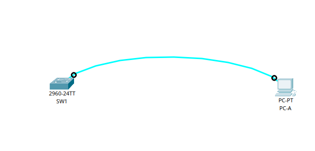
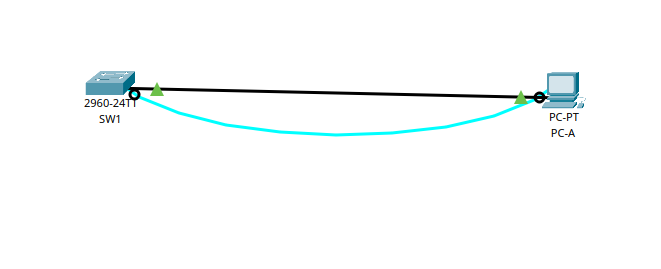
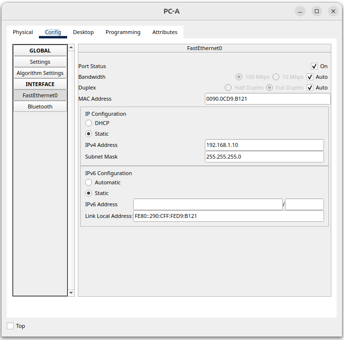

# Базовая настройка коммутатора

## Цель:
Создание сети и настройка основных параметров устройства.

### Описание/Пошаговая инструкция выполнения домашнего задания:

В ходе данной работы вам предстоит построить простую топологию, используя Ethernet-кабель локальной сети, и получить доступ к коммутатору Cisco, используя консольное подключение и методы удаленного доступа. Перед настройкой базовых параметров коммутатора нужно проверить настройки коммутатора по умолчанию. Необходимо также показать использование IP-адреса управления для удаленного управления коммутатором.
Подробное описание задания в методичке в материалах к занятию.
Готовые конфигурации необходимо оформить на github с описанием проделанной работы, используя markdown

----


### Часть 1. Создание сети и проверка настроек коммутатора по умолчанию


#### Шаг 1. Создайте сеть согласно топологии.

<details>
<summary>Создаем схему инфраструктуры</summary>


</details>

<details>
<summary>Почему нужно использовать консольное подключение для первоначальной настройки коммутатора? Почему нельзя подключиться к коммутатору через Telnet или SSH?</summary>

Еще не настроены VTY линии для админисративной работы по  данным протоколам
</details>

#### Шаг 2. Проверьте настройки коммутатора по умолчанию.

<details>
<summary>Перейдем в привелегированный режим и проверим настройки</summary>

```Console
Switch>enable
Switch#show runn
Switch#show running-config 
Building configuration...

Current configuration : 1080 bytes
!
version 15.0
no service timestamps log datetime msec
no service timestamps debug datetime msec
no service password-encryption
!
hostname Switch
!
!
!
!
!
!
spanning-tree mode pvst
spanning-tree extend system-id
!
interface FastEthernet0/1
!
interface FastEthernet0/2
!
interface FastEthernet0/3
!
interface FastEthernet0/4
!
interface FastEthernet0/5
!
interface FastEthernet0/6
!
interface FastEthernet0/7
!
interface FastEthernet0/8
!
interface FastEthernet0/9
!
interface FastEthernet0/10
!
interface FastEthernet0/11
!
interface FastEthernet0/12
!
interface FastEthernet0/13
!
interface FastEthernet0/14
!
interface FastEthernet0/15
!
interface FastEthernet0/16
!
interface FastEthernet0/17
!
interface FastEthernet0/18
!
interface FastEthernet0/19
!
interface FastEthernet0/20
!
interface FastEthernet0/21
!
interface FastEthernet0/22
!
interface FastEthernet0/23
!
interface FastEthernet0/24
!
interface GigabitEthernet0/1
!
interface GigabitEthernet0/2
!
interface Vlan1
 no ip address
 shutdown
!
!
!
!
line con 0
!
line vty 0 4
 login
line vty 5 15
 login
!
!
!
!
end
```
</details>


<details>
<summary>Изучите текущий файл running configuration</summary>

`Сколько интерфейсов FastEthernet имеется на коммутаторе 2960?  `

24  
`Сколько интерфейсов Gigabit Ethernet имеется на коммутаторе 2960?`  

2  
`Каков диапазон значений, отображаемых в vty-линиях?  `

0-4 && 5-15  

</details>

<details>
<summary>Проверяем файл загрузочной конфигурации (startup configuration), который содержится в энергонезависимом ОЗУ (NVRAM)</summary>

```Console
Switch>enable
Switch#show startup-config
startup-config is not present
Switch#
```
`Почему появляется это сообщение?`

Конфиг еше не создан

</details>

<details>
<summary>Изучите характеристики SVI для VLAN 1</summary>

```Console

Switch#
Switch#show inte
Switch#show interfaces v
Switch#show interfaces vlan 1
Vlan1 is administratively down, line protocol is down
  Hardware is CPU Interface, address is 0006.2ad4.9550 (bia 0006.2ad4.9550)
  MTU 1500 bytes, BW 100000 Kbit, DLY 1000000 usec,
     reliability 255/255, txload 1/255, rxload 1/255
  Encapsulation ARPA, loopback not set
  ARP type: ARPA, ARP Timeout 04:00:00
  Last input 21:40:21, output never, output hang never
  Last clearing of "show interface" counters never
  Input queue: 0/75/0/0 (size/max/drops/flushes); Total output drops: 0
  Queueing strategy: fifo
  Output queue: 0/40 (size/max)
  5 minute input rate 0 bits/sec, 0 packets/sec
  5 minute output rate 0 bits/sec, 0 packets/sec
     1682 packets input, 530955 bytes, 0 no buffer
     Received 0 broadcasts (0 IP multicast)
     0 runts, 0 giants, 0 throttles
     0 input errors, 0 CRC, 0 frame, 0 overrun, 0 ignored
     563859 packets output, 0 bytes, 0 underruns
     0 output errors, 23 interface resets
     0 output buffer failures, 0 output buffers swapped out

Switch#
```

`Назначен ли IP-адрес сети VLAN 1?`

Нет

`Какой MAC-адрес имеет SVI? Возможны различные варианты ответов.`

0006.2ad4.9550

`Данный интерфейс включен?`

Нет, down
</details>

<details>
<summary>
Изучите IP-свойства интерфейса SVI сети VLAN 1.
</summary>

`Какие выходные данные вы видите?`

Не вижу
</details>

<details>

<summary>Подсоедините кабель Ethernet компьютера PC-A к порту 6 на коммутаторе и изучите IP-свойства
интерфейса SVI сети VLAN 1</summary>



Линк поднялся, значки позеленели
</details>


<details>
<summary>Изучите сведения о версии ОС Cisco IOS на коммутаторе</summary>


```Console
Switch#show version
Cisco IOS Software, C2960 Software (C2960-LANBASEK9-M), Version 15.0(2)SE4, RELEASE SOFTWARE (fc1)
Technical Support: http://www.cisco.com/techsupport
Copyright (c) 1986-2013 by Cisco Systems, Inc.
Compiled Wed 26-Jun-13 02:49 by mnguyen

ROM: Bootstrap program is C2960 boot loader
BOOTLDR: C2960 Boot Loader (C2960-HBOOT-M) Version 12.2(25r)FX, RELEASE SOFTWARE (fc4)

Switch uptime is 39 minutes
System returned to ROM by power-on
System image file is "flash:c2960-lanbasek9-mz.150-2.SE4.bin"


This product contains cryptographic features and is subject to United
States and local country laws governing import, export, transfer and
use. Delivery of Cisco cryptographic products does not imply
third-party authority to import, export, distribute or use encryption.
Importers, exporters, distributors and users are responsible for
compliance with U.S. and local country laws. By using this product you
agree to comply with applicable laws and regulations. If you are unable
to comply with U.S. and local laws, return this product immediately.

A summary of U.S. laws governing Cisco cryptographic products may be found at:
http://www.cisco.com/wwl/export/crypto/tool/stqrg.html

If you require further assistance please contact us by sending email to
export@cisco.com.

cisco WS-C2960-24TT-L (PowerPC405) processor (revision B0) with 65536K bytes of memory.
Processor board ID FOC1010X104
Last reset from power-on
1 Virtual Ethernet interface
24 FastEthernet interfaces
2 Gigabit Ethernet interfaces
The password-recovery mechanism is enabled.

64K bytes of flash-simulated non-volatile configuration memory.
Base ethernet MAC Address       : 00:06:2A:D4:95:50
Motherboard assembly number     : 73-10390-03
Power supply part number        : 341-0097-02
Motherboard serial number       : FOC10093R12
Power supply serial number      : AZS1007032H
Model revision number           : B0
Motherboard revision number     : B0
Model number                    : WS-C2960-24TT-L
System serial number            : FOC1010X104
Top Assembly Part Number        : 800-27221-02
Top Assembly Revision Number    : A0
Version ID                      : V02
CLEI Code Number                : COM3L00BRA
Hardware Board Revision Number  : 0x01


Switch Ports Model              SW Version            SW Image
------ ----- -----              ----------            ----------
*    1 26    WS-C2960-24TT-L    15.0(2)SE4            C2960-LANBASEK9-M


Configuration register is 0xF


Switch#
```

`Под управлением какой версии ОС Cisco IOS работает коммутатор?`

15.0(2)SE4

`Как называется файл образа системы?`

flash:c2960-lanbasek9-mz.150-2.SE4.bin

`Какой базовый MAC-адрес назначен коммутатору?`

00:06:2A:D4:95:50

</details>


<details>
<summary>Изучите свойства по умолчанию интерфейса FastEthernet, который используется компьютером PC-A.</summary>

```Console
	
Switch#show interfaces fastEthernet 0/6
FastEthernet0/6 is up, line protocol is up (connected)
  Hardware is Lance, address is 0010.1129.c306 (bia 0010.1129.c306)
 BW 100000 Kbit, DLY 1000 usec,
     reliability 255/255, txload 1/255, rxload 1/255
  Encapsulation ARPA, loopback not set
  Keepalive set (10 sec)
  Full-duplex, 100Mb/s
  input flow-control is off, output flow-control is off
  ARP type: ARPA, ARP Timeout 04:00:00
  Last input 00:00:08, output 00:00:05, output hang never
  Last clearing of "show interface" counters never
  Input queue: 0/75/0/0 (size/max/drops/flushes); Total output drops: 0
  Queueing strategy: fifo
  Output queue :0/40 (size/max)
  5 minute input rate 0 bits/sec, 0 packets/sec
  5 minute output rate 0 bits/sec, 0 packets/sec
     956 packets input, 193351 bytes, 0 no buffer
     Received 956 broadcasts, 0 runts, 0 giants, 0 throttles
     0 input errors, 0 CRC, 0 frame, 0 overrun, 0 ignored, 0 abort
     0 watchdog, 0 multicast, 0 pause input
     0 input packets with dribble condition detected
     2357 packets output, 263570 bytes, 0 underruns
     0 output errors, 0 collisions, 10 interface resets
     0 babbles, 0 late collision, 0 deferred
     0 lost carrier, 0 no carrier
     0 output buffer failures, 0 output buffers swapped out
```

`Интерфейс включен или выключен?`

Up

`Что нужно сделать, чтобы включить интерфейс?`

Включается автоматически при подключении кабеля Ethernet. На маршрутизаторе вводим команду no shutdown

`Какой MAC-адрес у интерфейса?`

0010.1129.c306


`Какие настройки скорости и дуплекса заданы в интерфейсе?`

Full-duplex, 100Mb/s

</details>


<details>
<summary>Изучите параметры сети VLAN по умолчанию на коммутаторе. </summary>


```Console
Switch#show vlan

VLAN Name                             Status    Ports
---- -------------------------------- --------- -------------------------------
1    default                          active    Fa0/1, Fa0/2, Fa0/3, Fa0/4
                                                Fa0/5, Fa0/6, Fa0/7, Fa0/8
                                                Fa0/9, Fa0/10, Fa0/11, Fa0/12
                                                Fa0/13, Fa0/14, Fa0/15, Fa0/16
                                                Fa0/17, Fa0/18, Fa0/19, Fa0/20
                                                Fa0/21, Fa0/22, Fa0/23, Fa0/24
                                                Gig0/1, Gig0/2
1002 fddi-default                     active    
1003 token-ring-default               active    
1004 fddinet-default                  active    
1005 trnet-default                    active    

VLAN Type  SAID       MTU   Parent RingNo BridgeNo Stp  BrdgMode Trans1 Trans2
---- ----- ---------- ----- ------ ------ -------- ---- -------- ------ ------
1    enet  100001     1500  -      -      -        -    -        0      0
1002 fddi  101002     1500  -      -      -        -    -        0      0   
1003 tr    101003     1500  -      -      -        -    -        0      0   
1004 fdnet 101004     1500  -      -      -        ieee -        0      0   
1005 trnet 101005     1500  -      -      -        ibm  -        0      0   

VLAN Type  SAID       MTU   Parent RingNo BridgeNo Stp  BrdgMode Trans1 Trans2
---- ----- ---------- ----- ------ ------ -------- ---- -------- ------ ------

Remote SPAN VLANs
------------------------------------------------------------------------------

Primary Secondary Type              Ports
------- --------- ----------------- ------------------------------------------
```

`Какое имя присвоено сети VLAN 1 по умолчанию?`

default

`Какие порты расположены в сети VLAN 1?`

Все

`Активна ли сеть VLAN 1?`

да

`К какому типу сетей VLAN принадлежит VLAN по умолчанию?`

VLAN


</details>


<details>
<summary>Изучите флеш-память</summary>

```Console
Switch#show flash
Directory of flash:/

    1  -rw-     4670455          <no date>  2960-lanbasek9-mz.150-2.SE4.bin

64016384 bytes total (59345929 bytes free)
Switch#dir flash
Directory of flash:/

    1  -rw-     4670455          <no date>  2960-lanbasek9-mz.150-2.SE4.bin

64016384 bytes total (59345929 bytes free)
```

`Какое имя присвоено образу Cisco IOS?`

2960-lanbasek9-mz.150-2.SE4.bin

</details>


### Часть 2. Настройка базовых параметров сетевых устройств

#### Шаг 1. Настройте базовые параметры коммутатора.

<details>
<summary>Настройка базовых параметров коммутатора.</summary>

```Console
no ip domain-lookup
hostname S1
service password-encryption
enable secret class
banner motd #
Unauthorized access is strictly prohibited. #
```

```Console
Switch>enable
Switch#confi
Switch#configure ter
Switch#configure terminal 
Enter configuration commands, one per line.  End with CNTL/Z.
Switch(config)#
Switch(config)#
Switch(config)#
Switch(config)#no ip do
Switch(config)#no ip domai
Switch(config)#no ip domain-l
Switch(config)#no ip domain-lookup 
Switch(config)#host
Switch(config)#hostname S1
S1(config)#servi
S1(config)#service passw
S1(config)#service password-encryption 
S1(config)#enable se
S1(config)#enable secret cl
S1(config)#enable secret cla
S1(config)#enable secret class
S1(config)#banner motd #
Enter TEXT message.  End with the character '#'.
Unauthorized access is strictly prohibited. #

S1(config)#
```

</details>


<details>
<summary>Назначьте IP-адрес интерфейсу SVI на коммутаторе</summary>

```Console
S1(config)#interface vlan 1
S1(config-if)#ip addr 192.168.1.2 255.255.255.0
S1(config-if)#no shutdown

S1(config-if)#
%LINK-5-CHANGED: Interface Vlan1, changed state to up

%LINEPROTO-5-UPDOWN: Line protocol on Interface Vlan1, changed state to up
```

</details>

<details>
<summary>Доступ через порт консоли также следует ограничить с помощью пароля</summary>

```Console
S1(config-if)#line con 0
S1(config-line)#logg
S1(config-line)#logging sy
S1(config-line)#logging synchronous 
S1(config-line)#
```
</details>


<details>
<summary>Настройте каналы виртуального соединения для удаленного управления (vty), чтобы коммутатор
разрешил доступ через Telnet</summary>

```Console
S1(config-line)#line vty 0 15
S1(config-line)#pass
S1(config-line)#password cisco
S1(config-line)#login
S1(config-line)#
```


`Для чего нужна команда login?`

С помощью команды login указываем коммутатору при подключении запрос пароля


</details>

#### Шаг 2. Настройте IP-адрес на компьютере PC-A.
<details>
<summary>PC-A:FastEthernet0</summary>



</details>


### Часть 3. Проверка сетевых подключений

#### Шаг 1. Отобразите конфигурацию коммутатора.

<details>
<summary>Параметры, которые настроили, выделены желтым</summary>

```Console
S1#
S1#enable
S1#show run
Building configuration...

Current configuration : 1286 bytes
!
version 15.0
no service timestamps log datetime msec
no service timestamps debug datetime msec
service password-encryption
!
hostname S1
!
enable secret 5 $1$mERr$9cTjUIEqNGurQiFU.ZeCi1
!
!
!
no ip domain-lookup
!
!
!
spanning-tree mode pvst
spanning-tree extend system-id
!
interface FastEthernet0/1
!
interface FastEthernet0/2
!
interface FastEthernet0/3
!
interface FastEthernet0/4
!
interface FastEthernet0/5
!
interface FastEthernet0/6
!
interface FastEthernet0/7
!
interface FastEthernet0/8
!
interface FastEthernet0/9
!
interface FastEthernet0/10
!
interface FastEthernet0/11
!
interface FastEthernet0/12
!
interface FastEthernet0/13
!
interface FastEthernet0/14
!
interface FastEthernet0/15
!
interface FastEthernet0/16
!
interface FastEthernet0/17
!
interface FastEthernet0/18
!
interface FastEthernet0/19
!
interface FastEthernet0/20
!
interface FastEthernet0/21
!
interface FastEthernet0/22
!
interface FastEthernet0/23
!
interface FastEthernet0/24
!
interface GigabitEthernet0/1
!
interface GigabitEthernet0/2
!
interface Vlan1
 ip address 192.168.1.2 255.255.255.0
!
banner motd ^C
Unauthorized access is strictly prohibited. ^C
!
!
!
line con 0
 logging synchronous
!
line vty 0 4
 password 7 0822455D0A16
 login
line vty 5 15
 password 7 0822455D0A16
 login
!
!
!
!
end


S1#
```

</details>


<details>
<summary>Проверьте параметры VLAN 1</summary>

```Console
S1#show interfaces vlan 1
Vlan1 is up, line protocol is up
  Hardware is CPU Interface, address is 0006.2ad4.9550 (bia 0006.2ad4.9550)
  Internet address is 192.168.1.2/24
  MTU 1500 bytes, BW 100000 Kbit, DLY 1000000 usec,
     reliability 255/255, txload 1/255, rxload 1/255
  Encapsulation ARPA, loopback not set
  ARP type: ARPA, ARP Timeout 04:00:00
  Last input 21:40:21, output never, output hang never
  Last clearing of "show interface" counters never
  Input queue: 0/75/0/0 (size/max/drops/flushes); Total output drops: 0
  Queueing strategy: fifo
  Output queue: 0/40 (size/max)
  5 minute input rate 0 bits/sec, 0 packets/sec
  5 minute output rate 0 bits/sec, 0 packets/sec
     1682 packets input, 530955 bytes, 0 no buffer
     Received 0 broadcasts (0 IP multicast)
     0 runts, 0 giants, 0 throttles
     0 input errors, 0 CRC, 0 frame, 0 overrun, 0 ignored
     563859 packets output, 0 bytes, 0 underruns
     0 output errors, 23 interface resets
     0 output buffer failures, 0 output buffers swapped out

S1#
```

`Какова полоса пропускания этого интерфейса?`

100000 Kbit

`В каком состоянии находится VLAN 1?`

up

`В каком состоянии находится канальный протокол?`

line protocol is up

</details>


#### Шаг 2. Протестируйте сквозное соединение, отправив эхо-запрос


<details>
<summary>В командной строке компьютера PC-A с помощью утилиты ping проверьте связь сначала с адресом
PC-A</summary>

```Console
C:\>ping  192.168.1.10

Pinging 192.168.1.10 with 32 bytes of data:

Reply from 192.168.1.10: bytes=32 time=5ms TTL=128
Reply from 192.168.1.10: bytes=32 time=4ms TTL=128
Reply from 192.168.1.10: bytes=32 time=3ms TTL=128
Reply from 192.168.1.10: bytes=32 time=2ms TTL=128

Ping statistics for 192.168.1.10:
    Packets: Sent = 4, Received = 4, Lost = 0 (0% loss),
Approximate round trip times in milli-seconds:
    Minimum = 2ms, Maximum = 5ms, Average = 3ms
```

</details>

<details>
<summary>Из командной строки компьютера PC-A отправьте эхо-запрос на административный адрес
интерфейса SVI коммутатора S1</summary>

```Console
C:\>ping 192.168.1.2

Pinging 192.168.1.2 with 32 bytes of data:

Reply from 192.168.1.2: bytes=32 time<1ms TTL=255
Reply from 192.168.1.2: bytes=32 time<1ms TTL=255
Reply from 192.168.1.2: bytes=32 time<1ms TTL=255
Reply from 192.168.1.2: bytes=32 time<1ms TTL=255

Ping statistics for 192.168.1.2:
    Packets: Sent = 4, Received = 4, Lost = 0 (0% loss),
Approximate round trip times in milli-seconds:
    Minimum = 0ms, Maximum = 0ms, Average = 0ms
```

</details>

#### Шаг 3. Проверьте удаленное управление коммутатором S1.


<details>
<summary>Выберите сервер Telnet и укажите адрес управления SVI для подключения к S1</summary>

```Console

C:\>
C:\>telnet 192.168.1.2
Trying 192.168.1.2 ...Open
Unauthorized access is strictly prohibited. 


User Access Verification

Password: 
S1>enable
Password: 
S1#copy run
S1#copy running-config st
S1#copy running-config startup-config 
Destination filename [startup-config]? 
Building configuration...
[OK]
S1#exit

[Connection to 192.168.1.2 closed by foreign host]
C:\>
```

</details>


<details>
<summary>Вопросы для повторения</summary>

`Зачем необходимо настраивать пароль VTY для коммутатора?`

Чтобы можно было подключаться по Telnet и SSH.

`Что нужно сделать, чтобы пароли не отправлялись в незашифрованном виде?`

нужно прописать комманду:

```Console
enable  
configure terminal  
service password-encryption  
```

</details>

---