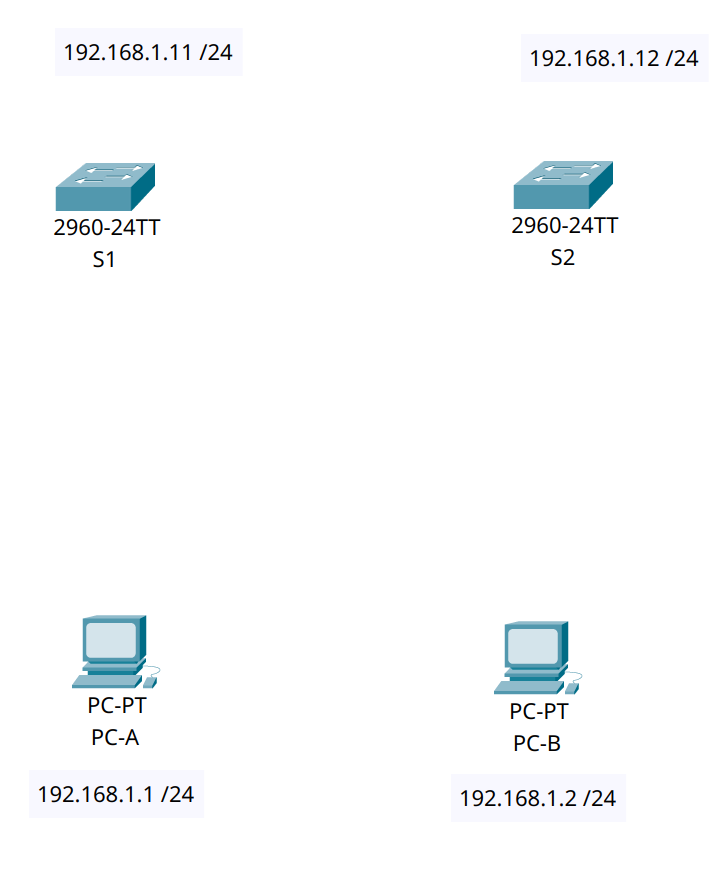
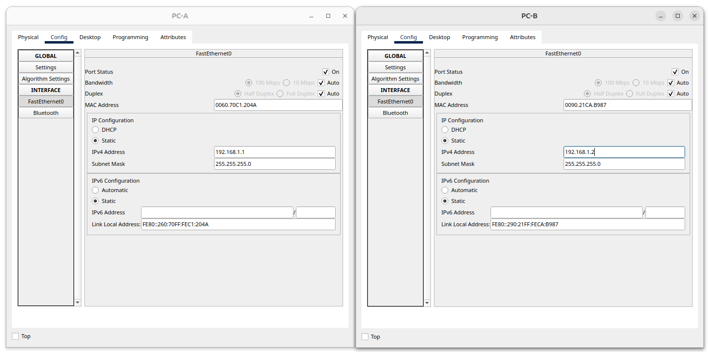
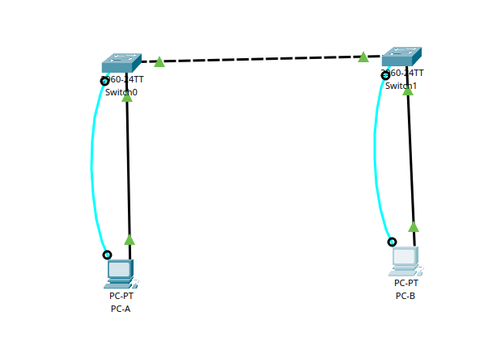

# MAC-адреса сетевых устройств

## Цель:

* Отображение, описание и анализ МАС-адресов Ethernet.
* Изучение таблицы МАС-адресов коммутатора.

#### Описание/Пошаговая инструкция выполнения домашнего задания:

* В первой части вы подключите оборудование. Затем вы настроите коммутатор и ПК в соответствии с таблицей адресации и протестируете настроенные конфигурации, проверив подключение к сети.
* Во второй части вам нужно построить топологию, состоящую из двух коммутаторов. Затем вам предстоит отправить эхо-запросы различным устройствам и посмотреть, как два коммутатора строят свои таблицы МАС-адресов
* Подробное описание задания в методичках в материалах к занятию.
* Готовые конфигурации необходимо оформить на github с описанием проделанной работы, используя markdown.

---

### Часть 1. Создание и настройка сети
####  Создаем топологию сети 
<details>
<summary>из 2  коммутаторов и 2 компьютеров</summary>

| Устройство  | Интерфейс  |   IP-адрес   | Маска подсети |
| :---------: |:-----------:| :---------------:|:-------------:|
| S1     | VLAN 1 | 192.168.1.11 |      /24      |
| S2     | VLAN 1 | 192.168.1.12 | /24 |
| PC-A     | NIC | 192.168.1.1 | /24|
| PC-B     | NIC | 192.168.1.2 | /24 |


</details>

####  Шаг 2. Настройте узлы ПК.
<details>
<summary>PC-A && PC-B</summary>


</details>

####  Шаг 3. Выполните инициализацию и перезагрузку коммутаторов.
<details>
<summary>Коммутатор S1</summary>

```Console
Switch>
Switch>enable
Switch#hostname S1
                ^
% Invalid input detected at '^' marker.
	
Switch#configure term
Switch#configure terminal 
Enter configuration commands, one per line.  End with CNTL/Z.
Switch(config)#
Switch(config)#hostname S1
S1(config)#line console 0
S1(config-line)#password cisco
S1(config-line)#login
S1(config-line)#exit
S1(config)#enable secret class
S1(config)#line vty 0 15
S1(config-line)#password cisco
S1(config-line)#login
S1(config-line)#exit
S1(config)#service password-en
S1(config)#service password-encryption 
S1(config)#banner motd #
Enter TEXT message.  End with the character '#'.
hi i am s1 switch! #

S1(config)#interface vlan 1
S1(config-if)#ip address 192.168.1.11 255.255.255.0
S1(config-if)#no shutdown

S1(config-if)#
%LINK-5-CHANGED: Interface Vlan1, changed state to up

S1(config-if)#end
S1#
%SYS-5-CONFIG_I: Configured from console by console

S1#copy running-config startup-config
Destination filename [startup-config]? 
Building configuration...
[OK]
S1#reload
```

</details>

<details>
<summary>Коммутатор S2</summary>

```Console
Switch>enable
Switch#configure terminal
Enter configuration commands, one per line.  End with CNTL/Z.
Switch(config)#hostname S2
S2(config)#line console 0
S2(config-line)#password cisco
S2(config-line)#login
S2(config-line)#exit
S2(config)#enable secret class
S2(config)#line vty 0 15
S2(config-line)#password cisco
S2(config-line)#login
S2(config-line)#exit
S2(config)#service p
S2(config)#service password-encryption 
S2(config)#banner motd #
Enter TEXT message.  End with the character '#'.
hi i am s2 switch! #

S2(config)#interface vlan 1
S2(config-if)#ip address 192.168.1.12 255.255.255.0
S2(config-if)#no shutdown

S2(config-if)#
%LINK-5-CHANGED: Interface Vlan1, changed state to up

S2(config-if)#end
S2#
%SYS-5-CONFIG_I: Configured from console by console

S2#copy runn
S2#copy running-config startup-config
Destination filename [startup-config]? 
Building configuration...
[OK]
S2#reload
Proceed with reload? [confirm]

```

</details>


<details>
<summary>Топология</summary>


</details>


### Часть 2. Изучение таблицы МАС-адресов коммутатора

####  Шаг 1. Запишите МАС-адреса сетевых устройств.
<details>
<summary>Откройте командную строку на PC-A и PC-B и введите команду ipconfig /all</summary>

```Console
C:\>ipconfig /all

FastEthernet0 Connection:(default port)

   Connection-specific DNS Suffix..: 
   Physical Address................: 0090.2B4C.8663
```
MAC-адрес компьютера PC-A:

```0090.2B4C.8663```

```Console
C:\>ipconfig /all

FastEthernet0 Connection:(default port)

   Connection-specific DNS Suffix..: 
   Physical Address................: 00D0.BCE4.CCDA
```
MAC-адрес компьютера PC-B:

``` 00D0.BCE4.CCDA```


</details>

<details>
<summary>Подключитесь к коммутаторам S1 и S2 через консоль и введите команду show interface F0/1 на
каждом коммутаторе</summary>

```Console
S1>show interface F0/1
FastEthernet0/1 is up, line protocol is up (connected)
  Hardware is Lance, address is 000a.f313.da01 (bia 000a.f313.da01)
```

МАС-адрес коммутатора S1 Fast Ethernet 0/1:

```000a.f313.da01```

```Console
S2>show interface F0/1
FastEthernet0/1 is up, line protocol is up (connected)
  Hardware is Lance, address is 000b.be76.9e01 (bia 000b.be76.9e01)
```
МАС-адрес коммутатора S2 Fast Ethernet 0/1:

```000b.be76.9e01```

</details>

####  Шаг 2. Просмотрите таблицу МАС-адресов коммутатора.

<details>
<summary>Коммутатор S</summary>

```Console
S2#show mac address-table
          Mac Address Table
-------------------------------------------

Vlan    Mac Address       Type        Ports
----    -----------       --------    -----

   1    000a.f313.da01    DYNAMIC     Fa0/1
   ```


Записаны ли в таблице МАС-адресов какие-либо МАС-адреса?

```Да, записаны.```

Какие МАС-адреса записаны в таблице? С какими портами коммутатора они сопоставлены и каким устройствам принадлежат?

```Mac-адрес интерфейса VLAN 1 на порту коммутатора f0/1```

Игнорируйте МАС-адреса, сопоставленные с центральным процессором.
Если вы не записали МАС-адреса сетевых устройств в шаге 1, как можно определить, каким устройствам принадлежат МАС-адреса, используя только выходные данные команды show mac address-table?
Можно посмотреть с какого номера интерфейса виден МАС-адрес, указанный в таблице и посмотреть к какому устройству подключен данный интерфейс.
Работает ли это решение в любой ситуации?

```Нет```
</details>

####  Шаг 3. Очистите таблицу МАС-адресов коммутатора S2 и снова отобразите таблицу МАС-адресов.

<details>
<summary>Коммутатор S2  очистка адресов</summary>

```Console
S2#
S2#
S2#clear mac address-table dynamic
S2#show mac address-table
          Mac Address Table
-------------------------------------------

Vlan    Mac Address       Type        Ports
----    -----------       --------    -----

S2#show mac address-table
          Mac Address Table
-------------------------------------------

Vlan    Mac Address       Type        Ports
----    -----------       --------    -----

S2#show mac address-table
          Mac Address Table
-------------------------------------------

Vlan    Mac Address       Type        Ports
----    -----------       --------    -----

S2#show mac address-table
          Mac Address Table
-------------------------------------------

Vlan    Mac Address       Type        Ports
----    -----------       --------    -----

   1    000a.f313.da01    DYNAMIC     Fa0/1
S2#
```


Указаны ли в таблице МАС-адресов адреса для VLAN 1?

```Нет, МАС-адреса для VLAN1 нет. Указан МАС-адрес интерфейса F0/1 коммутатора.```

Указаны ли другие МАС-адреса?

```Нет, других MAС-адресов нет.```

Через 10 секунд введите команду show mac address-table и нажмите клавишу ввода.
Появились ли в таблице МАС-адресов новые адреса?

```Нет, новые МАС-адреса не появились```


</details>


####  Шаг 4. С компьютера PC-B отправьте эхо-запросы устройствам в сети и просмотрите    таблицу МАС-адресов коммутатора.

<details>
<summary>С компьютера PC-B отправьте эхо-запросы устройствам в сети</summary>

```Console
/// PC-B
C:\>arp -a
  Internet Address      Physical Address      Type
  192.168.1.12          0001.63ba.39d1        dynamic
```

Не считая адресов многоадресной и широковещательной рассылки, сколько пар IP- и МАС-адресов устройств было получено через протокол ARP?

```Появился только 1 IP- и МАС-адрес.```

Из командной строки PC-B отправьте эхо-запросы на компьютер PC-A, а также коммутаторы S1 и S2.

```Console
C:\>
C:\>ping 192.168.1.12

Pinging 192.168.1.12 with 32 bytes of data:

Reply from 192.168.1.12: bytes=32 time<1ms TTL=255
Reply from 192.168.1.12: bytes=32 time=29ms TTL=255

Ping statistics for 192.168.1.12:
    Packets: Sent = 2, Received = 2, Lost = 0 (0% loss),
Approximate round trip times in milli-seconds:
    Minimum = 0ms, Maximum = 29ms, Average = 14ms

Control-C
^C
C:\>ping 192.168.1.11

Pinging 192.168.1.11 with 32 bytes of data:

Request timed out.
Reply from 192.168.1.11: bytes=32 time<1ms TTL=255

Ping statistics for 192.168.1.11:
    Packets: Sent = 2, Received = 1, Lost = 1 (50% loss),
Approximate round trip times in milli-seconds:
    Minimum = 0ms, Maximum = 0ms, Average = 0ms

Control-C
^C
C:\>ping 192.168.1.1

Pinging 192.168.1.1 with 32 bytes of data:

Reply from 192.168.1.1: bytes=32 time<1ms TTL=128
Reply from 192.168.1.1: bytes=32 time=4ms TTL=128

Ping statistics for 192.168.1.1:
    Packets: Sent = 2, Received = 2, Lost = 0 (0% loss),
Approximate round trip times in milli-seconds:
    Minimum = 0ms, Maximum = 4ms, Average = 2ms

Control-C
^C
```

От всех ли устройств получены ответы? Если нет, проверьте кабели и IP-конфигурации

```Да```


Подключившись через консоль к коммутатору S2, введите команду ```show mac address-table```.

```Console
S2>enable
S2#show mac address-table
          Mac Address Table
-------------------------------------------

Vlan    Mac Address       Type        Ports
----    -----------       --------    -----

   1    000a.f313.da01    DYNAMIC     Fa0/1
   1    0090.2b4c.8663    DYNAMIC     Fa0/1
   1    0090.2bb9.e7e5    DYNAMIC     Fa0/1
   1    00d0.bce4.ccda    DYNAMIC     Fa0/18
```

Добавил ли коммутатор в таблицу МАС-адресов дополнительные МАС-адреса?

```Да, коммутатор добавил в таблицу новые МАС-адреса. ```

Если да, то какие адреса и устройства?

```В таблицу добавились МАС-адреса Vlan1 коммутатора S1, МАС-адрес РС-А, МАС-адрес интерфейса F0/1 коммутатора S1 и МАС-адрес РС-В.```


```Console
/// PC-B
C:\>arp -a
  Internet Address      Physical Address      Type
  192.168.1.1           0090.2b4c.8663        dynamic
  192.168.1.11          0090.2bb9.e7e5        dynamic
  192.168.1.12          0001.63ba.39d1        dynamic

```

Появились ли в ARP-кэше компьютера PC-B дополнительные записи для всех сетевых устройств, которым были отправлены эхо-запросы?

```Да, появились дополнительные записи```


</details>


---
<details>
<summary>Вопрос для повторения</summary>

В сетях Ethernet данные передаются на устройства по соответствующим МАС-адресам. Для этого коммутаторы и компьютеры динамически создают ARP-кэш и таблицы МАС-адресов. Если компьютеров в сети немного, эта процедура выглядит достаточно простой. Какие сложности могут возникнуть в крупных сетях?

```Переполнение таблицы MAC адресов```

</details>
