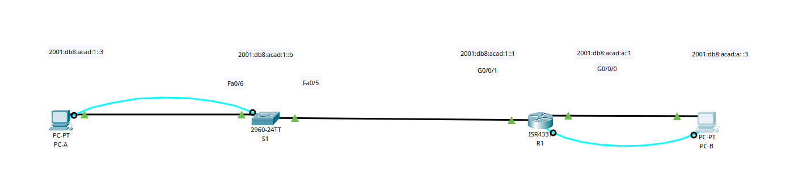
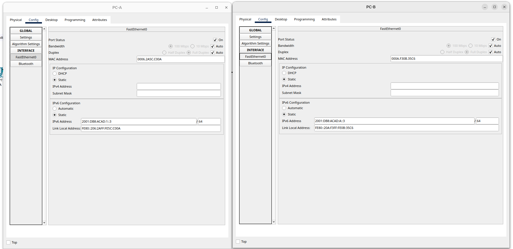
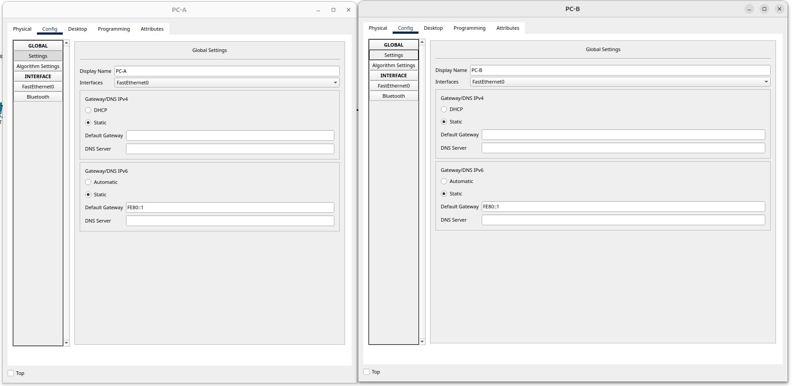

# Настройка IPv6-адресов на сетевых устройствах

## Цель:

* Настройка топологии и конфигурация основных параметров маршрутизатора и коммутатора.
* Ручная настройка IPv6-адресов.
* Проверка сквозного соединения.

#### Описание/Пошаговая инструкция выполнения домашнего задания:

* Вы будете настраивать хосты и интерфейсы устройств с IPv6-адресами.
* Для просмотра индивидуальных и групповых IPv6-адресов вы будете использовать команду show.
* Вы также будете проверять сквозное соединение с помощью команд ping and traceroute.
* Подробное описание задания в методичке в материалах к занятию.
* Готовые конфигурации необходимо оформить на github с описанием проделанной работы, используя markdown.

---


<details>
<summary>Топология и таблица адресации</summary>



| Устройство | 	Интерфейс |	IPv6-адрес |	Длина префикса |	Шлюз по умолчанию |
| :--------: |:--------:  |:---------:| :--------------:| :-----------------:|
| R1	       | G0/0/0    | 2001:db8:acad:a::1  |	64	|  —  |
| R1	       | G0/0/1	   | 2001:db8:acad:1::1  |	64	|  —  |
| S1	       |  VLAN 1	 | 2001:db8:acad:1::b	 |  64	|  —  |
| PC-A     	|  NIC	     | 2001:db8:acad:1::3	 |  64	| fe80::1 |
| PC-B     	|  NIC	     | 2001:db8:acad:a::3	 |  64	| fe80::1 |

</details>

---

#### Часть 1. Настройка топологии и конфигурация основных параметровмаршрутизатора и коммутатора


<details>
<summary>Шаг 1. Настройте маршрутизатор.</summary>

```Shell
enable
conf term
no ip domain-lookup
hostname R1
banner motd ##### R1 - Router #####
line console 0
logging synchronous
password cisco
login
exit
enable secret class
line vty 0 15
password cisco
login
exit
service password-encryption
exit

copy running-config startup-config
```


</details>

<details>
<summary>Шаг 2. Настройте коммутатор.</summary>

 
```Shell
enable
conf term
no ip domain-lookup
hostname S1
banner motd ##### S1 - Switch #####
line console 0
logging synchronous
password cisco
login
exit
enable secret class
line vty 0 15
password cisco
login
exit
service password-encryption
exit


copy running-config startup-config
```

```Shell
show sdm prefer
sdm prefer dual-ipv4-and-ipv6 default
end
reload
```

</details>


#### Часть 2. Ручная настройка IPv6-адресов

<details>
<summary>Шаг 1. Назначьте IPv6-адреса интерфейсам Ethernet на R1 </summary>

a. Назначьте глобальные индивидуальные IPv6-адреса, указанные в таблице адресации обоим интерфейсам Ethernet на R1.

```Shell
interface G0/0/0
ipv6 address 2001:db8:acad:a::1/64
interface G0/0/1
ipv6 address 2001:db8:acad:1::1/64

```

Введите команду `show ipv6 interface brief`, чтобы проверить, назначен ли каждому интерфейсу корректный индивидуальный IPv6-адрес.

```Shell
R1(config-if)#do show ipv6 interface brief
GigabitEthernet0/0/0       [administratively down/down]
    FE80::201:96FF:FE99:2901
    2001:DB8:ACAD:A::1
GigabitEthernet0/0/1       [administratively down/down]
    FE80::201:96FF:FE99:2902
    2001:DB8:ACAD:1::1
GigabitEthernet0/0/2       [administratively down/down]
    unassigned
Vlan1                      [administratively down/down]
    unassigned
```

c. Чтобы обеспечить соответствие локальных адресов канала индивидуальному адресу, вручную введите локальные адреса канала на каждом интерфейсе Ethernet на R1.

```Shell
interface G0/0/0
ipv6 address fe80::1 link-local
interface G0/0/1
ipv6 address fe80::1 link-local
```

```Shell
R1(config-if)#do show ipv6 interface brief
GigabitEthernet0/0/0       [administratively down/down]
    FE80::1
    2001:DB8:ACAD:A::1
GigabitEthernet0/0/1       [administratively down/down]
    FE80::1
    2001:DB8:ACAD:1::1
GigabitEthernet0/0/2       [administratively down/down]
    unassigned
Vlan1                      [administratively down/down]
    unassigned
```

d. Используйте выбранную команду, чтобы убедиться, что локальный адрес связи изменен на fe80::1.

```Shell
R1(config-if)#do show ipv6 int
GigabitEthernet0/0/0 is up, line protocol is up
  IPv6 is enabled, link-local address is FE80::1
  No Virtual link-local address(es):
  Global unicast address(es):
    2001:DB8:ACAD:A::1, subnet is 2001:DB8:ACAD:A::/64
  Joined group address(es):
    FF02::1
    FF02::1:FF00:1
  MTU is 1500 bytes
  ICMP error messages limited to one every 100 milliseconds
  ICMP redirects are enabled
  ICMP unreachables are sent
  ND DAD is enabled, number of DAD attempts: 1
  ND reachable time is 30000 milliseconds
GigabitEthernet0/0/1 is up, line protocol is up
  IPv6 is enabled, link-local address is FE80::1
  No Virtual link-local address(es):
  Global unicast address(es):
    2001:DB8:ACAD:1::1, subnet is 2001:DB8:ACAD:1::/64
  Joined group address(es):
    FF02::1
    FF02::1:FF00:1
  MTU is 1500 bytes
```

`Какие группы многоадресной рассылки назначены интерфейсу G0/0?`

```Shell
G0/0/0: FF02::1, FF02::1:FF00:1
G0/0/1: FF02::1, FF02::1:FF00:1
```

</details>

<details>
<summary>Шаг 2. Активируйте IPv6-маршрутизацию на R1.</summary>

a. В командной строке на PC-B введите команду ipconfig, чтобы получить данные IPv6-адреса, назначенного интерфейсу ПК.
```Shell
C:\>ipconfig

FastEthernet0 Connection:(default port)

   Connection-specific DNS Suffix..: 
   Link-local IPv6 Address.........: FE80::20A:F3FF:FE0B:35C6
   IPv6 Address....................: 2001:DB8:ACAD:A:20A:F3FF:FE0B:35C6
   IPv4 Address....................: 0.0.0.0
   Subnet Mask.....................: 0.0.0.0
   Default Gateway.................: FE80::1
                                     0.0.0.0
```
Да

b. Активируйте IPv6-маршрутизацию на R1 с помощью команды IPv6 unicast-routing.
```Shell	
R1(config-if)#ipv6 unicast-routing
```

c. Теперь, когда R1 входит в группу многоадресной рассылки всех маршрутизаторов, еще раз введите команду ipconfig на PC-B. Проверьте данные IPv6-адреса. Вопрос: Почему PC-B получил глобальный префикс маршрутизации и идентификатор подсети, которые вы настроили на R1?
```Shell
C:\>ipconfig

FastEthernet0 Connection:(default port)

   Connection-specific DNS Suffix..: 
   Link-local IPv6 Address.........: FE80::20A:F3FF:FE0B:35C6
   IPv6 Address....................: 2001:DB8:ACAD:A:20A:F3FF:FE0B:35C6
   IPv4 Address....................: 0.0.0.0
   Subnet Mask.....................: 0.0.0.0
   Default Gateway.................: FE80::1
                     
```
Ничего не изменилось на PC-B.

</details>

<details>
<summary>Шаг 3. Назначьте IPv6-адреса интерфейсу управления (SVI) на S1.</summary>

a. Назначьте адрес IPv6 для S1. Также назначьте этому интерфейсу локальный адрес канала.
```Shell
S1(config)#interface vlan1
S1(config-if)#ipv6 address fe80::1 link-local 
S1(config-if)#ipv6 address 2001:db8:acad:1::b/64
```

b. Проверьте правильность назначения IPv6-адресов интерфейсу управления с помощью команды `show ipv6 interface vlan1`.
 
```Shell
S1(config-if)#do show ipv6 interface vlan 1
Vlan1 is up, line protocol is up
  IPv6 is enabled, link-local address is FE80::1
  No Virtual link-local address(es):
  Global unicast address(es):
    2001:DB8:ACAD:1::B, subnet is 2001:DB8:ACAD:1::/64
  Joined group address(es):
    FF02::1
    FF02::1:FF00:1
    FF02::1:FF00:B
  MTU is 1500 bytes
  ICMP error messages limited to one every 100 milliseconds
  ICMP redirects are enabled
  ICMP unreachables are sent
  Output features: Check hwidb
  ND DAD is enabled, number of DAD attempts: 1
  ND reachable time is 30000 milliseconds

```
</details>

<details>
<summary>Шаг 4. Назначьте компьютерам статические IPv6-адреса.</summary>





</details>


#### Часть 3. Проверка сквозного подключения

<details>
<summary>С PC-A отправьте эхо-запрос на FE80::1. Это локальный адрес канала, назначенный G0/1 на R1.</summary>

```Shell
C:\>ping FE80::1

Pinging FE80::1 with 32 bytes of data:

Reply from FE80::1: bytes=32 time<1ms TTL=255
Reply from FE80::1: bytes=32 time<1ms TTL=255
Reply from FE80::1: bytes=32 time<1ms TTL=255

Ping statistics for FE80::1:
    Packets: Sent = 3, Received = 3, Lost = 0 (0% loss),
Approximate round trip times in milli-seconds:
    Minimum = 0ms, Maximum = 0ms, Average = 0ms
```

</details>

<details>
<summary>Отправьте эхо-запрос на интерфейс управления S1 с PC-A</summary>

```Shell
C:\>ping 2001:db8:acad:1::b

Pinging 2001:db8:acad:1::b with 32 bytes of data:

Reply from 2001:DB8:ACAD:1::B: bytes=32 time<1ms TTL=255
Reply from 2001:DB8:ACAD:1::B: bytes=32 time<1ms TTL=255
Reply from 2001:DB8:ACAD:1::B: bytes=32 time<1ms TTL=255
Reply from 2001:DB8:ACAD:1::B: bytes=32 time<1ms TTL=255

Ping statistics for 2001:DB8:ACAD:1::B:
    Packets: Sent = 4, Received = 4, Lost = 0 (0% loss),
Approximate round trip times in milli-seconds:
    Minimum = 0ms, Maximum = 0ms, Average = 0ms
```

</details>

<details>
<summary>Введите команду tracert на PC-A, чтобы проверить наличие сквозного подключения к PC-B</summary>

```Shell
C:\>tracert 2001:db8:acad:a::3

Tracing route to 2001:db8:acad:a::3 over a maximum of 30 hops: 

  1   0 ms      0 ms      0 ms      2001:DB8:ACAD:1::1
  2   0 ms      0 ms      0 ms      2001:DB8:ACAD:A::3

Trace complete.
```
</details>


<details>
<summary>С PC-B отправьте эхо-запрос на PC-A</summary>

```Shell
C:\>ping 2001:db8:acad:1::3

Pinging 2001:db8:acad:1::3 with 32 bytes of data:

Reply from 2001:DB8:ACAD:1::3: bytes=32 time<1ms TTL=127
Reply from 2001:DB8:ACAD:1::3: bytes=32 time<1ms TTL=127
Reply from 2001:DB8:ACAD:1::3: bytes=32 time<1ms TTL=127
Reply from 2001:DB8:ACAD:1::3: bytes=32 time<1ms TTL=127

Ping statistics for 2001:DB8:ACAD:1::3:
    Packets: Sent = 4, Received = 4, Lost = 0 (0% loss),
Approximate round trip times in milli-seconds:
    Minimum = 0ms, Maximum = 0ms, Average = 0ms

C:\>tracert 2001:db8:acad:1::3

Tracing route to 2001:db8:acad:1::3 over a maximum of 30 hops: 

  1   23 ms     0 ms      0 ms      2001:DB8:ACAD:A::1
  2   0 ms      0 ms      0 ms      2001:DB8:ACAD:1::3

Trace complete.
```

</details>


---


#### Вопросы для повторения
<details>
<summary>1. Почему обоим интерфейсам Ethernet на R1 можно назначить один и тот же локальный адрес канала — FE80::1?</summary>
Каждый интерфейс маршрутизатора относиться к отдельной сети.
Пакеты с локальным адресом канала никогда не выходят за пределы локальной сети, а значит, для обоих интерфейсов можно указывать один и тот же локальный адрес канала
</details>

<details><summary>2. Какой идентификатор подсети в индивидуальном IPv6-адресе 2001:db8:acad::aaaa:1234/64?
</summary>
Идентификатор подсети равен: 2001:db8:acad:0000:0000:0000:aaaa:1234/64
</details>