# Доступ к сетевым устройствам по протоколу SSH
 
## Цель
* Настройка маршрутизатора для доступа по протоколу SSH.
* Настройка коммутатора для доступа по протоколу SSH.
* SSH через интерфейс командной строки (CLI) коммутатора.


## Описание/Пошаговая инструкция выполнения домашнего задания:

* В работе необходимо включить SSH-сервер на маршрутизаторе, после чего подключиться к этому маршрутизатору, используя ПК с установленным клиентом SSH
* Подробное описание задания в методичке в материалах к занятию.
* Готовые конфигурации необходимо оформить на github с описанием проделанной работы, используя markdown.

---


### Часть 1. Настройка основных параметров устройств

<details>
<summary>Шаг 1. Создайте сеть согласно топологии.</summary>

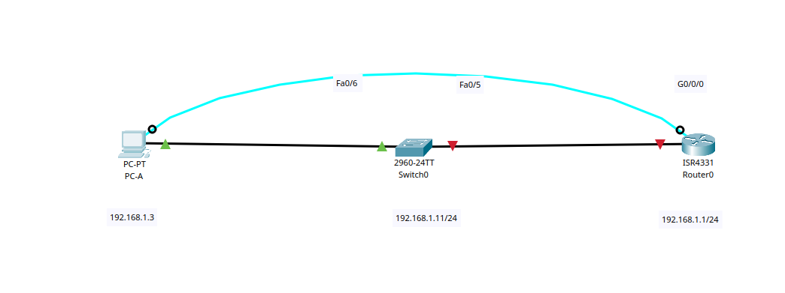
</details>

<details>
<summary>Шаг 2. Выполните инициализацию и перезагрузку маршрутизатора и коммутатора.</summary>
</details>

<details>
<summary>Шаг 3. Настройте маршрутизатор</summary>

```Shell
enable
configure terminal
hostname R1
line console 0
password cisco
login
end
configure terminal
enable secret class
line vty 0 15
password cisco
login
exit
service password-encryption
banner motd # Danger! Do not enter! #

interface GigabitEthernet 0/0/0
ip address 192.168.1.1 255.255.255.0
no shutdown
exit

copy running-config startup-config
reload
```
</details>


<details>
<summary>Шаг 4. Настройте компьютер PC-A.</summary>

1. Настройте для PC-A IP-адрес и маску подсети.  
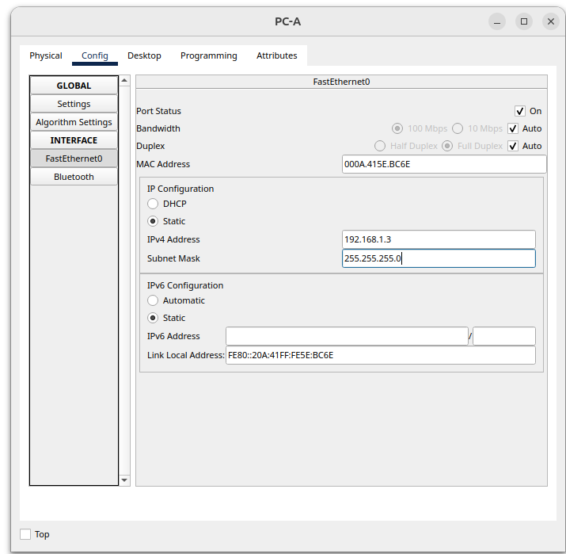

2. Настройте для PC-A шлюз по умолчанию.  
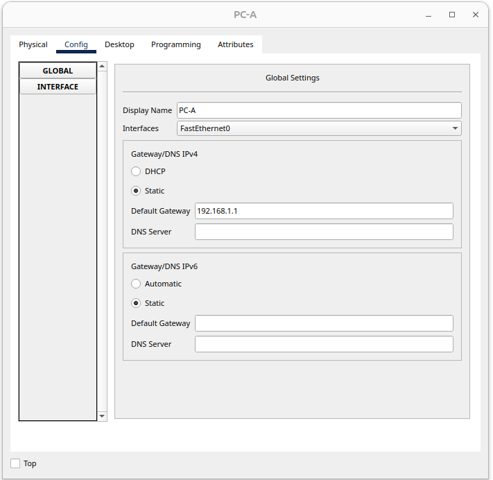

</details>

<details>
<summary>Шаг 5. Проверьте подключение к сети</summary>

Пошлите с PC-A команду Ping на маршрутизатор R1. Если эхо-запрос с помощью команды ping непроходит, найдите и устраните неполадки подключения.

```Shell
C:\>ping 192.168.1.1

Pinging 192.168.1.1 with 32 bytes of data:

Reply from 192.168.1.1: bytes=32 time=13ms TTL=255
Reply from 192.168.1.1: bytes=32 time<1ms TTL=255
Reply from 192.168.1.1: bytes=32 time<1ms TTL=255
Reply from 192.168.1.1: bytes=32 time<1ms TTL=255

Ping statistics for 192.168.1.1:
    Packets: Sent = 4, Received = 4, Lost = 0 (0% loss),
Approximate round trip times in milli-seconds:
    Minimum = 0ms, Maximum = 13ms, Average = 3ms

C:\>

```

</details>

### Часть 2. Настройка маршрутизатора для доступа по протоколу SSH

<details>
<summary>Шаг 1. Настройте аутентификацию устройств</summary>

При генерации ключа шифрования в качестве его части используются имя устройства и домен.
Поэтому эти имена необходимо указать перед вводом команды crypto key.

a. Задайте имя устройства.
b. Задайте домен для устройства.

```Shell
enable
configure terminal
ip domain name router.lab
```

</details>

<details>
<summary>Шаг 2. Создайте ключ шифрования с указанием его длины</summary>

```Shell
crypto key generate rsa general-keys modulus 1024
ip ssh version 2
```

</details>

<details>
<summary>Шаг 3. Создайте имя пользователя в локальной базе учетных записей</summary>

Настройте имя пользователя, используя admin в качестве имени пользователя и Adm1nP@55 в
качестве пароля.

```Shell
username admin secret Adm1nP@55
```

</details>


<details>
<summary>Шаг 4. Активируйте протокол SSH на линиях VTY</summary>

a. Активируйте протоколы Telnet и SSH на входящих линиях VTY с помощью команды transport input.  
b. Измените способ входа в систему таким образом, чтобы использовалась проверка пользователей по локальной базе учетных записей.

```Shell
line vty 0 15
transport input all
login local
end
```

</details>


<details>
<summary>Шаг 5. Сохраните текущую конфигурацию в файл загрузочной конфигурации.</summary>

```Shell
copy running-config startup-config
```
</details>


<details>
<summary>Шаг 6. Установите соединение с маршрутизатором по протоколу SSH.</summary>

1. Запустите Tera Term с PC-A.

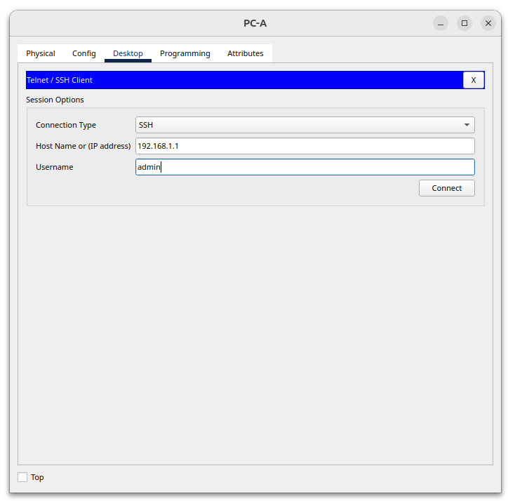

2. Установите SSH-подключение к R1. Use the username admin and password Adm1nP@55. У вас должно получиться установить SSH-подключение к R1.
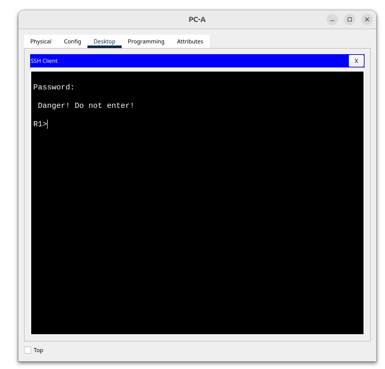

</details>

### Часть 3. Настройка коммутатора для доступа по протоколу SSH
В части 3 вам предстоит настроить коммутатор для приема подключений по протоколу SSH, а затем установить SSH-подключение с помощью программы Tera Term.
<details>
<summary>Шаг 1. Настройте аутентификацию устройств</summary>

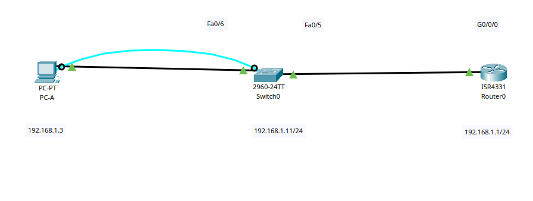


```Shell
enable
configure terminal
hostname S1
no ip domain-lookup
enable secret class
line console 0
password cisco
login
exit
line vty 0 15 
password cisco
login
exit
service password-encryption
banner motd # Danger! Do not enter! #

interface vlan1 
ip address 192.168.1.11 255.255.255.0
no shutdown
exit
ip default-gateway 192.168.1.1
exit

copy running-config startup-config
reload

```

</details>

<details>
<summary>Шаг 2. Настройте коммутатор для соединения по протоколу SSH.</summary>

Для настройки протокола SSH на коммутаторе используйте те же команды, которые применялись для аналогичной настройки маршрутизатора в части 2.

    a. Настройте имя устройства, как указано в таблице адресации.
    b. Задайте домен для устройства.
    c. Создайте ключ шифрования с указанием его длины.
    d. Создайте имя пользователя в локальной базе учетных записей.
    e. Активируйте протоколы Telnet и SSH на линиях VTY.
    f. Измените способ входа в систему таким образом, чтобы использовалась проверка пользователей по локальной базе учетных записей.


```Shell
enable
configure terminal
ip domain name switch.lab
crypto key generate rsa general-keys modulus 1024
ip ssh version 2
username admin secret Adm1nP@55
line vty 0 15
transport input all
login local
end
```

</details>

<details>
<summary>Шаг 3. Установите соединение с коммутатором по протоколу SSH</summary>

Запустите программу Tera Term на PC-A, затем установите подключение по протоколу SSH к
интерфейсу SVI коммутатора S1.
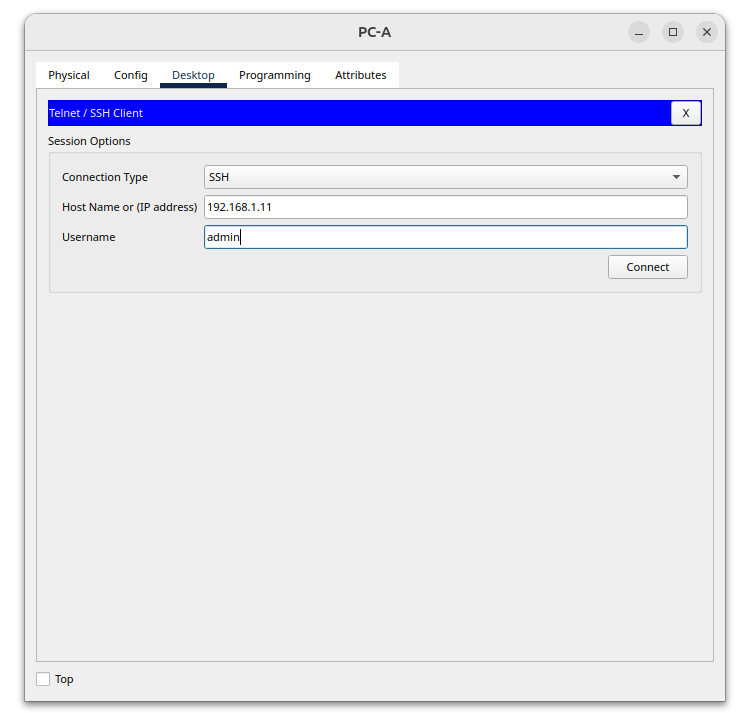

Удалось ли вам установить SSH-соединение с коммутатором?

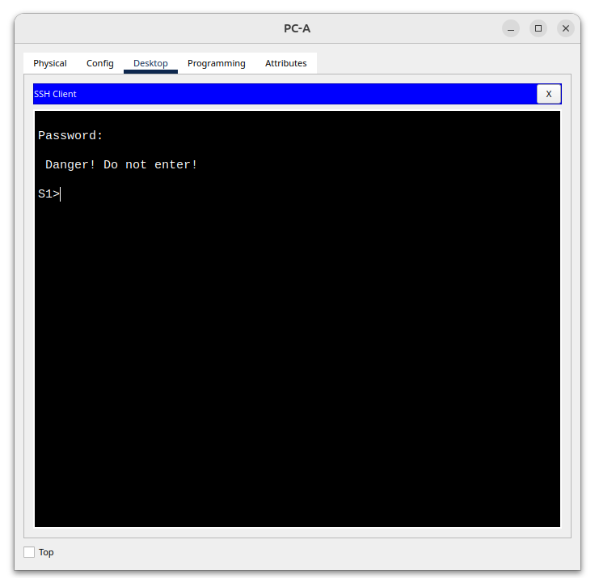

</details>

### Часть 4. Настройка протокола SSH с использованием интерфейса командной строки (CLI) коммутатора

<details>
<summary>Шаг 1. Посмотрите доступные параметры для клиента SSH в Cisco IOS</summary>

Откройте окно конфигурации Используйте вопросительный знак (?), чтобы отобразить варианты параметров для команды ssh.
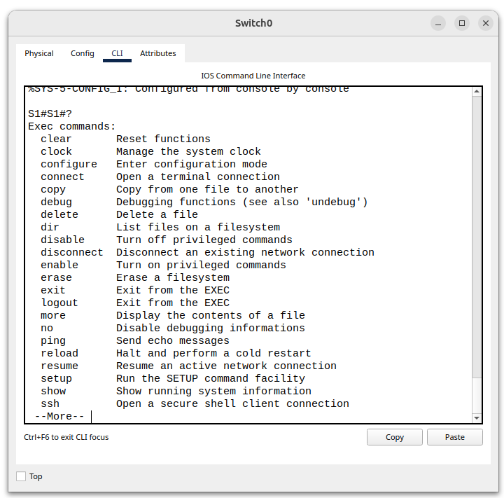

</details>

<details>
<summary>Шаг 2. Установите с коммутатора S1 соединение с маршрутизатором R1 по протоколу SSH</summary>

1. Чтобы подключиться к маршрутизатору R1 по протоколу SSH, введите команду
`ssh -l admin 192.168.1.1`. Это позволит вам войти в систему под именем admin. При появлении приглашения введите в качестве пароля `Adm1nP@55`.
``` Shell
ssh -l admin 192.168.1.1
```
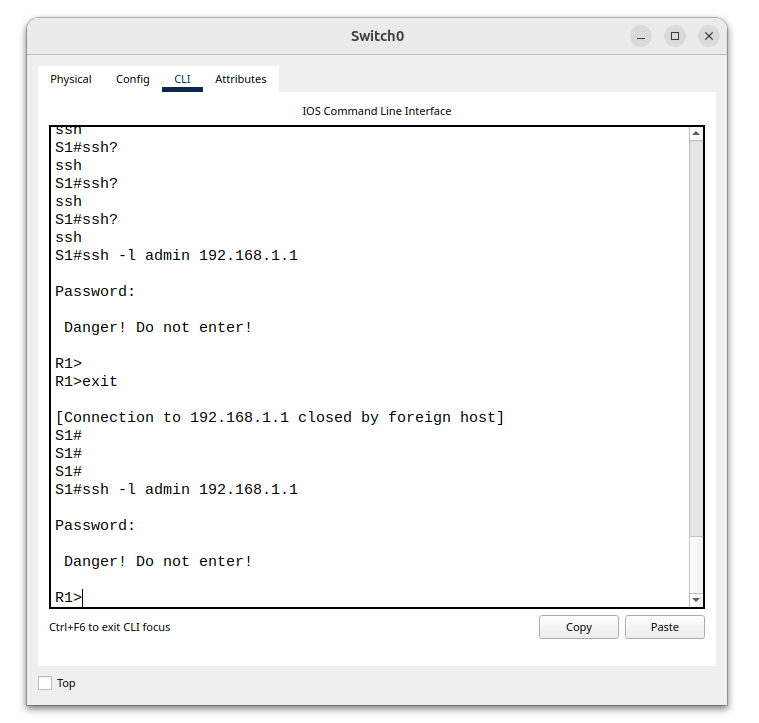

2. Чтобы вернуться к коммутатору S1, не закрывая сеанс SSH с маршрутизатором R1, нажмите комбинацию клавиш `Ctrl+Shift+6`. 
Отпустите клавиши `Ctrl+Shift+6` и нажмите x. Отображается приглашение привилегированного режима EXEC коммутатора.

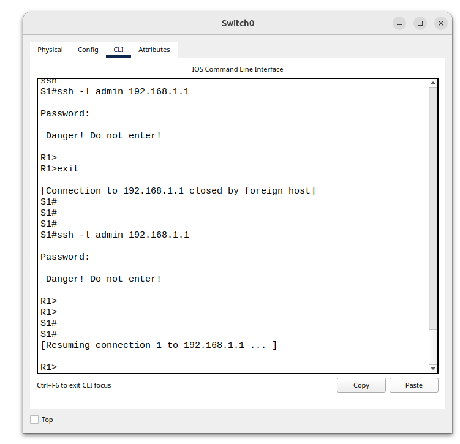


3. Чтобы вернуться к сеансу SSH на R1, нажмите клавишу `Enter` в пустой строке интерфейса командной строки. Чтобы увидеть окно командной строки маршрутизатора, нажмите клавишу `Enter` еще раз.

4. Чтобы завершить сеанс SSH на маршрутизаторе R1, введите в командной строке маршрутизатора команду exit.

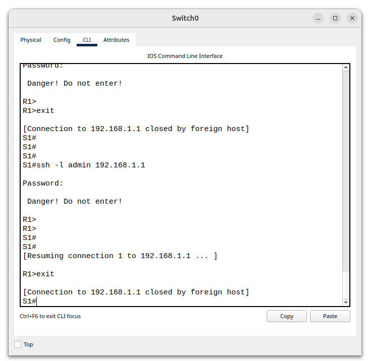

`Какие версии протокола SSH поддерживаются при использовании интерфейса командной строки?`

```Shell
Поддерживается версия 1 и версия 2
```

</details>

---

<details>
<summary>Вопрос для повторения</summary>

`Как предоставить доступ к сетевому устройству нескольким пользователям, у каждого из которых есть собственное имя пользователя?`
```Shell
Необходимо включить опцию обращения к локальной базе командой login local
```
</details>