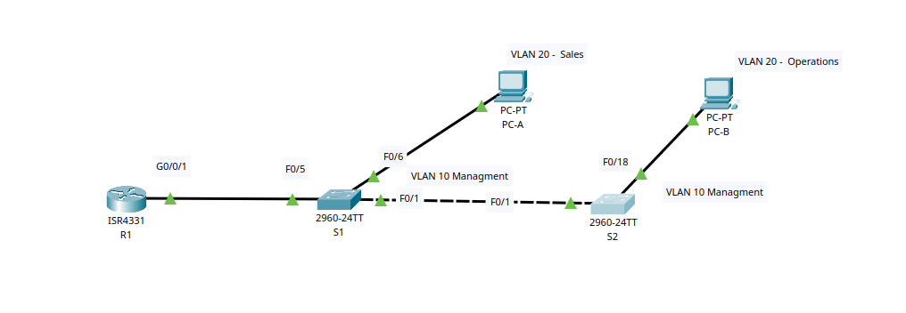
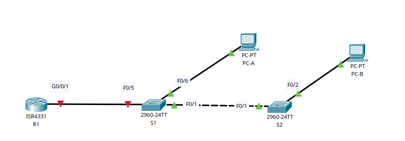
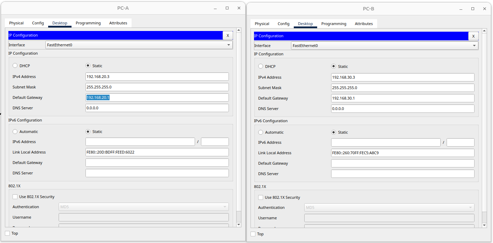

# Внедрение маршрутизации междувиртуальными локальными сетями

## Цель:

* Создание сети и настройка основных параметров устройства.
* Создание сетей VLAN и назначение портов коммутатора.
* Настройка транка 802.1Q между коммутаторами.
* Настройка маршрутизации между сетями VLAN.
* Проверка, что маршрутизация между VLAN работает.

## Описание/Пошаговая инструкция выполнения домашнего задания:

* В этой работе вы создадите VLAN на обоих коммутаторах в топологии, назначите VLAN для коммутации портов доступа,
  убедитесь, что VLAN работают должным образом, создадите транки VLAN между двумя коммутаторами и между S1 и R1, и
  настройте маршрутизацию между VLAN на R1 для разрешения связи между хостами в разных VLAN независимо от подсети, в
  которой находится хост.
* Подробное описание задания в методичке в материалах к занятию.
* Готовые конфигурации необходимо оформить на github с описанием проделанной работы, используя markdown.

---
<details>
<summary>Топология</summary>

[]

### Таблица адресации

| Устройство	 |  Интерфейс   |    IP-адрес    | 	Маска подсети	 | Шлюз по умолчанию |
|:-----------:|:------------:|:--------------:|:---------------:|:-----------------:|
|     R1	     |  G0/0/1.10	  | 192.168.10.1	  | 255.255.255.0	  |        —	         |
|      	      |  G0/0/1.20	  | 192.168.20.1	  | 255.255.255.0	  |        —	         |
|      	      |  G0/0/1.30	  | 192.168.30.1	  | 255.255.255.0	  |        —	         |
|      	      | G0/0/1.1000	 |      	—	       |       	—	       |        	—	        |
|     S1	     |   VLAN 10	   | 192.168.10.11	 | 255.255.255.0	  |   192.168.10.1	   |
|     S2	     |   VLAN 10	   | 192.168.10.12	 | 255.255.255.0	  |   192.168.10.1	   |
|    PC-A	    |     NIC	     | 192.168.20.3	  | 255.255.255.0	  |   192.168.20.1	   |
|    PC-B	    |     NIC	     | 192.168.30.3	  | 255.255.255.0	  |   192.168.30.1	   |

### Таблица VLAN

| VLAN  |    	Имя	     |                    Назначенный интерфейс                     |
|:-----:|:------------:|:------------------------------------------------------------:|
|  10	  | Управление	  |                 S1: VLAN 10 ,   S2: VLAN 10                  | 
|  20	  |    Sales	    |                           S1: F0/6                           |
|  30	  | Operations	  |                          S2: F0/18                           |
| 999	  | Parking_Lot	 | С1: F0/2-4, F0/7-24, G0/1-2 , С2:  F0/2-17, F0/19-24, G0/1-2 |
| 1000	 | Собственная	 |                              —                               |

</details>

#### Часть 1. Создание сети и настройка основных параметров устройства
В первой части лабораторной работы вам предстоит создать топологию сети и настроить базовые параметры для узлов ПК и коммутаторов.
<details>
<summary>Шаг 1. Создайте сеть согласно топологии.</summary>



</details>

<details>
<summary>Шаг 2. Настройте базовые параметры для маршрутизатора.</summary>

a. Подключитесь к маршрутизатору с помощью консоли и активируйте привилегированный режим EXEC. Откройте окно конфигурации  
b. Войдите в режим конфигурации.  
c. Назначьте маршрутизатору имя устройства.  
d. Отключите поиск DNS, чтобы предотвратить попытки маршрутизатора неверно преобразовывать введенные команды таким образом, как будто они являются именами узлов.  
e. Назначьте class в качестве зашифрованного пароля привилегированного режима EXEC.  
f. Назначьте cisco в качестве пароля консоли и включите вход в систему по паролю.  
g. Установите cisco в качестве пароля виртуального терминала и активируйте вход.  
h. Зашифруйте открытые пароли.  
i. Создайте баннер с предупреждением о запрете несанкционированного доступа к устройству.  
j. Сохраните текущую конфигурацию в файл загрузочной конфигурации.  

```Console
enable
configure terminal
hostname R1
no ip domain-lookup
enable secret class
line console 0
password class
login
exit
line vty 0 4
password cisco
login
exit
service password-encryption 
banner motd #
!!! Danger! Do not enter !!!
#
exit
clock set 13:35:00 Mar 02 2024
copy running-config startup-config
reload

```


</details>

<details>
<summary>Шаг 3. Настройте базовые параметры каждого коммутатора.</summary>

a. Присвойте коммутатору имя устройства.  
b. Отключите поиск DNS, чтобы предотвратить попытки маршрутизатора неверно преобразовывать введенные команды таким образом, как будто они являются именами узлов.  
c. Назначьте class в качестве зашифрованного пароля привилегированного режима EXEC.  
d. Назначьте cisco в качестве пароля консоли и включите вход в систему по паролю.  
e. Установите cisco в качестве пароля виртуального терминала и активируйте вход.  
f. Зашифруйте открытые пароли.  
g. Создайте баннер с предупреждением о запрете несанкционированного доступа к устройству.  
h. Настройте на коммутаторах время.  
i. Сохранение текущей конфигурации в качестве начальной.  

S1 / S2

```Console
enable
configure terminal
hostname S1 // S2
no ip domain-lookup
enable secret class
line console 0
password cisco
login
exit
line vty 0 4
password cisco
login
exit
service password-encryption 
banner motd #
!!! Danger! Do not enter !!!
#
exit
clock set 13:4:00 Mar 02 2024
copy running-config startup-config
reload
```


</details>

<details>
<summary>Шаг 4. Настройте узлы ПК.</summary>


</details>

#### Часть 2. Создание сетей VLAN и назначение портов коммутатора


<details>
<summary>Шаг 1. Создайте сети VLAN на коммутаторах.</summary>

a. Создайте и назовите необходимые VLAN на каждом коммутаторе из таблицы выше.  
b. Настройте интерфейс управления и шлюз по умолчанию на каждом коммутаторе, используя информацию об IP-адресе в таблице адресации.  
c. Назначьте все неиспользуемые порты коммутатора VLAN Parking_Lot, настройте их для статического режима доступа и административно деактивируйте их.  
**Примечание**. Команда interface range полезна для выполнения этой задачи с минимальным количеством команд.

S1
```Console

enable
configure terminal

interface vlan 10
vlan 10
name Managment
exit

interface vlan 10
ip address 192.168.10.11 255.255.255.0
exit
interface fastEthernet 0/1
switchport mode acc
switchport access vlan 10
exit

ip default-gateway 192.168.10.1

interface fastEthernet 0/6
switchport mode access 
switchport access vlan 20
exit

interface vlan 999
vlan 999
name Parking_Lot
exit

interface range fastEthernet 0/2-4, fastEthernet 0/7-24, gigabitEthernet 0/1-2
switchport mode access 
switchport access vlan 999
shutdown
exit

```

S2
```Console

enable
configure terminal

interface vlan 10
vlan 10
name Managment
exit

interface vlan 30
ip address 192.168.10.12 255.255.255.0
exit

interface fastEthernet 0/1
switchport mode acc
switchport access vlan 10
exit

ip default-gateway 192.168.10.1

interface vlan 30
vlan 30
name Operations
exit

interface fastEthernet 0/18
switchport mode access 
switchport access vlan 30
exit

interface vlan 999
vlan 999
name Parking_Lot
exit

interface range fastEthernet 0/2-17, fastEthernet 0/19-24, gigabitEthernet 0/1-2
switchport mode access 
switchport access vlan 999
shutdown
exit

```

</details>


<details>
<summary>Шаг 2. Назначьте сети VLAN соответствующим интерфейсам коммутатора.</summary>

a. Назначьте используемые порты соответствующей VLAN (указанной в таблице VLAN выше) и настройте их для режима статического доступа.  
b. Убедитесь, что VLAN назначены на правильные интерфейсы.  

S1

```Console
S1>show vlan

VLAN Name                             Status    Ports
---- -------------------------------- --------- -------------------------------
1    default                          active    Fa0/5
10   Managment                        active    Fa0/1
20   Sales                            active    Fa0/6
999  Parking_Lot                      active    Fa0/2, Fa0/3, Fa0/4, Fa0/7
                                                Fa0/8, Fa0/9, Fa0/10, Fa0/11
                                                Fa0/12, Fa0/13, Fa0/14, Fa0/15
                                                Fa0/16, Fa0/17, Fa0/18, Fa0/19
                                                Fa0/20, Fa0/21, Fa0/22, Fa0/23
                                                Fa0/24, Gig0/1, Gig0/2
1002 fddi-default                     active    
1003 token-ring-default               active    
1004 fddinet-default                  active    
1005 trnet-default                    active    

VLAN Type  SAID       MTU   Parent RingNo BridgeNo Stp  BrdgMode Trans1 Trans2
---- ----- ---------- ----- ------ ------ -------- ---- -------- ------ ------
1    enet  100001     1500  -      -      -        -    -        0      0
10   enet  100010     1500  -      -      -        -    -        0      0
20   enet  100020     1500  -      -      -        -    -        0      0
999  enet  100999     1500  -      -      -        -    -        0      0
1002 fddi  101002     1500  -      -      -        -    -        0      0   
1003 tr    101003     1500  -      -      -        -    -        0      0   
1004 fdnet 101004     1500  -      -      -        ieee -        0      0   
1005 trnet 101005     1500  -      -      -        ibm  -        0      0   

VLAN Type  SAID       MTU   Parent RingNo BridgeNo Stp  BrdgMode Trans1 Trans2
---- ----- ---------- ----- ------ ------ -------- ---- -------- ------ ------

Remote SPAN VLANs
------------------------------------------------------------------------------

Primary Secondary Type              Ports
------- --------- ----------------- ------------------------------------------
S1>
```

```Console
S2#show vlan

VLAN Name                             Status    Ports
---- -------------------------------- --------- -------------------------------
1    default                          active    
10   Managment                        active    Fa0/1
30   Operations                       active    Fa0/18
999  Parking_Lot                      active    Fa0/2, Fa0/3, Fa0/4, Fa0/5
                                                Fa0/6, Fa0/7, Fa0/8, Fa0/9
                                                Fa0/10, Fa0/11, Fa0/12, Fa0/13
                                                Fa0/14, Fa0/15, Fa0/16, Fa0/17
                                                Fa0/19, Fa0/20, Fa0/21, Fa0/22
                                                Fa0/23, Fa0/24, Gig0/1, Gig0/2
1002 fddi-default                     active    
1003 token-ring-default               active    
1004 fddinet-default                  active    
1005 trnet-default                    active    

VLAN Type  SAID       MTU   Parent RingNo BridgeNo Stp  BrdgMode Trans1 Trans2
---- ----- ---------- ----- ------ ------ -------- ---- -------- ------ ------
1    enet  100001     1500  -      -      -        -    -        0      0
10   enet  100010     1500  -      -      -        -    -        0      0
30   enet  100030     1500  -      -      -        -    -        0      0
999  enet  100999     1500  -      -      -        -    -        0      0
1002 fddi  101002     1500  -      -      -        -    -        0      0   
1003 tr    101003     1500  -      -      -        -    -        0      0   
1004 fdnet 101004     1500  -      -      -        ieee -        0      0   
1005 trnet 101005     1500  -      -      -        ibm  -        0      0   

VLAN Type  SAID       MTU   Parent RingNo BridgeNo Stp  BrdgMode Trans1 Trans2
---- ----- ---------- ----- ------ ------ -------- ---- -------- ------ ------

Remote SPAN VLANs
------------------------------------------------------------------------------

Primary Secondary Type              Ports
------- --------- ----------------- ------------------------------------------
S2#

```

</details>


#### Часть 3. Конфигурация магистрального канала стандарта 802.1Q между коммутаторами

<details>
<summary>Шаг 1. Вручную настройте магистральный интерфейс F0/1 на коммутаторах S1 и S2.</summary>

a.  Настройка статического транкинга на интерфейсе F0/1 для обоих коммутаторов. Откройте окноконфигурации  
b.  Установите native VLAN 1000 на обоих коммутаторах.  
c.  Укажите, что VLAN 10, 20, 30 и 1000 могут проходить по транку.    
d.  Проверьте транки, native VLAN и разрешенные VLAN через транк

S1
```Console
enable
configure terminal
interface F0/1
switchport mode trunk
exit

vlan 1000
name NATIVE
exit

interface F0/1
switchport trunk allowed vlan 10,20,30,1000
exit

```
S2

```Console
enable
configure terminal
interface F0/1
switchport mode trunk
exit

vlan 1000
name NATIVE
exit

interface F0/1
switchport trunk allowed vlan 30,1000
exit

```

S1
```Console

S1(config)#do show vlan

VLAN Name                             Status    Ports
---- -------------------------------- --------- -------------------------------
1    default                          active    Fa0/5
10   Managment                        active    
20   Sales                            active    Fa0/6
999  Parking_Lot                      active    Fa0/2, Fa0/3, Fa0/4, Fa0/7
                                                Fa0/8, Fa0/9, Fa0/10, Fa0/11
                                                Fa0/12, Fa0/13, Fa0/14, Fa0/15
                                                Fa0/16, Fa0/17, Fa0/18, Fa0/19
                                                Fa0/20, Fa0/21, Fa0/22, Fa0/23
                                                Fa0/24, Gig0/1, Gig0/2
1000 NATIVE                           active    
1002 fddi-default                     active    
1003 token-ring-default               active    
1004 fddinet-default                  active    
1005 trnet-default                    active    

VLAN Type  SAID       MTU   Parent RingNo BridgeNo Stp  BrdgMode Trans1 Trans2
---- ----- ---------- ----- ------ ------ -------- ---- -------- ------ ------
1    enet  100001     1500  -      -      -        -    -        0      0
10   enet  100010     1500  -      -      -        -    -        0      0
20   enet  100020     1500  -      -      -        -    -        0      0
999  enet  100999     1500  -      -      -        -    -        0      0
1000 enet  101000     1500  -      -      -        -    -        0      0
1002 fddi  101002     1500  -      -      -        -    -        0      0   
1003 tr    101003     1500  -      -      -        -    -        0      0   
1004 fdnet 101004     1500  -      -      -        ieee -        0      0   
1005 trnet 101005     1500  -      -      -        ibm  -        0      0   

VLAN Type  SAID       MTU   Parent RingNo BridgeNo Stp  BrdgMode Trans1 Trans2
---- ----- ---------- ----- ------ ------ -------- ---- -------- ------ ------

Remote SPAN VLANs
------------------------------------------------------------------------------

Primary Secondary Type              Ports
------- --------- ----------------- ------------------------------------------
S1(config)#
```

S2
```Console
S2(config)#do show vlan

VLAN Name                             Status    Ports
---- -------------------------------- --------- -------------------------------
1    default                          active    
10   Managment                        active    
30   Operations                       active    Fa0/18
999  Parking_Lot                      active    Fa0/2, Fa0/3, Fa0/4, Fa0/5
                                                Fa0/6, Fa0/7, Fa0/8, Fa0/9
                                                Fa0/10, Fa0/11, Fa0/12, Fa0/13
                                                Fa0/14, Fa0/15, Fa0/16, Fa0/17
                                                Fa0/19, Fa0/20, Fa0/21, Fa0/22
                                                Fa0/23, Fa0/24, Gig0/1, Gig0/2
1000 NATIVE                           active    
1002 fddi-default                     active    
1003 token-ring-default               active    
1004 fddinet-default                  active    
1005 trnet-default                    active    

VLAN Type  SAID       MTU   Parent RingNo BridgeNo Stp  BrdgMode Trans1 Trans2
---- ----- ---------- ----- ------ ------ -------- ---- -------- ------ ------
1    enet  100001     1500  -      -      -        -    -        0      0
10   enet  100010     1500  -      -      -        -    -        0      0
30   enet  100030     1500  -      -      -        -    -        0      0
999  enet  100999     1500  -      -      -        -    -        0      0
1000 enet  101000     1500  -      -      -        -    -        0      0
1002 fddi  101002     1500  -      -      -        -    -        0      0   
1003 tr    101003     1500  -      -      -        -    -        0      0   
1004 fdnet 101004     1500  -      -      -        ieee -        0      0   
1005 trnet 101005     1500  -      -      -        ibm  -        0      0   

VLAN Type  SAID       MTU   Parent RingNo BridgeNo Stp  BrdgMode Trans1 Trans2
---- ----- ---------- ----- ------ ------ -------- ---- -------- ------ ------

Remote SPAN VLANs
------------------------------------------------------------------------------

Primary Secondary Type              Ports
------- --------- ----------------- ------------------------------------------
S2(config)#
```


</details>

<details>
<summary>Шаг 2. Вручную настройте магистральный интерфейс F0/5 на коммутаторе S1</summary>

a. Настройте интерфейс S1 F0/5 с теми же параметрами транка, что и F0/1. Это транк до маршрутизатора.
b. Сохраните текущую конфигурацию в файл загрузочной конфигурации.
c. Проверка транкинга.

```Console
interface fastEthernet 0/5
no shutdown
switchport mode trunk
switchport trunk native vlan 1000
switchport trunk allowed vlan 10,20,30,1000

```
S1
```Console
S2#show interfaces trunk 
Port        Mode         Encapsulation  Status        Native vlan
Fa0/1       on           802.1q         trunking      1000

Port        Vlans allowed on trunk
Fa0/1       10,20,30,1000

Port        Vlans allowed and active in management domain
Fa0/1       10,30,1000

Port        Vlans in spanning tree forwarding state and not pruned
Fa0/1       10,30,1000


```

S2
```Console
S2#show interfaces trunk
Port        Mode         Encapsulation  Status        Native vlan
Fa0/1       on           802.1q         trunking      1000

Port        Vlans allowed on trunk
Fa0/1       10,20,30,1000

Port        Vlans allowed and active in management domain
Fa0/1       10,30,1000

Port        Vlans in spanning tree forwarding state and not pruned
Fa0/1       10,30,1000
```
</details>

<details>
<summary>Вопрос: Что произойдет, если G0/0/1 на R1 будет отключен?</summary>
Интерфейс F0/5 на S1 будет в состоянии "down" и не отобразится в "show interfaces trunk"
</details>


#### Часть 4. Настройка маршрутизации между сетями VLAN

<details>
<summary>Шаг 1. Настройте маршрутизатор</summary>

a. При необходимости активируйте интерфейс G0/0/1 на маршрутизаторе.  
b. Настройте подинтерфейсы для каждой VLAN, как указано в таблице IP-адресации. Все подинтерфейсы используют инкапсуляцию 802.1Q. Убедитесь, что подинтерфейсу для native VLAN не назначен IP-адрес. Включите описание для каждого подинтерфейса.  
c. Убедитесь, что вспомогательные интерфейсы работают  

```Console

enable
configure terminal
interface  gigabitEthernet 0/0/1.10
encapsulation dot1Q  10
ip address 192.168.10.1 255.255.255.0
description Managment
no shut
exit

interface  gigabitEthernet 0/0/1.20
encapsulation dot1Q  20
ip address 192.168.20.1 255.255.255.0
description Sales
no shut
exit

interface  gigabitEthernet 0/0/1.30
encapsulation dot1Q  30
ip address 192.168.30.1 255.255.255.0
description Operations
no shut
exit

interface  gigabitEthernet 0/0/1.1000
encapsulation dot1Q  1000
description NATIVE
no shut
exit

interface  gigabitEthernet 0/0/1
no shut
exit

```

```Console
R1#show ip interface brief
Interface              IP-Address      OK? Method Status                Protocol 
GigabitEthernet0/0/0   unassigned      YES NVRAM  administratively down down 
GigabitEthernet0/0/1   unassigned      YES NVRAM  up                    up 
GigabitEthernet0/0/1.10192.168.10.1    YES manual up                    up 
GigabitEthernet0/0/1.20192.168.20.1    YES manual up                    up 
GigabitEthernet0/0/1.30192.168.30.1    YES manual up                    up 
GigabitEthernet0/0/1.1000unassigned      YES unset  up                    up 
GigabitEthernet0/0/2   unassigned      YES NVRAM  administratively down down 
Vlan1                  unassigned      YES unset  administratively down down

```

</details>

#### Часть 5. Проверка, что маршрутизация между VLAN работает

<details>
<summary>Шаг 1. Выполните следующие тесты с PC-A. Все должно быть успешно.</summary>

a. Отправьте эхо-запрос с PC-A на шлюз по умолчанию.  


```Console
C:\>ping 192.168.10.1

Pinging 192.168.10.1 with 32 bytes of data:

Reply from 192.168.10.1: bytes=32 time=8ms TTL=255
Reply from 192.168.10.1: bytes=32 time<1ms TTL=255
Reply from 192.168.10.1: bytes=32 time<1ms TTL=255
Reply from 192.168.10.1: bytes=32 time<1ms TTL=255

Ping statistics for 192.168.10.1:
    Packets: Sent = 4, Received = 4, Lost = 0 (0% loss),
Approximate round trip times in milli-seconds:
    Minimum = 0ms, Maximum = 8ms, Average = 2ms

C:\>
```

b. Отправьте эхо-запрос с PC-A на PC-B.  

``` Console

C:\>ping 192.168.30.3

Pinging 192.168.30.3 with 32 bytes of data:

Reply from 192.168.30.3: bytes=32 time<1ms TTL=255
Reply from 192.168.30.3: bytes=32 time<1ms TTL=255
Reply from 192.168.30.3: bytes=32 time<1ms TTL=255
^C
```

c. Отправьте команду ping с компьютера PC-A на коммутатор S2.

``` Console

C:\>ping 192.168.10.12

Pinging 192.168.10.12 with 32 bytes of data:

Reply from 192.168.10.12: bytes=32 time<1ms TTL=254
Reply from 192.168.10.12: bytes=32 time<1ms TTL=254
Reply from 192.168.10.12: bytes=32 time<1ms TTL=254
Reply from 192.168.10.12: bytes=32 time<1ms TTL=254

Ping statistics for 192.168.10.12:
    Packets: Sent = 4, Received = 4, Lost = 0 (0% loss),
Approximate round trip times in milli-seconds:
    Minimum = 0ms, Maximum = 0ms, Average = 0ms

C:\>
```
</details>

<details>
<summary>Шаг 2. Пройдите следующий тест с PC-B</summary>

```Console
C:\>tracert 192.168.20.3

Tracing route to 192.168.20.3 over a maximum of 30 hops: 

  1   2 ms      0 ms      1 ms      192.168.30.1
  1   2 ms      0 ms      0 ms      192.168.20.3
  
Trace complete.

```

Вопрос:Какие промежуточные IP-адреса отображаются в результатах?
2 адреса 192.168.30.1 192.168.20.3

</details>

