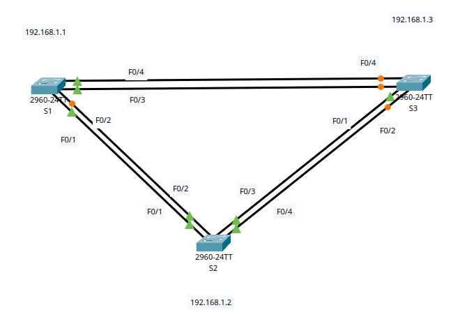
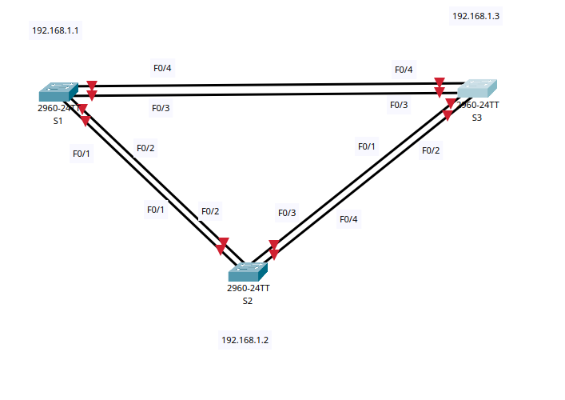
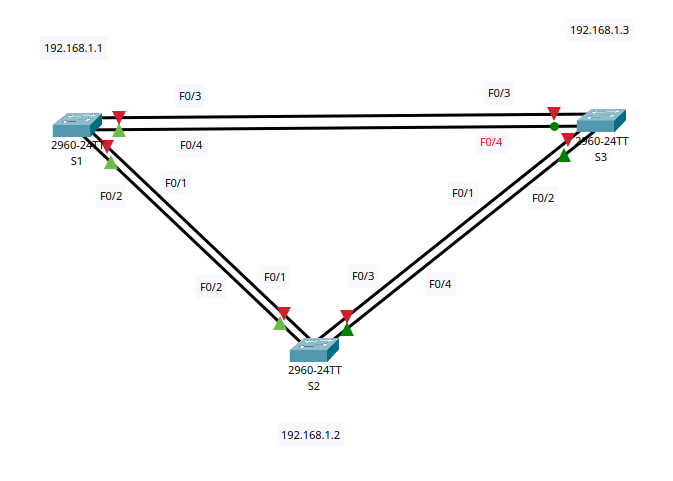
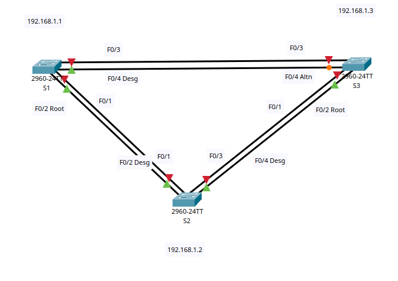
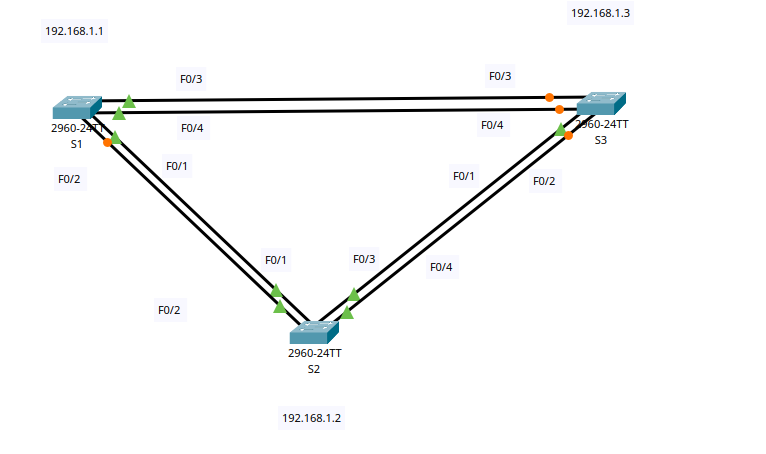

# Развертывание коммутируемой сети с резервными каналами (STP)

## Цель:

* Создание сети и настройка основных параметров устройства.
* Выбор корневого моста.
* Наблюдение за процессом выбора протоколом STP порта, исходя из стоимости портов.
* Наблюдение за процессом выбора протоколом STP порта, исходя из приоритета портов.

## Описание/Пошаговая инструкция выполнения домашнего задания:

* Ваша задача заключается настройке, изменениях параметров STP и наблюдением за процессом выбора портов с учетом
  стоимости и приоритета.
* Подробное описание задания в методичке в материалах к занятию.
* Готовые конфигурации необходимо оформить на github с описанием проделанной работы, используя markdown.

---

<details>
<summary>Топология</summary>




</details>


<details>
<summary>Таблица маршрутизации</summary>

| Устройство | Интерфейс |  IP-адрес   | Маска подсети |
|:----------:|:---------:|:-----------:|:-------------:|
|     S1     |  VLAN 1   | 192.168.1.1 | 255.255.255.0 |
|     S2     |  VLAN 1   | 192.168.1.2 | 255.255.255.0 |
|     S3     |  VLAN 1   | 192.168.1.3 | 255.255.255.0 |  

</details>

#### Часть 1. Создание сети и настройка основных параметров устройства

<details> <summary>
 Шаг 1: Создайте сеть согласно топологии.
</summary>
Подключите устройства, как показано в топологии, и подсоедините необходимые кабели.


</details>


<details> <summary>
Шаг 2: Выполните инициализацию и перезагрузку коммутаторов.
</summary>
</details>


<details> <summary>
Шаг 3: Настройте базовые параметры каждого коммутатора.
</summary>

```Console

enable
configure terminal
hostname S1 // S2 // S3
no ip domain-lookup
enable secret class
line console 0
password cisco
login
logging synchronous  
exit
line vty 0 4
password cisco
login
exit

banner motd #
!!! Danger! Do not enter !!!
#
interface vlan 1  
ip address 192.168.1.1 255.255.255.0  // 192.168.1.2 255.255.255.0 // 192.168.1.3 255.255.255.0
no shutdown  
exit  
 
exit
copy running-config startup-config
reload

```

</details>


<details> <summary>
Шаг 4: Проверьте связь.
</summary>

Проверьте способность компьютеров обмениваться эхо-запросами.

Успешно ли выполняется эхо-запрос от коммутатора S1 на коммутатор S2?

```Console
S1>ping 192.168.1.2

Type escape sequence to abort.
Sending 5, 100-byte ICMP Echos to 192.168.1.2, timeout is 2 seconds:
..!!!
Success rate is 60 percent (3/5), round-trip min/avg/max = 0/0/0 ms

```

Да

Успешно ли выполняется эхо-запрос от коммутатора S1 на коммутатор S3?

```Console  
S1>ping 192.168.1.3

Type escape sequence to abort.
Sending 5, 100-byte ICMP Echos to 192.168.1.3, timeout is 2 seconds:
..!!!
Success rate is 60 percent (3/5), round-trip min/avg/max = 0/0/0 ms

```

Да

Успешно ли выполняется эхо-запрос от коммутатора S2 на коммутатор S3?

```Console
S2>ping 192.168.1.3

Type escape sequence to abort.
Sending 5, 100-byte ICMP Echos to 192.168.1.3, timeout is 2 seconds:
..!!!
Success rate is 60 percent (3/5), round-trip min/avg/max = 0/0/0 ms

```

Да

Выполняйте отладку до тех пор, пока ответы на все вопросы не будут положительными.

</details>

#### Часть 2. Выбор корневого моста

<details> <summary> Шаг 1: Отключите все порты на коммутаторах.</summary> 

```Console
// S1 // S2 // S3
enable
configure terminal
interface range fastEthernet 0/1-4
shutdown
exit

```



</details>
<details> <summary> Шаг 2: Настройте подключенные порты в качестве транковых.
</summary> 

```Console
// S1 // S2 // S3
interface range fastEthernet 0/1-4
switchport mode trunk
switchport trunk allowed vlan 1
exit
```

</details>
<details> <summary> Шаг 3: Включите порты F0/2 и F0/4 на всех коммутаторах.
</summary>

```Console
// S1 // S2 // S3
interface range fastEthernet 0/2 , fastEthernet 0/4
no shutdown
exit

```



</details>
<details> <summary> Шаг 4: Отобразите данные протокола spanning-tree. </summary>

S1

```Console
S1#show spanning-tree 
VLAN0001
  Spanning tree enabled protocol ieee
  Root ID    Priority    32769
             Address     000A.F350.7B9B
             Cost        19
             Port        2(FastEthernet0/2)
             Hello Time  2 sec  Max Age 20 sec  Forward Delay 15 sec

  Bridge ID  Priority    32769  (priority 32768 sys-id-ext 1)
             Address     0060.5CEA.A302
             Hello Time  2 sec  Max Age 20 sec  Forward Delay 15 sec
             Aging Time  20

Interface        Role Sts Cost      Prio.Nbr Type
---------------- ---- --- --------- -------- --------------------------------
Fa0/2            Root FWD 19        128.2    P2p
Fa0/4            Desg FWD 19        128.4    P2p
```

S2

```Console
S2#show spanning-tree 
VLAN0001
  Spanning tree enabled protocol ieee
  Root ID    Priority    32769
             Address     000A.F350.7B9B
             This bridge is the root
             Hello Time  2 sec  Max Age 20 sec  Forward Delay 15 sec

 Bridge ID  Priority    32769  (priority 32768 sys-id-ext 1)
             Address     000A.F350.7B9B
             Hello Time  2 sec  Max Age 20 sec  Forward Delay 15 sec
             Aging Time  20

Interface        Role Sts Cost      Prio.Nbr Type
---------------- ---- --- --------- -------- --------------------------------
Fa0/4            Desg FWD 19        128.4    P2p
Fa0/2            Desg FWD 19        128.2    P2p

```

S3

```Console
S3#show spanning-tree 
VLAN0001
  Spanning tree enabled protocol ieee
  Root ID    Priority    32769
             Address     000A.F350.7B9B
             Cost        19
             Port        2(FastEthernet0/2)
             Hello Time  2 sec  Max Age 20 sec  Forward Delay 15 sec

  Bridge ID  Priority    32769  (priority 32768 sys-id-ext 1)
             Address     00E0.A379.9838
             Hello Time  2 sec  Max Age 20 sec  Forward Delay 15 sec
             Aging Time  20

Interface        Role Sts Cost      Prio.Nbr Type
---------------- ---- --- --------- -------- --------------------------------
Fa0/4            Altn BLK 19        128.4    P2p
Fa0/2            Root FWD 19        128.2    P2p
```

В схему ниже запишите роль и состояние (Sts) активных портов на каждом коммутаторе в топологии.



`Какой коммутатор является корневым мостом?`

S2

`Почему этот коммутатор был выбран протоколом spanning-tree в качестве корневого моста?`

Корневой мост выбирается по с самым низким BID (Root ID). Но поскольку данный параметр не редактировался, то на всех
коммутаторах он одинаковый, и корневой мост выбран по минимальному MAC адресу (000A.F350.7B9B).

`Какие порты на коммутаторе являются корневыми портами?`

S1 : F0/2    
S2 : F0/2

`Какие порты на коммутаторе являются назначенными портами?`

S1 F0/1  
S2 F0/2 F0/4

`Какой порт отображается в качестве альтернативного и в настоящее время заблокирован?`

S3 F0/4

`Почему протокол spanning-tree выбрал этот порт в качестве невыделенного (заблокированного) порта?`

Данный порт не был выбран в качестве корневого или назначенного порта. Т.к. в сумме параметров (приоритета , стоимости)
данный порт является наихудшим.

</details>
---

#### Часть 3. Наблюдение за процессом выбора протоколом STP порта, исходя из стоимости портов

<details><summary>Шаг 1: Определите коммутатор с заблокированным портом.</summary>

```Console
S3>show spanning-tree 
/// ommited ///
Fa0/4            Altn BLK 19        128.4    P2p
```

*S3* - это коммутатор с заблокированным портом.

</details>

<details><summary>Шаг 2: Измените стоимость порта.</summary>

*S3*

```Console
enable
conf t
int Fa0/2
spanning-tree vlan 1 cost 18
exit

```

</details>
<details><summary>Шаг 3: Просмотрите изменения протокола spanning-tree.</summary>

```Console
S1>show spanning-tree 
VLAN0001
  Spanning tree enabled protocol ieee
  Root ID    Priority    32769
             Address     000A.F350.7B9B
             Cost        19
             Port        2(FastEthernet0/2)
             Hello Time  2 sec  Max Age 20 sec  Forward Delay 15 sec

  Bridge ID  Priority    32769  (priority 32768 sys-id-ext 1)
             Address     0060.5CEA.A302
             Hello Time  2 sec  Max Age 20 sec  Forward Delay 15 sec
             Aging Time  20

Interface        Role Sts Cost      Prio.Nbr Type
---------------- ---- --- --------- -------- --------------------------------
Fa0/2            Root FWD 19        128.2    P2p
Fa0/4            Altn BLK 19        128.4    P2p
```

```Console
S2>show spanning-tree 
VLAN0001
  Spanning tree enabled protocol ieee
  Root ID    Priority    32769
             Address     000A.F350.7B9B
             This bridge is the root
             Hello Time  2 sec  Max Age 20 sec  Forward Delay 15 sec

  Bridge ID  Priority    32769  (priority 32768 sys-id-ext 1)
             Address     000A.F350.7B9B
             Hello Time  2 sec  Max Age 20 sec  Forward Delay 15 sec
             Aging Time  20

Interface        Role Sts Cost      Prio.Nbr Type
---------------- ---- --- --------- -------- --------------------------------
Fa0/4            Desg FWD 19        128.4    P2p
Fa0/2            Desg FWD 19        128.2    P2p

```

```Console
S3#show spanning-tree 
VLAN0001
  Spanning tree enabled protocol ieee
  Root ID    Priority    32769
             Address     000A.F350.7B9B
             Cost        18
             Port        2(FastEthernet0/2)
             Hello Time  2 sec  Max Age 20 sec  Forward Delay 15 sec

  Bridge ID  Priority    32769  (priority 32768 sys-id-ext 1)
             Address     00E0.A379.9838
             Hello Time  2 sec  Max Age 20 sec  Forward Delay 15 sec
             Aging Time  20

Interface        Role Sts Cost      Prio.Nbr Type
---------------- ---- --- --------- -------- --------------------------------
Fa0/2            Root FWD 18        128.2    P2p
Fa0/4            Desg FWD 19        128.4    P2p
```

`Почему протокол spanning-tree заменяет ранее заблокированный порт на назначенный порт и блокирует порт, который был назначенным портом на другом коммутаторе?`

Потому что стоимость пути до него становится меньшей и он становится более приоритетным.

</details>
<details><summary>Часть 4: Наблюдение за процессом выбора протоколом STP порта, исходя из приоритета портов</summary>

*S3*

```Console
enable
conf t
int Fa0/2
no spanning-tree vlan 1 cost 18
exit

```

S1

```Console
S1>show spanning-tree 
VLAN0001
  Spanning tree enabled protocol ieee
  Root ID    Priority    32769
             Address     000A.F350.7B9B
             Cost        19
             Port        2(FastEthernet0/2)
             Hello Time  2 sec  Max Age 20 sec  Forward Delay 15 sec

  Bridge ID  Priority    32769  (priority 32768 sys-id-ext 1)
             Address     0060.5CEA.A302
             Hello Time  2 sec  Max Age 20 sec  Forward Delay 15 sec
             Aging Time  20

Interface        Role Sts Cost      Prio.Nbr Type
---------------- ---- --- --------- -------- --------------------------------
Fa0/2            Root FWD 19        128.2    P2p
Fa0/4            Desg FWD 19        128.4    P2p
```

S2

```Console
S2>show spanning-tree
VLAN0001
  Spanning tree enabled protocol ieee
  Root ID    Priority    32769
             Address     000A.F350.7B9B
             This bridge is the root
             Hello Time  2 sec  Max Age 20 sec  Forward Delay 15 sec

  Bridge ID  Priority    32769  (priority 32768 sys-id-ext 1)
             Address     000A.F350.7B9B
             Hello Time  2 sec  Max Age 20 sec  Forward Delay 15 sec
             Aging Time  20

Interface        Role Sts Cost      Prio.Nbr Type
---------------- ---- --- --------- -------- --------------------------------
Fa0/4            Desg FWD 19        128.4    P2p
Fa0/2            Desg FWD 19        128.2    P2p
```

S3

```Console
S3#show spanning-tree
VLAN0001
  Spanning tree enabled protocol ieee
  Root ID    Priority    32769
             Address     000A.F350.7B9B
             Cost        19
             Port        2(FastEthernet0/2)
             Hello Time  2 sec  Max Age 20 sec  Forward Delay 15 sec

  Bridge ID  Priority    32769  (priority 32768 sys-id-ext 1)
             Address     00E0.A379.9838
             Hello Time  2 sec  Max Age 20 sec  Forward Delay 15 sec
             Aging Time  20

Interface        Role Sts Cost      Prio.Nbr Type
---------------- ---- --- --------- -------- --------------------------------
Fa0/2            Root FWD 19        128.2    P2p
Fa0/4            Altn BLK 19        128.4    P2p
```

</details>

#### Часть 4. Наблюдение за процессом выбора протоколом STP порта, исходя из приоритета портов

<details><summary>Перевыборы</summary>

```Console
// S1 // S2 // S3
interface range fastEthernet 0/1 , fastEthernet 0/3
no shutdown
exit
```



S1

```Console

S1#show spanning-tree
VLAN0001
  Spanning tree enabled protocol ieee
  Root ID    Priority    32769
             Address     000A.F350.7B9B
             Cost        19
             Port        1(FastEthernet0/1)
             Hello Time  2 sec  Max Age 20 sec  Forward Delay 15 sec

  Bridge ID  Priority    32769  (priority 32768 sys-id-ext 1)
             Address     0060.5CEA.A302
             Hello Time  2 sec  Max Age 20 sec  Forward Delay 15 sec
             Aging Time  20

Interface        Role Sts Cost      Prio.Nbr Type
---------------- ---- --- --------- -------- --------------------------------
Fa0/3            Desg FWD 19        128.3    P2p
Fa0/1            Root FWD 19        128.1    P2p
Fa0/2            Altn BLK 19        128.2    P2p
Fa0/4            Desg FWD 19        128.4    P2p
```

S2

```Console
S2#show spanning-tree
VLAN0001
  Spanning tree enabled protocol ieee
  Root ID    Priority    32769
             Address     000A.F350.7B9B
             This bridge is the root
             Hello Time  2 sec  Max Age 20 sec  Forward Delay 15 sec

  Bridge ID  Priority    32769  (priority 32768 sys-id-ext 1)
             Address     000A.F350.7B9B
             Hello Time  2 sec  Max Age 20 sec  Forward Delay 15 sec
             Aging Time  20

Interface        Role Sts Cost      Prio.Nbr Type
---------------- ---- --- --------- -------- --------------------------------
Fa0/4            Desg FWD 19        128.4    P2p
Fa0/1            Desg FWD 19        128.1    P2p
Fa0/2            Desg FWD 19        128.2    P2p
Fa0/3            Desg FWD 19        128.3    P2p
```

S3

```Console
S3#show spanning-tree
VLAN0001
  Spanning tree enabled protocol ieee
  Root ID    Priority    32769
             Address     000A.F350.7B9B
             Cost        19
             Port        1(FastEthernet0/1)
             Hello Time  2 sec  Max Age 20 sec  Forward Delay 15 sec

  Bridge ID  Priority    32769  (priority 32768 sys-id-ext 1)
             Address     00E0.A379.9838
             Hello Time  2 sec  Max Age 20 sec  Forward Delay 15 sec
             Aging Time  20

Interface        Role Sts Cost      Prio.Nbr Type
---------------- ---- --- --------- -------- --------------------------------
Fa0/1            Root FWD 19        128.1    P2p
Fa0/2            Altn BLK 19        128.2    P2p
Fa0/3            Altn BLK 19        128.3    P2p
Fa0/4            Altn BLK 19        128.4    P2p
```

`Какой порт выбран протоколом STP в качестве порта корневого моста на каждом коммутаторе некорневого моста?`

На коммутаторе S1 выбран порт F0/1, на коммутаторе S3 порт F0/1.

`Почему протокол STP выбрал эти порты в качестве портов корневого моста на этих коммутаторах?`

Так как стоимости интерфейсов равны, эти порты были выбраны из-за наименьшего номера порта.

</details>

#### Вопросы для повторения

<details><summary>Какое значение протокол STP использует первым после выбора корневого моста, чтобы определить выбор порта?</summary>

Протокол STP (Spanning Tree Protocol) использует значение Bridge ID (BID) первым после выбора корневого моста, чтобы
определить выбор порта. Bridge ID состоит из двух частей: приоритета моста и MAC-адреса моста. После выбора корневого
моста, остальные мосты в сети выбирают порт, основываясь на их BID. Обычно порт с наименьшим значением BID становится
предпочтительным портом для прохождения трафика к корневому мосту.
</details>
<details><summary>Если первое значение на двух портах одинаково, какое следующее значение будет использовать протокол STP при выборе порта?</summary>

Если первые значения на двух портах одинаковы, протокол STP будет использовать значение порта с наименьшим стоимостным
путем к корневому мосту для выбора порта. Стоимость пути рассчитывается на основе затрат на прохождение через каждый
сегмент сети, так что порт с более низкой общей стоимостью пути будет выбран в качестве предпочтительного порта.
</details>
<details><summary>Если оба значения на двух портах равны, каким будет следующее значение, которое использует протокол STP при выборе порта?</summary>

Если оба значения на двух портах равны, то следующим значением, которое протокол STP использует при выборе порта,
является MAC-адрес коммутатора (Bridge ID). Если стоимость пути к корневому мосту и приоритет портов одинаковы, то порт
с более низким MAC-адресом будет предпочтительным.
</details>

---