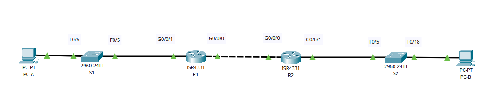
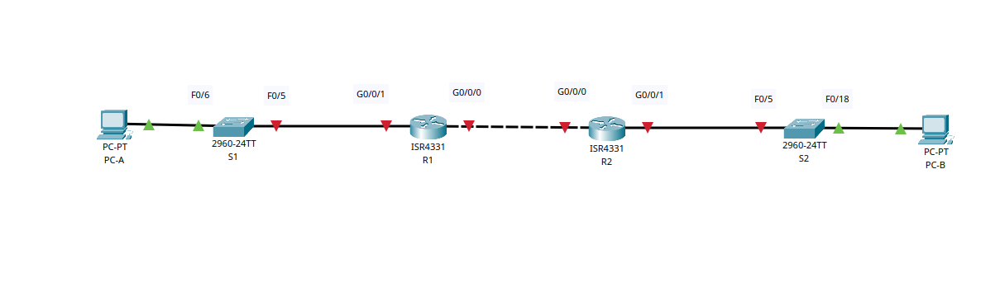
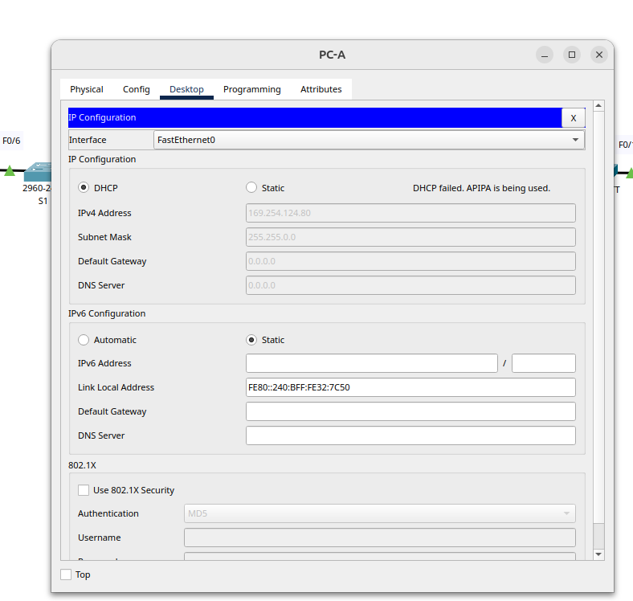
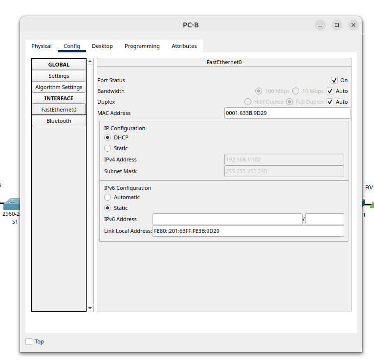
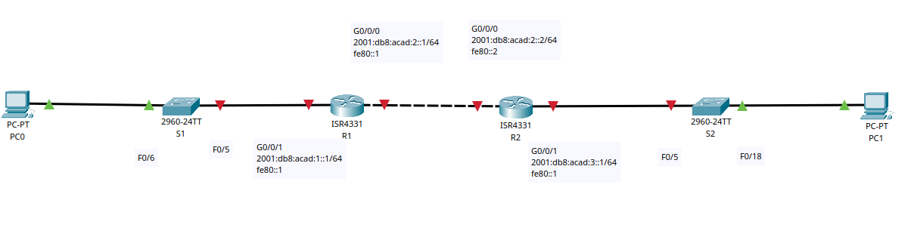

# Реализация DHCPv4/6

## Цель:

* Настройка и проверка двух серверов DHCPv4.
* Настройка и проверка DHCP-ретрансляции.
* Проверка назначения адреса SLAAC.
* Настройка и проверка DHCPv6.

## Описание/Пошаговая инструкция выполнения домашнего задания:

* Ваша задача заключается в настройке маршрутизатора R2 для назначения IPv4-адресов в двух разных подсетях.
* Настроить маршрутизатор R2 для назначения адресов IPv6 в двух разных подсетях, подключенных к маршрутизатору R1.
* Подробное описание задания в методичках в материалах к занятию.
* Готовые конфигурации необходимо оформить на github с описанием проделанной работы, используя markdown.

---

### Реализация DHCPv4

<details>
<summary>Топология</summary>



### Таблица адресации.
|Устройство|Интерфейс|IP-адрес|Маска подсети|Шлюз по умолчанию|
|:---:|:---:|:---:|:---:|:---:|
|R1|G0/0/0|10.0.0.1|255.255.255.252|-|
|  |G0/0/1|-|-|-|
|  |G0/0/1.100|192.168.1.1|255.255.255.192| |
|  |G0/0/1.200|192.168.1.65|255.255.255.224| |
|  |G0/0/1.1000|-|-|-|
|R2|G0/0 |10.0.0.2|255.255.255.252|-|
|  |G0/0/1|192.168.1.97|255.255.255.240| |
|S1|VLAN 200|192.168.1.66|255.255.255.224|192.168.1.65|
|S2|VLAN 1|192.168.1.98|255.255.255.240|192.168.1.97|
|PC-A|NIC|DHCP|DHCP|DHCP|
|PC-B|NIC|DHCP|DHCP|DHCP|  

### Таблица VLAN.
|VLAN|Имя|Назначенный интерфейс|
|:---:|:---:|:---:|
|1|Нет|S2: F0/18|
|100|Клиенты|S1: F0/6|
|200|Управление|S1: VLAN 200|
|999|Parking_Lot|S1: F0/1-4, F0/7-24, G0/1-2; S2: F0/1-4, F0/6-17, F0/19-24, G0/1-2|
|1000|Собственная|-| 


</details>


#### Часть 1. Создание сети и настройка основных параметров устройства

<details>
<summary>Шаг 1. Создание схемы адресации</summary>

| Сеть |IP-адрес|Маска подсети|
|:----:|:---:|:---:|
|  A   |192.168.1.1|255.255.255.192|
|  B   |192.168.1.65|255.255.255.224|
|  C   |192.168.1.97|255.255.255.240|

</details>
<details>
<summary>Шаг 2. Создайте сеть согласно топологии.</summary>



</details>

<details>
<summary>Шаг 3. Произведите базовую настройку маршрутизаторов.</summary>

**R1/R2**

```Console
en
conf t
hostname R1 // hostname R2
no ip domain-lookup
enable secret class
line console 0
password cisco
login
logging synchronous
exit
line vty 0 4
password cisco
login
exit
service password-encryption
banner motd # R1 - Router. Danger! Do not enter # // banner motd # R2 - Router. Danger! Do not enter # 
exit
copy running-config startup-config
clock set 19:44:00 Mar 24 2024

```

</details>

<details>
<summary>Шаг 4. Настройка маршрутизации между сетями VLAN на маршрутизаторе R1</summary>

**R1**
```Console
en  
conf t  
int gi0/0/1.100
encapsulation dot1Q 100
ip address 192.168.1.1 255.255.255.192
description Clients
no sh
exit
int gi0/0/1.200
encapsulation dot1Q 200
ip address 192.168.1.65 255.255.255.224
description Management
no sh
exit
int gi0/0/1.1000
encapsulation dot1Q 1000 native
description Native
no sh
exit
int gi0/0/1
no sh
exit
int gi0/0/0
ip address 10.0.0.1 255.255.255.252
no sh
exit
ip route 0.0.0.0 255.255.255.252 10.0.0.2
exit
```

```Console
R1#show ip int brief
Interface              IP-Address      OK? Method Status                Protocol 
GigabitEthernet0/0/0   10.0.0.1        YES manual up                    down 
GigabitEthernet0/0/1   unassigned      YES unset  up                    up 
GigabitEthernet0/0/1.100192.168.1.1     YES manual up                    up 
GigabitEthernet0/0/1.200192.168.1.65    YES manual up                    up 
GigabitEthernet0/0/1.1000unassigned      YES unset  up                    up 
GigabitEthernet0/0/2   unassigned      YES unset  administratively down down 
Vlan1                  unassigned      YES unset  administratively
```

</details>
<details>
<summary>Шаг 5. Настройте G0/1 на R2, затем G0/0/0 и статическую маршрутизацию для обоих маршрутизаторов</summary>

**R2**

```Console
en
conf t
int gi0/0/1
ip address 192.168.1.97 255.255.255.240
no sh
exit
int gi0/0/0
ip address 10.0.0.2 255.255.255.252
no sh
exit
ip route 0.0.0.0 255.255.255.252 10.0.0.1
exit
copy running-config startup-config  
```

```Console
R1#ping 192.168.1.97

Type escape sequence to abort.
Sending 5, 100-byte ICMP Echos to 192.168.1.97, timeout is 2 seconds:
.!!!!
Success rate is 80 percent (4/5), round-trip min/avg/max = 0/0/0 ms
```

```Console
R2#ping 192.168.1.1

Type escape sequence to abort.
Sending 5, 100-byte ICMP Echos to 192.168.1.1, timeout is 2 seconds:
!!!!!
Success rate is 100 percent (5/5), round-trip min/avg/max = 0/0/0 ms

```

</details>

<details>
<summary>Шаг 6. Настройте базовые параметры каждого коммутатора.</summary>

```Console
en 
conf t  
hostname S1 // hostname S2
no ip domain-lookup  
enable secret class  
line console 0  
password cisco  
login  
logging synchronous  
exit  
line vty 0 4  
password cisco  
login  
exit  
service password-encryption  
banner motd #  S1 - Switch. Danger! Do not enter # // banner motd #  S2 - Switch.  Danger! Do not enter #  
exit  
copy running-config startup-config  
clock set 20:22:00 Mar 24 2024
```

</details>

<details>
<summary>Шаг 7. Создайте сети VLAN на коммутаторе S1.</summary>

**S1**

```Console
en
conf t
vlan 100
name Clients
exit
vlan 200
name Management
exit
vlan 999
name Parking_Lot
exit
vlan 1000
name Native
exit
interface vlan 200
ip address 192.168.1.66 255.255.255.224
no sh
ip default-gateway 192.168.1.65
interface FastEthernet 0/6
switchport mode access
switchport access vlan 100
no sh
exit
interface range fastEthernet 0/1-4, fastEthernet 0/7-24, gigabitEthernet 0/1-2
switchport mode access
switchport access vlan 999
sh
exit
interface fastEthernet 0/5
switchport mode trunk 
switchport trunk allowed vlan 100,200,1000
switchport trunk native vlan 1000
no sh
exit
```

```Console
S1#show vlan brief

VLAN Name                             Status    Ports
---- -------------------------------- --------- -------------------------------
1    default                          active    
100  Clients                          active    Fa0/6
200  Management                       active    
999  Parking_Lot                      active    Fa0/1, Fa0/2, Fa0/3, Fa0/4
                                                Fa0/7, Fa0/8, Fa0/9, Fa0/10
                                                Fa0/11, Fa0/12, Fa0/13, Fa0/14
                                                Fa0/15, Fa0/16, Fa0/17, Fa0/18
                                                Fa0/19, Fa0/20, Fa0/21, Fa0/22
                                                Fa0/23, Fa0/24, Gig0/1, Gig0/2
1000 Native                           active    
1002 fddi-default                     active    
1003 token-ring-default               active    
1004 fddinet-default                  active    
1005 trnet-default                    active 
```

```Console
S1#sho int status
Port      Name               Status       Vlan       Duplex  Speed Type
Fa0/1                        disabled 999        auto    auto  10/100BaseTX
Fa0/2                        disabled 999        auto    auto  10/100BaseTX
Fa0/3                        disabled 999        auto    auto  10/100BaseTX
Fa0/4                        disabled 999        auto    auto  10/100BaseTX
Fa0/5                        connected    trunk      auto    auto  10/100BaseTX
Fa0/6                        connected    100        auto    auto  10/100BaseTX
Fa0/7                        disabled 999        auto    auto  10/100BaseTX
Fa0/8                        disabled 999        auto    auto  10/100BaseTX
Fa0/9                        disabled 999        auto    auto  10/100BaseTX
Fa0/10                       disabled 999        auto    auto  10/100BaseTX
Fa0/11                       disabled 999        auto    auto  10/100BaseTX
Fa0/12                       disabled 999        auto    auto  10/100BaseTX
Fa0/13                       disabled 999        auto    auto  10/100BaseTX
Fa0/14                       disabled 999        auto    auto  10/100BaseTX
Fa0/15                       disabled 999        auto    auto  10/100BaseTX
Fa0/16                       disabled 999        auto    auto  10/100BaseTX
Fa0/17                       disabled 999        auto    auto  10/100BaseTX
Fa0/18                       disabled 999        auto    auto  10/100BaseTX
Fa0/19                       disabled 999        auto    auto  10/100BaseTX
Fa0/20                       disabled 999        auto    auto  10/100BaseTX
Fa0/21                       disabled 999        auto    auto  10/100BaseTX

```


**S2**

```Console
en
conf t
vlan 1
exit
interface fastEthernet 0/18
switchport mode access 
switchport access vlan 1
no sh 
exit
interface vlan 1
ip address 192.168.1.98 255.255.255.240
no sh 
exit
ip default-gateway 192.168.1.97

int range f0/1-4, f0/6-17, f0/19-24, g0/1-2
sh

exit
exit

```

```Console

S2#show int status
Port      Name               Status       Vlan       Duplex  Speed Type
Fa0/1                        disabled 1          auto    auto  10/100BaseTX
Fa0/2                        disabled 1          auto    auto  10/100BaseTX
Fa0/3                        disabled 1          auto    auto  10/100BaseTX
Fa0/4                        disabled 1          auto    auto  10/100BaseTX
Fa0/5                        connected    1          auto    auto  10/100BaseTX
Fa0/6                        disabled 1          auto    auto  10/100BaseTX
Fa0/7                        disabled 1          auto    auto  10/100BaseTX
Fa0/8                        disabled 1          auto    auto  10/100BaseTX
Fa0/9                        disabled 1          auto    auto  10/100BaseTX
Fa0/10                       disabled 1          auto    auto  10/100BaseTX
Fa0/11                       disabled 1          auto    auto  10/100BaseTX
Fa0/12                       disabled 1          auto    auto  10/100BaseTX
Fa0/13                       disabled 1          auto    auto  10/100BaseTX
Fa0/14                       disabled 1          auto    auto  10/100BaseTX
Fa0/15                       disabled 1          auto    auto  10/100BaseTX
Fa0/16                       disabled 1          auto    auto  10/100BaseTX
Fa0/17                       disabled 1          auto    auto  10/100BaseTX
Fa0/18                       connected    1          auto    auto  10/100BaseTX
Fa0/19                       disabled 1          auto    auto  10/100BaseTX
Fa0/20                       disabled 1          auto    auto  10/100BaseTX
Fa0/21                       disabled 1          auto    auto  10/100BaseTX
Fa0/22                       disabled 1          auto    auto  10/100BaseTX
Fa0/23                       disabled 1          auto    auto  10/100BaseTX
Fa0/24                       disabled 1          auto    auto  10/100BaseTX
Gig0/1                       disabled 1          auto    auto  10/100BaseTX
Gig0/2                       disabled 1          auto    auto  10/100BaseTX

```

</details>
<details>
<summary>Шаг 8. Назначьте сети VLAN соответствующим интерфейсам коммутатора.</summary>

```Console
S1#show vlan brief

VLAN Name                             Status    Ports
---- -------------------------------- --------- -------------------------------
1    default                          active    
100  Clients                          active    Fa0/6
200  Management                       active    
999  Parking_Lot                      active    Fa0/1, Fa0/2, Fa0/3, Fa0/4
                                                Fa0/7, Fa0/8, Fa0/9, Fa0/10
                                                Fa0/11, Fa0/12, Fa0/13, Fa0/14
                                                Fa0/15, Fa0/16, Fa0/17, Fa0/18
                                                Fa0/19, Fa0/20, Fa0/21, Fa0/22
                                                Fa0/23, Fa0/24, Gig0/1, Gig0/2
1000 Native                           active    
1002 fddi-default                     active    
1003 token-ring-default               active    
1004 fddinet-default                  active    
1005 trnet-default                    active  
```

```Console
S2#show vlan brief

VLAN Name                             Status    Ports
---- -------------------------------- --------- -------------------------------
1    default                          active    Fa0/1, Fa0/2, Fa0/3, Fa0/4
                                                Fa0/5, Fa0/6, Fa0/7, Fa0/8
                                                Fa0/9, Fa0/10, Fa0/11, Fa0/12
                                                Fa0/13, Fa0/14, Fa0/15, Fa0/16
                                                Fa0/17, Fa0/18, Fa0/19, Fa0/20
                                                Fa0/21, Fa0/22, Fa0/23, Fa0/24
                                                Gig0/1, Gig0/2
1002 fddi-default                     active    
1003 token-ring-default               active    
1004 fddinet-default                  active    
1005 trnet-default                    active   
```
`Вопрос:Почему интерфейс F0/5 указан в VLAN 1?`
В процессе настройки порта на конкретный VLAN не было задано соответствующих команд для этого порта, и как следствие, он остался в VLAN 1.

</details>

<details>
<summary>Шаг 9. Вручную настройте интерфейс S1 F0/5 в качестве транка 802.1Q.</summary>

Ранее сделано

`Какой IP-адрес был бы у ПК, если бы он был подключен к сети с помощью DHCP?`

Взят из пула DHCP-адресов.



</details>


#### Часть 2. Настройка и проверка двух серверов DHCPv4 на R1
<details>
<summary>Шаг 1. Настройте R1 с пулами DHCPv4 для двух поддерживаемых подсетей. Ниже приведен только пул DHCP для подсети A</summary>

**R1**

```Console
ip dhcp exclude 192.168.1.1 192.168.1.5
ip dhcp pool R1-POOL-A
network 192.168.1.0 255.255.255.192
default-router 10.0.0.1
dns-server 10.0.0.1
domain-name CCNA-lab.com
lease 2 12 30 infinite // подстава :)
 

```

```Console

ip dhcp exclude 192.168.1.97 192.168.1.101
ip dhcp pool R2_Client_LAN
network 192.168.1.96 255.255.255.240
default-router 10.0.0.1
dns-server 10.0.0.1
domain-name CCNA-lab.com
lease 2 12 30 infinite // подстава :)
 
```

```Console
R1#show running-config | section dhcp
ip dhcp excluded-address 192.168.1.1 192.168.1.5
ip dhcp excluded-address 192.168.1.97 192.168.1.101
ip dhcp pool R1-POOL-A
 network 192.168.1.0 255.255.255.192
 default-router 10.0.0.1
 dns-server 10.0.0.1
 domain-name CCNA-lab.com
ip dhcp pool R2_Client_LAN
 network 192.168.1.96 255.255.255.240
 default-router 10.0.0.1
 dns-server 10.0.0.1
 domain-name CCNA-lab.com

```

</details>

<details>
<summary>Шаг 2. Сохраните конфигурацию.</summary>

```Console
R1#copy running-config startup-config 
```

</details>
<details>
<summary>Шаг 3. Проверка конфигурации сервера DHCPv4</summary>

```Console
R1#show ip dhcp pool 

Pool R1-POOL-A :
 Utilization mark (high/low)    : 100 / 0
 Subnet size (first/next)       : 0 / 0 
 Total addresses                : 62
 Leased addresses               : 1
 Excluded addresses             : 2
 Pending event                  : none

 1 subnet is currently in the pool
 Current index        IP address range                    Leased/Excluded/Total
 192.168.1.1          192.168.1.1      - 192.168.1.62      1    / 2     / 62

Pool R2_Client_LAN :
 Utilization mark (high/low)    : 100 / 0
 Subnet size (first/next)       : 0 / 0 
 Total addresses                : 14
 Leased addresses               : 0
 Excluded addresses             : 2
 Pending event                  : none

 1 subnet is currently in the pool
 Current index        IP address range                    Leased/Excluded/Total
 192.168.1.97         192.168.1.97     - 192.168.1.110     0    / 2     / 14
```


```Console
R1#show ip dhcp binding
IP address       Client-ID/              Lease expiration        Type
                 Hardware address
192.168.1.6      0040.0B32.7C50           --                     Automatic
```

```Console
ip dhcp server statistics  // Сного подстава
```


</details>
<details>
<summary>Шаг 4. Попытка получить IP-адрес от DHCP на PC-A</summary>

```Console
C:\>ipconfig /all

FastEthernet0 Connection:(default port)

   Connection-specific DNS Suffix..: CCNA-lab.com
   Physical Address................: 0040.0B32.7C50
   Link-local IPv6 Address.........: FE80::240:BFF:FE32:7C50
   IPv6 Address....................: ::
   IPv4 Address....................: 192.168.1.6
   Subnet Mask.....................: 255.255.255.192
   Default Gateway.................: ::
                                     10.0.0.1
   DHCP Servers....................: 192.168.1.1
   DHCPv6 IAID.....................: 
   DHCPv6 Client DUID..............: 00-01-00-01-11-9A-47-84-00-40-0B-32-7C-50
   DNS Servers.....................: ::
                                     10.0.0.1

Bluetooth Connection:

   Connection-specific DNS Suffix..: CCNA-lab.com
   Physical Address................: 0060.479E.0C4E
   Link-local IPv6 Address.........: ::
   IPv6 Address....................: ::
   IPv4 Address....................: 0.0.0.0
   Subnet Mask.....................: 0.0.0.0
   Default Gateway.................: ::
                                     0.0.0.0
   DHCP Servers....................: 0.0.0.0
   DHCPv6 IAID.....................: 
   DHCPv6 Client DUID..............: 00-01-00-01-11-9A-47-84-00-40-0B-32-7C-50
   DNS Servers.....................: ::
                                     10.0.0.1


C:\>

```
b. После завершения процесса обновления выполните команду ipconfig для просмотра новой информации об IP-адресе.
```Console
C:\>ipconfig

FastEthernet0 Connection:(default port)

   Connection-specific DNS Suffix..: CCNA-lab.com
   Link-local IPv6 Address.........: FE80::240:BFF:FE32:7C50
   IPv6 Address....................: ::
   IPv4 Address....................: 192.168.1.6
   Subnet Mask.....................: 255.255.255.192
   Default Gateway.................: ::
                                     10.0.0.1

Bluetooth Connection:

   Connection-specific DNS Suffix..: CCNA-lab.com
   Link-local IPv6 Address.........: ::
   IPv6 Address....................: ::
   IPv4 Address....................: 0.0.0.0
   Subnet Mask.....................: 0.0.0.0
   Default Gateway.................: ::
                                     0.0.0.0
```
Проверьте подключение с помощью пинга IP-адреса интерфейса R0 G0/0/1.
```Console

C:\>ping 192.168.1.97

Pinging 192.168.1.97 with 32 bytes of data:

Reply from 192.168.1.97: bytes=32 time<1ms TTL=254
Reply from 192.168.1.97: bytes=32 time<1ms TTL=254
Reply from 192.168.1.97: bytes=32 time=3ms TTL=254
Reply from 192.168.1.97: bytes=32 time<1ms TTL=254

Ping statistics for 192.168.1.97:
    Packets: Sent = 4, Received = 4, Lost = 0 (0% loss),
Approximate round trip times in milli-seconds:
    Minimum = 0ms, Maximum = 3ms, Average = 0ms

```

</details>


#### Часть 3. Настройка и проверка DHCP-ретрансляции на R2

<details>
<summary>Шаг 1. Настройка R2 в качестве агента DHCP-ретрансляции для локальной сети на G0/0/1</summary>

**R2**

```Console
en
conf t
interface gigabitEthernet 0/0/1
ip helper-address 10.0.0.1
end
copy running-config startup-config
```

</details>
<details>
<summary>Шаг 2. Попытка получить IP-адрес от DHCP на PC-B</summary>



```Console
C:\>ipconfig /all

FastEthernet0 Connection:(default port)

   Connection-specific DNS Suffix..: CCNA-lab.com
   Physical Address................: 0001.633B.9D29
   Link-local IPv6 Address.........: FE80::201:63FF:FE3B:9D29
   IPv6 Address....................: ::
   IPv4 Address....................: 192.168.1.102
   Subnet Mask.....................: 255.255.255.240
   Default Gateway.................: ::
                                     10.0.0.1
   DHCP Servers....................: 10.0.0.1
   DHCPv6 IAID.....................: 
   DHCPv6 Client DUID..............: 00-01-00-01-74-D4-A1-C2-00-01-63-3B-9D-29
   DNS Servers.....................: ::
                                     10.0.0.1

Bluetooth Connection:

   Connection-specific DNS Suffix..: CCNA-lab.com
   Physical Address................: 0002.1737.CAD5
   Link-local IPv6 Address.........: ::
   IPv6 Address....................: ::
   IPv4 Address....................: 0.0.0.0
   Subnet Mask.....................: 0.0.0.0
   Default Gateway.................: ::
                                     0.0.0.0
   DHCP Servers....................: 0.0.0.0
   DHCPv6 IAID.....................: 
   DHCPv6 Client DUID..............: 00-01-00-01-74-D4-A1-C2-00-01-63-3B-9D-29
   DNS Servers.....................: ::
                                     10.0.0.1

```

b. После завершения процесса обновления выполните команду ipconfig для просмотра новой информации об IP-адресе.

```Console
C:\>ipconfig

FastEthernet0 Connection:(default port)

   Connection-specific DNS Suffix..: CCNA-lab.com
   Link-local IPv6 Address.........: FE80::201:63FF:FE3B:9D29
   IPv6 Address....................: ::
   IPv4 Address....................: 192.168.1.102
   Subnet Mask.....................: 255.255.255.240
   Default Gateway.................: ::
                                     10.0.0.1

Bluetooth Connection:

   Connection-specific DNS Suffix..: CCNA-lab.com
   Link-local IPv6 Address.........: ::
   IPv6 Address....................: ::
   IPv4 Address....................: 0.0.0.0
   Subnet Mask.....................: 0.0.0.0
   Default Gateway.................: ::
                                     0.0.0.0

```
c. Проверьте подключение с помощью пинга IP-адреса интерфейса R1 G0/0/1.
```Console
C:\>ping 192.168.1.1

Pinging 192.168.1.1 with 32 bytes of data:

Reply from 192.168.1.1: bytes=32 time=12ms TTL=254
Reply from 192.168.1.1: bytes=32 time<1ms TTL=254
Reply from 192.168.1.1: bytes=32 time<1ms TTL=254
Reply from 192.168.1.1: bytes=32 time<1ms TTL=254

Ping statistics for 192.168.1.1:
    Packets: Sent = 4, Received = 4, Lost = 0 (0% loss),
Approximate round trip times in milli-seconds:
    Minimum = 0ms, Maximum = 12ms, Average = 3ms

C:\>
```
d. Выполните show ip dhcp binding для R1 для проверки назначений адресов в DHCP.
```Console
R1>show ip dhcp binding
IP address       Client-ID/              Lease expiration        Type
                 Hardware address
192.168.1.6      0040.0B32.7C50           --                     Automatic
192.168.1.102    0001.633B.9D29           --                     Automatic
R1>
```

e. Выполните команду show ip dhcp server statistics для проверки сообщений DHCP.

```Console
show ip dhcp server statistics // Сного подстава :)
```

</details>

---
### Настройка DHCPv6
#### Часть 1. Создание сети и настройка основных параметров устройства
<details>
<summary>Шаг 1. Создайте сеть согласно топологии.</summary>



##### Таблица адресации.
|Устройство|Интерфейс|IPv6-адрес|
|   :---:|:---|:---|
|R1|G0/0/0|2001:db8:acad:2::1/64|
|   |   |fe80::1|
|  |G0/0/1|2001:db8:acad:1::1/64|
|   |   |fe80::1|
|R2|G0/0/0|2001:db8:acad:2::2/64|
|   |   |fe80::2|
|  |G0/0/1|2001:db8:acad:3::1/64|
|   |   |fe80::1|
|PC-A|NIC|DHCP|
|PC-B|NIC|DHCP|  

</details>

<details>
<summary>Шаг 2. Настройте базовые параметры каждого коммутатора. </summary>

 **S1 S2**
```Console
enable
conf t
hostname S1 // S2
no ip domain-lookup
enable secret class
line console 0
password cisco
login
logging synchronous
exit
line vty 0 4
password cisco
login
exit
service password-encryption

banner motd #  S1 - Switch #
// S2 banner motd #  S2 - Switch #

interface range fa0/1-4, fa0/7-24, gi0/1-2
// S2  interface range fa0/1-4, fa0/6-17, fa0/19-24, gi0/1-2  
shutdown
exit
exit

copy running-config startup-config
```
</details>

<details>
<summary>Шаг 3. Произведите базовую настройку маршрутизаторов.</summary>

 **R1 R2**

```Console
enable  
conf t
hostname R1  // R2
no ip domain-lookup  
enable secret class  
line console 0  
password cisco  
login  
logging synchronous  
exit  
line vty 0 4  
password cisco  
login  
exit  
service password-encryption  
banner motd #  R1 - Router # // R2 banner motd #  R2 - Router #   
ipv6 unicast-routing  
exit  
copy running-config startup-config  

```


</details>

<details>
<summary>Шаг 4. Настройка интерфейсов и маршрутизации для обоих маршрутизаторов.</summary>

**R1**
```Console
en 
conf t
int gigabitEthernet 0/0/0  
ipv6 address 2001:db8:acad:2::1/64  
ipv6 address fe80::1 link-local
no sh 
ex
int gigabitEthernet 0/0/1  
ipv6 address 2001:db8:acad:1::1/64  
ipv6 address fe80::1 link-local  
no sh 
ex
ipv6 route ::/0 2001:db8:acad:2::2
ex
copy running-config startup-config  
```

**R2**
```Console
en
conf t
int gigabitEthernet 0/0/0  
ipv6 address 2001:db8:acad:2::2/64  
ipv6 address fe80::2 link-local  
no sh
ex
int gigabitEthernet 0/0/1  
ipv6 address 2001:db8:acad:3::1/64  
ipv6 address fe80::1 link-local  
no sh 
ex
ipv6 route ::/0 2001:db8:acad:2::1
ex
copy running-config startup-config  
```

Убедитесь, что маршрутизация работает с помощью пинга адреса G0/0/1 R2 из R1
```Console
R2#ping 2001:db8:acad:1::1

Type escape sequence to abort.
Sending 5, 100-byte ICMP Echos to 2001:db8:acad:1::1, timeout is 2 seconds:
!!!!!
Success rate is 100 percent (5/5), round-trip min/avg/max = 0/0/0 ms
```

```Console
R1#ping 2001:db8:acad:3::1

Type escape sequence to abort.
Sending 5, 100-byte ICMP Echos to 2001:db8:acad:3::1, timeout is 2 seconds:
!!!!!
Success rate is 100 percent (5/5), round-trip min/avg/max = 0/0/0 ms
```

</details>


#### Часть 2. Проверка назначения адреса SLAAC от R1
<details>
<summary>Часть 2. Проверка назначения адреса SLAAC от R1</summary>

**PS-A1**
```Console
C:\>ipconfig

FastEthernet0 Connection:(default port)

   Connection-specific DNS Suffix..: 
   Link-local IPv6 Address.........: FE80::209:7CFF:FE54:9403
   IPv6 Address....................: 2001:DB8:ACAD:1:209:7CFF:FE54:9403
   IPv4 Address....................: 0.0.0.0
   Subnet Mask.....................: 0.0.0.0
   Default Gateway.................: FE80::1
                                     0.0.0.0
```

`Откуда взялась часть адреса с идентификатором хоста?`  
Часть адреса с идентификатором хоста сгенерировалась методом SLAAC

</details>

#### Часть 3. Настройка и проверка сервера DHCPv6 без гражданства на R1

<details>
<summary>Шаг 1. Более подробно изучите конфигурацию PC-A.</summary>


**PC-A**
```Console
C:\>ipconfig /all

FastEthernet0 Connection:(default port)

   Connection-specific DNS Suffix..: 
   Physical Address................: 0009.7C54.9403
   Link-local IPv6 Address.........: FE80::209:7CFF:FE54:9403
   IPv6 Address....................: 2001:DB8:ACAD:1:209:7CFF:FE54:9403
   IPv4 Address....................: 0.0.0.0
   Subnet Mask.....................: 0.0.0.0
   Default Gateway.................: FE80::1
                                     0.0.0.0
   DHCP Servers....................: 0.0.0.0
   DHCPv6 IAID.....................: 
   DHCPv6 Client DUID..............: 00-01-00-01-A2-6A-3D-21-00-09-7C-54-94-03
   DNS Servers.....................: ::
                                     0.0.0.0

```


</details>

<details>
<summary>Шаг 2. Настройте R1 для предоставления DHCPv6 без состояния для PC-A.</summary>

**R1**

```Console
en
conf t
ipv6 dhcp pool R1-STATELESS
dns-server 2001:db8:acad::254
domain-name STATELESS.com

ex

interface g0/0/1
ipv6 nd other-config-flag
ipv6 dhcp server R1-STATELESS

ex
ex


copy running-config startup-config  
```

Перезапустите PC-A.e.  
Проверьте выводipconfig /allи обратите внимание на изменения.

**PC-A**

```Console
C:\>ipconfig /all

FastEthernet0 Connection:(default port)

   Connection-specific DNS Suffix..: STATELESS.com 
   Physical Address................: 0009.7C54.9403
   Link-local IPv6 Address.........: FE80::209:7CFF:FE54:9403
   IPv6 Address....................: 2001:DB8:ACAD:1:209:7CFF:FE54:9403
   IPv4 Address....................: 0.0.0.0
   Subnet Mask.....................: 0.0.0.0
   Default Gateway.................: FE80::1
                                     0.0.0.0
   DHCP Servers....................: 0.0.0.0
   DHCPv6 IAID.....................: 1113926435
   DHCPv6 Client DUID..............: 00-01-00-01-A2-6A-3D-21-00-09-7C-54-94-03
   DNS Servers.....................: 2001:DB8:ACAD::254
                                     0.0.0.0
```

Тестирование подключения с помощью пинга IP-адреса интерфейса G0/1 R2.
**PC-A**
```Console
C:\>ping 2001:db8:acad:3::1

Pinging 2001:db8:acad:3::1 with 32 bytes of data:

Reply from 2001:DB8:ACAD:3::1: bytes=32 time<1ms TTL=254
Reply from 2001:DB8:ACAD:3::1: bytes=32 time<1ms TTL=254
Reply from 2001:DB8:ACAD:3::1: bytes=32 time<1ms TTL=254
Reply from 2001:DB8:ACAD:3::1: bytes=32 time<1ms TTL=254

Ping statistics for 2001:DB8:ACAD:3::1:
    Packets: Sent = 4, Received = 4, Lost = 0 (0% loss),
Approximate round trip times in milli-seconds:
    Minimum = 0ms, Maximum = 0ms, Average = 0ms
```

</details>

#### Часть 4. Настройка и проверка состояния DHCPv6 сервера на R1

<details>
<summary>В части 4 настраивается R1 для ответа на запросы DHCPv6 от локальной сети на R2</summary>

**R1**

```Console
en
conf t

ipv6 dhcp pool R2-STATEFUL
address prefix 2001:db8:acad:3:aaa::/80
dns-server 2001:db8:acad::254
domain-name STATEFUL.com

int g0/0/0
ipv6 dhcp server R2-STATEFUL

```

</details>

#### Часть 5. Настройка и проверка DHCPv6 Relay на R2

<details>
<summary>Шаг 1. Включите PC-B и проверьте адрес SLAAC, который он генерирует.</summary>

```Console
C:\>ipconfig /all

FastEthernet0 Connection:(default port)

   Connection-specific DNS Suffix..: 
   Physical Address................: 0002.4A67.7897
   Link-local IPv6 Address.........: FE80::202:4AFF:FE67:7897
   IPv6 Address....................: 2001:DB8:ACAD:3:202:4AFF:FE67:7897
   IPv4 Address....................: 0.0.0.0
   Subnet Mask.....................: 0.0.0.0
   Default Gateway.................: FE80::1
                                     0.0.0.0
   DHCP Servers....................: 0.0.0.0
   DHCPv6 IAID.....................: 
   DHCPv6 Client DUID..............: 00-01-00-01-70-93-CA-56-00-02-4A-67-78-97
   DNS Servers.....................: ::
                                     0.0.0.0
```

</details>

<details>
<summary>Шаг 2. Настройте R2 в качестве агента DHCP-ретрансляции для локальной сети на G0/0/1.</summary>

**R2**

```Console
en
conf t

int g0/0/1
ipv6 nd managed-config-flag
ipv6 dhcp relay destination 2001:db8:acad:2::1 g0/0/0
                        ^
% Invalid input detected at '^' marker.

```
в PCT не работает

</details>

<details>
<summary>Шаг 3. Попытка получить адрес IPv6 из DHCPv6 на PC-B.</summary>

```Console
C:\>ipconfig /all

FastEthernet0 Connection:(default port)

   Connection-specific DNS Suffix..: 
   Physical Address................: 0002.4A67.7897
   Link-local IPv6 Address.........: FE80::202:4AFF:FE67:7897
   IPv6 Address....................: ::
   IPv4 Address....................: 0.0.0.0
   Subnet Mask.....................: 0.0.0.0
   Default Gateway.................: FE80::1
                                     0.0.0.0
   DHCP Servers....................: 0.0.0.0
   DHCPv6 IAID.....................: 455044735
   DHCPv6 Client DUID..............: 00-01-00-01-70-93-CA-56-00-02-4A-67-78-97
   DNS Servers.....................: ::
                                     0.0.0.0

Bluetooth Connection:

   Connection-specific DNS Suffix..: 
   Physical Address................: 0007.EC80.663D
   Link-local IPv6 Address.........: ::
```

Чуда конечно не произошло, ну это и ожидалось. Ретрансляции DHCPv6 не работает - так как команда не применилась

```Console

C:\>ping 2001:db8:acad:1::1

Pinging 2001:db8:acad:1::1 with 32 bytes of data:

Reply from FE80::1: Destination host unreachable.
Reply from FE80::1: Destination host unreachable.
Reply from FE80::1: Destination host unreachable.
Reply from FE80::1: Destination host unreachable.

Ping statistics for 2001:DB8:ACAD:1::1:
    Packets: Sent = 4, Received = 0, Lost = 4 (100% loss),
```
Ну вот и все.

</details>

---