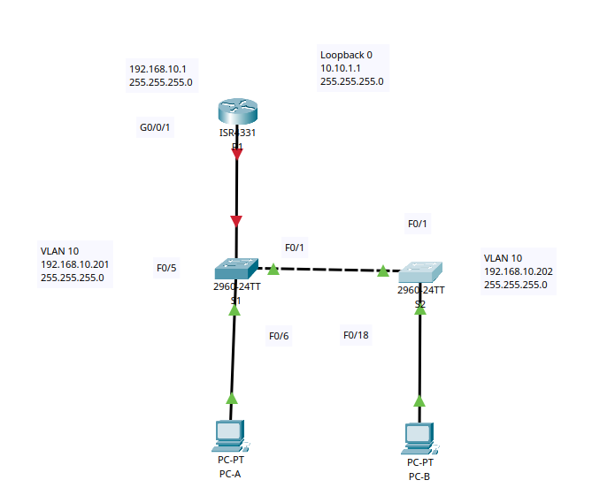

# Конфигурация безопасности коммутатора

## Цель:

* Настройка основного сетевого устройства.
* Настройка сетей VLAN.
* Настройки безопасности коммутатора.

## Описание/Пошаговая инструкция выполнения домашнего задания:

1. Это комплексная работа, нацеленная на повторение ранее изученных функций безопасности уровня 2.
2. Подробное описание задания в методичке в материалах к занятию.
3. Готовые конфигурации необходимо оформить на github с описанием проделанной работы, используя markdown.

---

### Часть 1. Настройка основного сетевого устройства

<details><summary>Шаг 1. Создайте сеть.</summary>

a. Создайте сеть согласно топологии.

| Устройство | Interface/VLAN |    IP-адрес    | Маска подсети |
|:----------:|:--------------:|:--------------:|:-------------:|
|     R1     |     G0/0/1     |  192.168.10.1  | 255.255.255.0 |
|            |   Loopback 0   |   10.10.1.1    | 255.255.255.0 |
|     S1     |    VLAN 10     | 192.168.10.201 | 255.255.255.0 |
|     S2     |    VLAN 10     | 192.168.10.202 | 255.255.255.0 |
|    PC-A    |      NIC       |      DHCP      | 255.255.255.0 |
|    PC-B    |      NIC       |      DHCP      | 255.255.255.0 |



b. Инициализация устройств.


</details>
<details><summary>Шаг 2. Настройте маршрутизатор R1.</summary>

```Console
en
conf t
hostname R1
no ip domain lookup
ip dhcp excluded-address 192.168.10.1 192.168.10.9
ip dhcp excluded-address 192.168.10.201 192.168.10.202

ip dhcp pool Students
network 192.168.10.0 255.255.255.0
default-router 192.168.10.1
domain-name CCNA2.Lab-11.6.1

interface Loopback0
ip address 10.10.1.1 255.255.255.0

interface G0/0/1
description Link to S1
ip dhcp relay information trusted //  подстава :)
ip address 192.168.10.1 255.255.255.0
no sh

line con 0
logging synchronous
exec-timeout 0 0
```

b. Проверьте текущую конфигурацию на R1, используя следующую команду:

```Console
R1#show ip interface brief
Interface              IP-Address      OK? Method Status                Protocol 
GigabitEthernet0/0/0   unassigned      YES unset  administratively down down 
GigabitEthernet0/0/1   192.168.10.1    YES manual up                    up 
GigabitEthernet0/0/2   unassigned      YES unset  administratively down down 
Loopback0              10.10.1.1       YES manual up                    up 
Vlan1                  unassigned      YES unset  administratively down down
R1#
```

</details>
<details><summary>Шаг 3. Настройка и проверка основных параметров коммутатора</summary>

**S1**

```Console
en
conf t
no ip domain-lookup
hostname S1
int f0/6
description connection to PC-A
ex
int f0/1
description connection to S2:f0/1
ex
int f0/5
description connection to R1:g0/0/1
ex
ip default-gateway 192.168.10.1  
```

**S2**

```Console
en 
conf t  
hostname S2  
no ip domain-lookup  
interface f0/18  
description connection to PC-B 
ex
interface f0/1  
description connection to S1:f0/1
ex
ip default-gateway 192.168.10.1  
```

</details>

### Часть 2. Настройка сетей VLAN

<details><summary>Шаг 1. Сконфигурируйте VLAN 10.</summary>

**S1/S2**

```Console
en
conf t
vlan 10 
name management 
exit
```

</details>
<details><summary>Шаг 2. Сконфигруриуйте SVI для VLAN 10.</summary>

**S1**

```Console
en  
conf t  
int vlan 10  
ip address 192.168.10.201 255.255.255.0  
no sh  
description SVI S1  
ex
```

**S2**

```Console
en  
conf t  
int vlan 10  
ip address 192.168.10.202 255.255.255.0  
no sh  
description SVI S2  
ex 
```

</details>
<details><summary>Шаг 3. Настройте VLAN 333 с именем Native на S1 и S2.</summary>

**S1/S2**

```Console
en
conf t
vlan 333 
name Native
ex
```

</details>
<details><summary>Шаг 4. Настройте VLAN 999 с именем ParkingLot на S1 и S2.
</summary>

```Console

en  
conf t
vlan 999
name ParkingLot
ex
```

</details>

### Часть 3: Настройки безопасности коммутатора.

<details><summary>Шаг 1. Реализация магистральных соединений 802.1Q.
</summary>

a. Настройте все магистральные порты Fa0/1 на обоих коммутаторах для использования VLAN 333 в качестве native VLAN.

**S1/S2**

```Console
en
conf t
int f0/1
switchport mode trunk
switchport trunk native vlan 333
end
```

b. Убедитесь, что режим транкинга успешно настроен на всех коммутаторах. команда: `show interface trunk`

```Console
S1#show interface trunk
Port        Mode         Encapsulation  Status        Native vlan
Fa0/1       on           802.1q         trunking      333

Port        Vlans allowed on trunk
Fa0/1       1-1005

Port        Vlans allowed and active in management domain
Fa0/1       1,10,333,999

Port        Vlans in spanning tree forwarding state and not pruned
Fa0/1       1,10,333,999
```

```Console
S2#show interface trunk
Port        Mode         Encapsulation  Status        Native vlan
Fa0/1       on           802.1q         trunking      333

Port        Vlans allowed on trunk
Fa0/1       1-1005

Port        Vlans allowed and active in management domain
Fa0/1       1,10,333,999

Port        Vlans in spanning tree forwarding state and not pruned
Fa0/1       1,10,333,999
```

c. Отключить согласование DTP F0/1 на S1 и S2.

```Console
en
conf t
interface f0/1
switchport nonegotiate
```

d. Проверьте с помощью команды `show interfaces`

```Console
S1#show interfaces f0/1 switchport | include Negotiation
Negotiation of Trunking: Off
```

```Console
S2# show interfaces f0/1 switchport | include Negotiation
Negotiation of Trunking: Off
```

</details>
<details><summary>Шаг 2. Настройка портов доступа</summary>

a. На **S1** настройте F0/5 и F0/6 в качестве портов доступа и свяжите их с VLAN 10.

```Console
en
conf t
int ran f0/5-6
switchport mode access
switchport access vlan 10
no sh
ex
```

b. На **S2** настройте порт доступа Fa0/18 и свяжите его с VLAN 10.

```Console
en
conf t
int f0/18
switchport mode access
switchport access vlan 10
no sh
ex
```

</details>
<details><summary>Шаг 3. Безопасность неиспользуемых портов коммутатора</summary>

a. На **S1 и S2** переместите неиспользуемые порты из VLAN 1 в VLAN 999 и отключите неиспользуемые порты.

**S1**

```Console
en
conf t
int ran f0/2-4, f0/7-24, g0/1-2 // S2:int ran f0/2-17, f0/19-24, g0/1-2
switchport mode access
switchport access vlan 999
sh
ex
```

```Console
S1#sh int st
Port      Name               Status       Vlan       Duplex  Speed Type
Fa0/1     connection to S2:f connected    trunk      auto    auto  10/100BaseTX
Fa0/2                        disabled 999        auto    auto  10/100BaseTX
Fa0/3                        disabled 999        auto    auto  10/100BaseTX
Fa0/4                        disabled 999        auto    auto  10/100BaseTX
Fa0/5     connection to R1:g connected    10         auto    auto  10/100BaseTX
Fa0/6     connection to PC-A connected    10         auto    auto  10/100BaseTX
Fa0/7                        disabled 999        auto    auto  10/100BaseTX
Fa0/8                        disabled 999        auto    auto  10/100BaseTX
Fa0/9                        disabled 999        auto    auto  10/100BaseTX
Fa0/10                       disabled 999        auto    auto  10/100BaseTX
Fa0/11                       disabled 999        auto    auto  10/100BaseTX
Fa0/12                       disabled 999        auto    auto  10/100BaseTX
Fa0/13                       disabled 999        auto    auto  10/100BaseTX
Fa0/14                       disabled 999        auto    auto  10/100BaseTX
Fa0/15                       disabled 999        auto    auto  10/100BaseTX
Fa0/16                       disabled 999        auto    auto  10/100BaseTX
Fa0/17                       disabled 999        auto    auto  10/100BaseTX
Fa0/18                       disabled 999        auto    auto  10/100BaseTX
Fa0/19                       disabled 999        auto    auto  10/100BaseTX
Fa0/20                       disabled 999        auto    auto  10/100BaseTX
Fa0/21                       disabled 999        auto    auto  10/100BaseTX
Fa0/22                       disabled 999        auto    auto  10/100BaseTX
Fa0/23                       disabled 999        auto    auto  10/100BaseTX
Fa0/24                       disabled 999        auto    auto  10/100BaseTX
Gig0/1                       disabled 999        auto    auto  10/100BaseTX
Gig0/2                       disabled 999        auto    auto  10/100BaseTX
```

```Console
S2#sh int st
Port      Name               Status       Vlan       Duplex  Speed Type
Fa0/1     connection to S1:f connected    trunk      auto    auto  10/100BaseTX
Fa0/2                        disabled 999        auto    auto  10/100BaseTX
Fa0/3                        disabled 999        auto    auto  10/100BaseTX
Fa0/4                        disabled 999        auto    auto  10/100BaseTX
Fa0/5                        disabled 999        auto    auto  10/100BaseTX
Fa0/6                        disabled 999        auto    auto  10/100BaseTX
Fa0/7                        disabled 999        auto    auto  10/100BaseTX
Fa0/8                        disabled 999        auto    auto  10/100BaseTX
Fa0/9                        disabled 999        auto    auto  10/100BaseTX
Fa0/10                       disabled 999        auto    auto  10/100BaseTX
Fa0/11                       disabled 999        auto    auto  10/100BaseTX
Fa0/12                       disabled 999        auto    auto  10/100BaseTX
Fa0/13                       disabled 999        auto    auto  10/100BaseTX
Fa0/14                       disabled 999        auto    auto  10/100BaseTX
Fa0/15                       disabled 999        auto    auto  10/100BaseTX
Fa0/16                       disabled 999        auto    auto  10/100BaseTX
Fa0/17                       disabled 999        auto    auto  10/100BaseTX
Fa0/18    connection to PC-B connected    10         auto    auto  10/100BaseTX
Fa0/19                       disabled 999        auto    auto  10/100BaseTX
Fa0/20                       disabled 999        auto    auto  10/100BaseTX
Fa0/21                       disabled 999        auto    auto  10/100BaseTX
Fa0/22                       disabled 999        auto    auto  10/100BaseTX
Fa0/23                       disabled 999        auto    auto  10/100BaseTX
Fa0/24                       disabled 999        auto    auto  10/100BaseTX
Gig0/1                       disabled 999        auto    auto  10/100BaseTX
Gig0/2                       disabled 999        auto    auto  10/100BaseTX

```

</details>
<details><summary>Шаг 4. Документирование и реализация функций безопасности порта.</summary>

a. На **S1**, введите команду `show port-security interface f0/6` для отображения настроек по умолчанию безопасности
порта для интерфейса F0/6.

```Console
S1#show port-security interface f0/6
Port Security              : Disabled
Port Status                : Secure-down
Violation Mode             : Shutdown
Aging Time                 : 0 mins
Aging Type                 : Absolute
SecureStatic Address Aging : Disabled
Maximum MAC Addresses      : 1
Total MAC Addresses        : 0
Configured MAC Addresses   : 0
Sticky MAC Addresses       : 0
Last Source Address:Vlan   : 0000.0000.0000:0
Security Violation Count   : 0

```

| Функция                                     | Настройка по умолчанию |
|---------------------------------------------|:----------------------:|
| Защита портов                               |        Disabled        |
| Максимальное количество записей MAC-адресов |           0            |
| Режим проверки на нарушение безопасности    |        Shutdown        |
| Aging Time                                  |         0 mins         |
| Aging Type                                  |        Absolute        |
| Secure Static Address Aging                 |        Disabled        |
| Sticky MAC Address                          |           0            |  

b. На **S1** включите защиту порта на F0/6 со следующими настройками:

* Максимальное количество записей MAC-адресов: 3
* Режим безопасности: restrict
* Aging time: 60 мин.
* Aging type: неактивный

```Console
en
conf t
int f0/6
switch port-se
switch port-security
switch port-security maximum 3
switchport port-security violation restrict
switchport port-security aging time 60
switchport port-security aging type // Не работает в CPT
```

c. Verify port security on S1 F0/6

```Console
S1#show port-security interface f0/6
Port Security              : Enabled
Port Status                : Secure-up
Violation Mode             : Restrict
Aging Time                 : 60 mins
Aging Type                 : Absolute
SecureStatic Address Aging : Disabled
Maximum MAC Addresses      : 3
Total MAC Addresses        : 0
Configured MAC Addresses   : 0
Sticky MAC Addresses       : 0
Last Source Address:Vlan   : 0000.0000.0000:0
Security Violation Count   : 0
```

```Console
S1#show port-security address
               Secure Mac Address Table
-----------------------------------------------------------------------------
Vlan    Mac Address       Type                          Ports   Remaining Age
                                                                   (mins)
----    -----------       ----                          -----   -------------
-----------------------------------------------------------------------------
Total Addresses in System (excluding one mac per port)     : 0
Max Addresses limit in System (excluding one mac per port) : 1024
```

d. Включите безопасность порта для F0/18 на S2. Настройте каждый активный порт доступа таким образом, чтобы он
автоматически добавлял адреса МАС, изученные на этом порту, в текущую конфигурацию.

e. Настройте следующие параметры безопасности порта на S2 F / 18:

* Максимальное количество записей MAC-адресов: 2
* Тип безопасности: Protect
* Aging time: 60 мин.

```Console
en
conf t
int f0/18
switchport mode access
switchport port-security
switchport port-security mac-address sticky
switchport port-security maximum 2
switchport port-security violation protect
switchport port-security aging time 60
```

f. Проверка функции безопасности портов на S2 F0/18.

```Console
S2#show ip dhcp snooping binding
MacAddress          IpAddress        Lease(sec)  Type           VLAN  Interface
------------------  ---------------  ----------  -------------  ----  -----------------
00:0C:CF:A0:21:28   192.168.10.10    0           dhcp-snooping  10    FastEthernet0/18
Total number of bindings: 1
S2#show port-security interface f0/18
Port Security              : Enabled
Port Status                : Secure-up
Violation Mode             : Protect
Aging Time                 : 60 mins
Aging Type                 : Absolute
SecureStatic Address Aging : Disabled
Maximum MAC Addresses      : 2
Total MAC Addresses        : 1
Configured MAC Addresses   : 0
Sticky MAC Addresses       : 1
Last Source Address:Vlan   : 000C.CFA0.2128:10
Security Violation Count   : 0
```

```Console
S2#show port-security address
               Secure Mac Address Table
-----------------------------------------------------------------------------
Vlan    Mac Address       Type                          Ports   Remaining Age
                                                                   (mins)
----    -----------       ----                          -----   -------------
-----------------------------------------------------------------------------
Total Addresses in System (excluding one mac per port)     : 0
Max Addresses limit in System (excluding one mac per port) : 1024
```
</details>
<details><summary>Шаг 5. Реализовать безопасность DHCP snooping.</summary>

a. На S2 включите DHCP snooping и настройте DHCP snooping во VLAN 10.

```Console
en
con t
ip dhcp snooping 
ip dhcp snooping vlan 10
```

b. Настройте магистральные порты на S2 как доверенные порты.

```Console
int f0/1
ip dhcp snooping trust
```

c. Ограничьте ненадежный порт Fa0/18 на S2 пятью DHCP-пакетами в секунду

```Console
int f0/18
ip dhcp snooping limit rate 5
```

d. Проверка DHCP Snooping на S2.

```Console
S2#show ip dhcp snooping
Switch DHCP snooping is enabled
DHCP snooping is configured on following VLANs:
10
Insertion of option 82 is enabled
Option 82 on untrusted port is not allowed
Verification of hwaddr field is enabled
Interface                  Trusted    Rate limit (pps)
-----------------------    -------    ----------------
FastEthernet0/1            yes        unlimited       
FastEthernet0/18           yes        5   

```

e. В командной строке на PC-B освободите, а затем обновите IP-адрес.

```Console

C:\>ipconfig /release

   IP Address......................: 0.0.0.0
   Subnet Mask.....................: 0.0.0.0
   Default Gateway.................: 0.0.0.0
   DNS Server......................: 0.0.0.0

C:\>ipconfig /renew

   IP Address......................: 192.168.10.10
   Subnet Mask.....................: 255.255.255.0
   Default Gateway.................: 192.168.10.1
   DNS Server......................: 0.0.0.0
```

f. Проверьте привязку отслеживания DHCP с помощью команды `show ip dhcp snooping binding`.

```Console
S2#show ip dhcp snooping binding
MacAddress          IpAddress        Lease(sec)  Type           VLAN  Interface
------------------  ---------------  ----------  -------------  ----  -----------------
00:0C:CF:A0:21:28   192.168.10.10    0           dhcp-snooping  10    FastEthernet0/18
Total number of bindings: 1
```

</details>
<details><summary>Шаг 6. Реализация PortFast и BPDU Guard</summary>

**S1**

```Console
en
conf t
int f0/6
switchport mode access
spanning-tree portfast
ex
spanning-tree portfast default
```

**S2**

```Console
en
conf t
int f0/18
switchport mode access
spanning-tree portfast
ex
spanning-tree portfast default
```

b. Включите защиту BPDU на портах доступа VLAN 10 S1 и S2, подключенных к PC-A и PC-B.
**S1**

```Console
int  f0/6
spanning-tree bpduguard enable
ex
```

**S2**

```Console
int  f0/18
spanning-tree bpduguard enable
ex
```

c. Убедитесь, что защита BPDU и PortFast включены на соответствующих портах.

**S1**

```Console
S1#show spanning-tree interface f0/6 detail


Port 6 (FastEthernet0/6) of VLAN0010 is designated forwarding
  Port path cost 19, Port priority 128, Port Identifier 128.6
  Designated root has priority 32778, address 000C.CF23.E1C1
  Designated bridge has priority 32778, address 000C.CF23.E1C1
  Designated port id is 128.6, designated path cost 19
  Timers: message age 16, forward delay 0, hold 0
  Number of transitions to forwarding state: 1
  The port is in the portfast mode
  Link type is point-to-point by default
```

```Console
S2#show spanning-tree interface f0/18 detail


Port 18 (FastEthernet0/18) of VLAN0010 is designated forwarding
  Port path cost 19, Port priority 128, Port Identifier 128.18
  Designated root has priority 32778, address 000C.CF23.E1C1
  Designated bridge has priority 32778, address 0060.706E.D5BE
  Designated port id is 128.18, designated path cost 19
  Timers: message age 16, forward delay 0, hold 0
  Number of transitions to forwarding state: 1
  The port is in the portfast mode
  Link type is point-to-point by default
```

</details>

<details><summary>Шаг 7. Проверьте наличие сквозного подключения.</summary>

Проверьте PING связь между всеми устройствами в таблице IP-адресации. В случае сбоя проверки связи может потребоваться
отключить брандмауэр на хостах.

| №  |          От           |      Назначение      | Результат |
|:--:|:---------------------:|:--------------------:|:---------:|
| 1  | PC-A (192.168.10.10)  |  R1 (192.168.10.1)   |     ✅     |
| 2  | PC-A (192.168.10.10)  | Loopback 0 10.10.1.1 |     ✅     |
| 3  | PC-A (192.168.10.10)  |  S1 192.168.10.201   |     ✅     |
| 4  | PC-A (192.168.10.10)  |  S2 192.168.10.202   |     ✅     |
| 5  | PC-A (192.168.10.10)  | PC-B (192.168.10.11) |     ✅     |
| 5  | PC-B (192.168.10.11)  |  R1 (192.168.10.1)   |     ✅     |
| 6  | PC-B (192.168.10.11)  | Loopback 0 10.10.1.1 |     ✅     |
| 7  | PC-B (192.168.10.11)  | S1 (192.168.10.201)  |     ✅     |
| 8  | PC-B (192.168.10.11)  | S2 (192.168.10.202)  |     ✅     |
| 9  |          R1           | S1 (192.168.10.201)  |     ✅     |
| 10 |          R1           | S2 (192.168.10.202)  |     ✅     |
| 11 | S1   (192.168.10.201) | S2 (192.168.10.202)  |     ✅     |

</details>

---
<details><summary>Вопросы для повторения</summary>

1. С точки зрения безопасности порта на S2, почему нет значения таймера для оставшегося возраста в минутах, когда было
   сконфигурировано динамическое обучение - sticky?

```Console
 При использовании динамического обучения с функцией sticky MAC-адреса подключенного устройства сохраняется в постоянной памяти (NVRAM) коммутатора.
``` 

2. Что касается безопасности порта на S2, если вы загружаете скрипт текущей конфигурации на S2,почему порту 18 на PC-B
   никогда не получит IP-адрес через DHCP?

```Console
Если на коммутаторе S2 активирована функция port-security с параметром mac-address sticky, при подключении другого коммутатора с аналогичной конфигурацией, MAC-адрес будет отличаться от того, который сохранен в постоянной памяти (NVRAM). 
```

3. Что касается безопасности порта, в чем разница между типом абсолютного устаревания и типом устаревание по не
   активности?

```CConsole
При абсолютном устаревании адреса, порт будет удален после истечения определенного времени, установленного в настройках. Это означает, что существует временное ограничение на продолжительность работы устройства, подключенного к порту.

В случае неактивности порта, порт будет удален только в том случае, если период отключенного состояния порта превысит время, указанное в настройках. То есть, в этом случае нет ограничения на время работы устройства, подключенного к порту, если порт остается активным.3. 
```

</details>