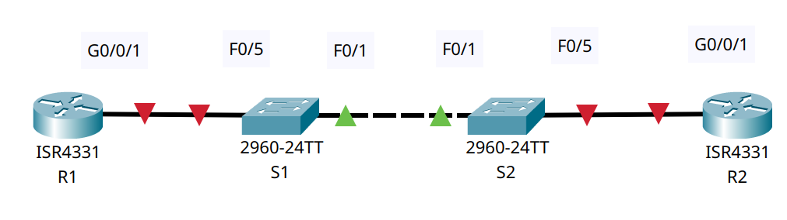

# Настройка протокола OSPFv2 для одной области

## Цель:

* Создание сети и настройка основных параметров устройства.
* Настройка и проверка базовой работы протокола OSPFv2 для одной области.
* Оптимизация и проверка конфигурации OSPFv2 для одной области.

## Описание/Пошаговая инструкция выполнения домашнего задания:

1. Вам было поручено настроить сеть небольшой компании с помощью OSPFv2. R1 будет размещать интернет-соединение (
   имитируемое интерфейсом Loopback 1) и делиться информацией о маршруте по умолчанию до R2. После первоначальной
   настройки организация попросила оптимизировать конфигурацию, чтобы уменьшить трафик протокола и гарантировать, что R1
   продолжает контролировать маршрутизацию.
2. Подробное описание задания в методичке в материалах к занятию.
3. Готовые конфигурации необходимо оформить на github с описанием проделанной работы, используя markdown.

---


Часть 1. Создание сети и настройка основных параметров устройстваЧасть
<details>
<summary>Шаг 1. Создайте сеть согласно топологии.</summary>



| Устройство	 | Интерфейс	 |  IP-адрес	   | Маска подсети |
|:-----------:|:----------:|:------------:|:-------------:|
|     R1	     |  G0/0/1	   |  10.53.0.1	  |      /24      |
|     R1	     | Loopback1	 | 172.16.1.1	  |      /24      |
|     R2	     |  G0/0/1	   |  10.53.0.2	  |      /24      |
|     R2	     | Loopback1	 | 192.168.1.1	 |      /24      |

</details>
<details>
<summary>Шаг 2. Произведите базовую настройку маршрутизаторов.</summary>

``R1/R2``

```Console
en
conf t
no ip domain-lookup
hostname R1 // hostname R2
bann motd ### R1 - Router  #### // bann motd ### R2 - Router  ####
line con 0
logging synchronous 
password cisco
login
exit
enable  secret class
line vty 0 15
password cisco
login
exit
serv password-encryption
exit
copy run start
```

</details>

<details>
<summary>Шаг 3. Настройте базовые параметры каждого коммутатора.</summary>

``S1/S2``

```Console
en
conf t
no ip domain-lookup
hostname S1 // hostname S2
bann motd ### S1 - Switch  #### // bann motd ### S2 - Switch ####
line con 0
logging synchronous 
password cisco
login
exit
enable  secret class
line vty 0 15
password cisco
login
exit
serv password-encryption
exit
copy run start

```

</details>

Часть 2. Настройка и проверка базовой работы протокола OSPFv2 для одной области
<details>
<summary>Шаг 1. Настройте адреса интерфейса и базового OSPFv2 на каждом маршрутизаторе.</summary>

a. Настройте адреса интерфейсов на каждом маршрутизаторе, как показано в таблице адресации выше.
``R1/R2``

```Console
en
conf t
int g0/0/1
ip address 10.53.0.1 255.255.255.0 // ip address 10.53.0.2	 255.255.255.0
no sh
int Loopback 1
ip address 172.16.1.1 255.255.255.0 // ip address 192.168.1.1	 255.255.255.0
no sh

```

b. Перейдите в режим конфигурации маршрутизатора OSPF, используя идентификатор процесса 56.
``R1/R2``

```Console
router ospf 56
```

c. Настройте статический идентификатор маршрутизатора для каждого маршрутизатора (1.1.1.1 для R1, 2.2.2.2 для R2).

``R1``

```Console
router-id 1.1.1.1
```

``R2``

```Console
router-id 2.2.2.2
```

d. Настройте инструкцию сети для сети между R1 и R2, поместив ее в область 0.

``R1/R2``

```Console
inte g0/0/1
ip ospf 56 area 0
ex
```

e. Только на R2 добавьте конфигурацию, необходимую для объявления сети Loopback 1 в область OSPF 0.

``R2``

```Console
interface loopback 1
ip ospf 56 area 0
ex
```

``R1``

```Console
R1#show ip ospf int

GigabitEthernet0/0/1 is up, line protocol is up
  Internet address is 10.53.0.1/24, Area 0
  Process ID 56, Router ID 1.1.1.1, Network Type BROADCAST, Cost: 1
  Transmit Delay is 1 sec, State BDR, Priority 1
  Designated Router (ID) 2.2.2.2, Interface address 10.53.0.2
  Backup Designated Router (ID) 1.1.1.1, Interface address 10.53.0.1
  Timer intervals configured, Hello 10, Dead 40, Wait 40, Retransmit 5
    Hello due in 00:00:01
  Index 1/1, flood queue length 0
  Next 0x0(0)/0x0(0)
  Last flood scan length is 1, maximum is 1
  Last flood scan time is 0 msec, maximum is 0 msec
  Neighbor Count is 1, Adjacent neighbor count is 1
    Adjacent with neighbor 2.2.2.2  (Designated Router)
  Suppress hello for 0 neighbor(s)
  
 R1#show ip ospf neighbor 


Neighbor ID     Pri   State           Dead Time   Address         Interface
2.2.2.2           1   FULL/DR         00:00:30    10.53.0.2       GigabitEthernet0/0/1
  
```

``R2``

```Console
R2#show ip ospf neighbor 


Neighbor ID     Pri   State           Dead Time   Address         Interface
1.1.1.1           1   FULL/BDR        00:00:31    10.53.0.1       GigabitEthernet0/0/1

R2#show ip ospf interface 

GigabitEthernet0/0/1 is up, line protocol is up
  Internet address is 10.53.0.2/24, Area 0
  Process ID 56, Router ID 2.2.2.2, Network Type BROADCAST, Cost: 1
  Transmit Delay is 1 sec, State DR, Priority 1
  Designated Router (ID) 2.2.2.2, Interface address 10.53.0.2
  Backup Designated Router (ID) 1.1.1.1, Interface address 10.53.0.1
  Timer intervals configured, Hello 10, Dead 40, Wait 40, Retransmit 5
    Hello due in 00:00:06
  Index 1/1, flood queue length 0
  Next 0x0(0)/0x0(0)
  Last flood scan length is 1, maximum is 1
  Last flood scan time is 0 msec, maximum is 0 msec
  Neighbor Count is 1, Adjacent neighbor count is 1
    Adjacent with neighbor 1.1.1.1  (Backup Designated Router)
  Suppress hello for 0 neighbor(s)
Loopback1 is up, line protocol is up
  Internet address is 192.168.1.1/24, Area 0
  Process ID 56, Router ID 2.2.2.2, Network Type LOOPBACK, Cost: 1
  Loopback interface is treated as a stub Host

```

``Какой маршрутизатор является DR? Какой маршрутизатор является BDR? Каковы критерии отбора?``

Из вывода команды show ip ospf neighbor мы можем определить следующее:

**DR (Designated Router):** Это маршрутизатор, который играет роль главного в обмене маршрутной информацией в OSPF на
данном сегменте сети. Он отвечает за распространение LSAs (Link State Advertisements) по всей области. В данном случае,
маршрутизатор с IP-адресом 10.53.0.2 (Neighbor ID: 2.2.2.2) играет роль DR.

**BDR (Backup Designated Router):** Это резервный маршрутизатор, который заменяет DR в случае его отказа. Он
поддерживает полную копию базы данных OSPF и готов принять роль DR, если текущий DR станет недоступным. В данном случае,
маршрутизатор с IP-адресом 10.53.0.1 (Neighbor ID: 1.1.1.1) играет роль BDR.

**Критерии отбора DR и BDR в OSPF включают в себя:**

- **Приоритет (Priority):** Каждый маршрутизатор OSPF имеет приоритет, который может быть установлен вручную.
  Маршрутизатор с наибольшим приоритетом становится DR, а маршрутизатор с следующим по величине приоритетом становится
  BDR. Если приоритеты равны, применяются другие критерии выбора.

- **Router ID (Идентификатор маршрутизатора):** Если приоритеты равны, маршрутизатор с наибольшим Router ID становится
  DR. Router ID может быть назначен вручную или автоматически (обычно это самый высокий IP-адрес на устройстве).

- **Соседство (Neighborship):** Если все остальные критерии равны, OSPF выбирает маршрутизатор с наименьшим IP-адресом
  на интерфейсе, через который устанавливается соседство, в качестве DR.

h. Запустите Ping до адреса интерфейса R2 Loopback 1 из R1. Выполнение команды ping должно быть успешным.

```Console
R1#ping 192.168.1.1

Type escape sequence to abort.
Sending 5, 100-byte ICMP Echos to 192.168.1.1, timeout is 2 seconds:
!!!!!
Success rate is 100 percent (5/5), round-trip min/avg/max = 0/0/3 ms
```

</details>

Часть 3. Оптимизация и проверка конфигурации OSPFv2 для одной области
<details>
<summary>Шаг 1. Реализация различных оптимизаций на каждом маршрутизаторе.</summary>

a. На R1 настройте приоритет OSPF интерфейса G0/0/1 на 50, чтобы убедиться, что R1 является назначенным маршрутизатором.
``R1``

```Console
en
conf t
int g0/0/1
ip ospf priority 50
end
clear ip ospf process
```

b. Настройте таймеры OSPF на G0/0/1 каждого маршрутизатора для таймера приветствия, составляющего 30 секунд.
``R1/R2``

```Console
en
conf t
int g0/0/1
ip ospf hello-interval 30
ip ospf dead-interval 120
exit
```

c. На R1 настройте статический маршрут по умолчанию, который использует интерфейс Loopback 1 в качестве интерфейса
выхода. Затем распространите маршрут по умолчанию в OSPF. Обратите внимание на сообщение консоли после установки
маршрута по умолчанию.

``R1``

```Console
en
conf t
ip route 0.0.0.0 0.0.0.0 loopback 1
// %Default route without gateway, if not a point-to-point interface, may impact performance
router ospf 56
default-information originate
end
```

d. добавьте конфигурацию, необходимую для OSPF для обработки R2 Loopback 1 как сети точка-точка. Это приводит к тому,
что OSPF объявляет Loopback 1 использует маску подсети интерфейса.

``R2``

```Console
en
conf t
interface lo 1
ip ospf network point-to-point
exit
```

e. Только на R2 добавьте конфигурацию, необходимую для предотвращения отправки объявлений OSPF в сеть Loopback 1.

``R2``

```Console
en
conf t
router ospf 56
passive-interface loopback 1
exit
```

f. Измените базовую пропускную способность для маршрутизаторов. После этой настройки перезапустите OSPF с помощью
команды clear ip ospf process . Обратите внимание на сообщение консоли после установки новой опорной полосы

``R1``

```Console
en
conf t
router ospf 56
auto-cost reference-bandwidth 1000
% OSPF: Reference bandwidth is changed.
        Please ensure reference bandwidth is consistent across all routers.
exit

clear ip ospf process
 //Reset ALL OSPF processes? [no]: yes

//R1#
//00:31:50: %OSPF-5-ADJCHG: Process 56, Nbr 2.2.2.2 on GigabitEthernet0/0/1 from FULL to DOWN, Neighbor Down: Adjacency forced to reset

//00:31:50: %OSPF-5-ADJCHG: Process 56, Nbr 2.2.2.2 on GigabitEthernet0/0/1 from FULL to DOWN, Neighbor Down: Interface down or detached

```

``R2``

```Console
en
conf t
router ospf 56
auto-cost reference-bandwidth 1000
// % OSPF: Reference bandwidth is changed.
//        Please ensure reference bandwidth is consistent across all routers. 
exit
exit
clear ip ospf process
//Reset ALL OSPF processes? [no]: yes

//R2#
//00:34:14: %OSPF-5-ADJCHG: Process 56, Nbr 1.1.1.1 on GigabitEthernet0/0/1 from FULL to DOWN, Neighbor Down: Adjacency forced to reset

//00:34:14: %OSPF-5-ADJCHG: Process 56, Nbr 1.1.1.1 on GigabitEthernet0/0/1 from FULL to DOWN, Neighbor Down: Interface down or detached

```

</details>

<details>
<summary>Шаг 2. Убедитесь, что оптимизация OSPFv2 реализовалась.</summary>

a. Выполните команду `show ip ospf interface g0/0/1` на R1 и убедитесь, что приоритет интерфейса установлен равным 50, а
временные интервалы — Hello 30, Dead 120, а тип сети по умолчанию — Broadcast.

``R1``

```Console
R1#show ip ospf interface g0/0/1

GigabitEthernet0/0/1 is up, line protocol is up
  Internet address is 10.53.0.1/24, Area 0
  Process ID 56, Router ID 1.1.1.1, Network Type BROADCAST, Cost: 10
  Transmit Delay is 1 sec, State DR, Priority 50
  Designated Router (ID) 1.1.1.1, Interface address 10.53.0.1
  Backup Designated Router (ID) 2.2.2.2, Interface address 10.53.0.2
  Timer intervals configured, Hello 30, Dead 120, Wait 120, Retransmit 5
    Hello due in 00:00:20
  Index 1/1, flood queue length 0
  Next 0x0(0)/0x0(0)
  Last flood scan length is 1, maximum is 1
  Last flood scan time is 0 msec, maximum is 0 msec
  Neighbor Count is 1, Adjacent neighbor count is 1
    Adjacent with neighbor 2.2.2.2  (Backup Designated Router)
  Suppress hello for 0 neighbor(s)
```

b. На R1 выполните команду `show ip route ospf`, чтобы убедиться, что сеть R2 Loopback1 присутствует в таблице
маршрутизации. Обратите внимание на разницу в метрике между этим выходным и предыдущим выходным. Также обратите
внимание, что маска теперь составляет 24 бита, в отличие от 32 битов, ранее объявленных.

``R1``

```Console
R1#show ip route ospf
O    192.168.1.0 [110/10] via 10.53.0.2, 00:03:46, GigabitEthernet0/0/1
```

c. Введите команду `show ip route ospf` на маршрутизаторе R2. Единственная информация о маршруте OSPF должна быть
распространяемый по умолчанию маршрут R1.

``R2``

```Console
R2#show ip route ospf
O*E2    0.0.0.0/0 [110/10] via 10.53.0.1, 00:04:45, GigabitEthernet0/0/1
```

d. Запустите Ping до адреса интерфейса R1 Loopback 1 из R2. Выполнение команды ping должно быть успешным.

``R2``

```Console
R2#ping 172.16.1.1
Type escape sequence to abort.
Sending 5, 100-byte ICMP Echos to 172.16.1.1, timeout is 2 seconds:
!!!!!
Success rate is 100 percent (5/5), round-trip min/avg/max = 0/0/3 ms
```

`Почему стоимость OSPF для маршрута по умолчанию отличается от стоимости OSPF в R1 для сети 192.168.1.0/24?`
Потому что мы изменили базовую пропускную способность для маршрутизаторов.

</details>
