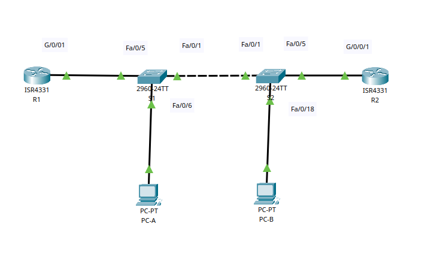
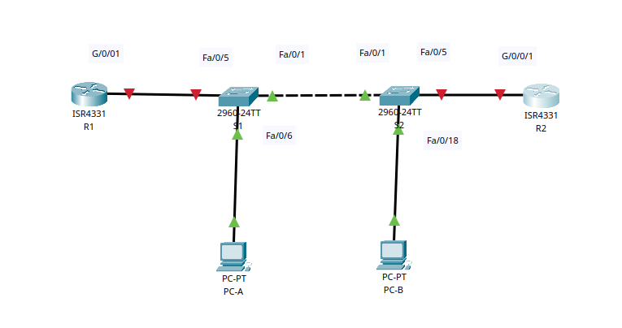

# Настройка и проверка расширенных списков контроля доступа

## Цель:

* Создание сети и настройка основных параметров устройства.
* Настройка и проверка списков расширенного контроля доступа.

## Описание/Пошаговая инструкция выполнения домашнего задания:

* Вам было поручено настроить списки контроля доступа в сети небольшой компании. ACL являются одним из самых простых и
  прямых средств управления трафиком уровня 3. R1 будет размещать интернет-соединение (смоделированное интерфейсом
  Loopback 1) и предоставлять информацию о маршруте по умолчанию для R2. После завершения первоначальной настройки
  компания имеет некоторые конкретные требования к безопасности дорожного движения, которые вы несете ответственность за
  реализацию.

---



**Таблица адресации**

| Устройство	 |  Интерфейс	  |  IP-адрес	  | Маска подсети 	 | Шлюз по умолчанию |
|:-----------:|:------------:|:-----------:|:---------------:|:-----------------:|
|     R1	     |   G0/0/1	    |     —	      |       —	        |         —         |
|      	      |  G0/0/1.20	  | 10.20.0.1	  | 255.255.255.0	  |         —         |
|      	      |  G0/0/1.30	  | 10.30.0.1	  | 255.255.255.0	  |         —         |
|      	      |  G0/0/1.40	  | 10.40.0.1	  | 255.255.255.0	  |         —         |
|      	      | G0/0/1.1000	 |     —	      |       —	        |         —         |
|             |  Loopback1	  | 172.16.1.1  | 255.255.255.0	  |         —         |
|     R2	     |   G0/0/1	    | 10.20.0.4	  | 255.255.255.0	  |         —         |
|     S1	     |   VLAN 20	   | 10.20.0.2	  | 255.255.255.0	  |     10.20.0.1     |
|     S2	     |   VLAN 20	   | 10.20.0.3	  | 255.255.255.0	  |     10.20.0.1     |
|    PC-A	    |     NIC	     | 10.30.0.10	 | 255.255.255.0	  |     10.30.0.1     |
|    PC-B	    |     NIC	     | 10.40.0.10	 | 255.255.255.0	  |     10.40.0.1     |

**Таблица VLAN**

| VLAN	 |    Имя	     |         Назначенный интерфейс         |
|:-----:|:-----------:|:-------------------------------------:|
|  20	  | Management	 |               S2: F0/5                |
|  30	  | Operations	 |               S1: F0/6                |
|  40	  |   Sales	    |               S2: F0/18               |
| 999	  | ParkingLot	 |      S1: F0/2-4, F0/7-24, G0/1-2      |
|       |             | S2: F0/2-4, F0/6-17, F0/19-24, G0/1-2 |
| 1000	 | Собственная |                  	—                   |

#### Часть 1. Создание сети и настройка основных параметров устройства

<details>
<summary>Шаг 1. Создайте сеть согласно топологии.</summary>




</details>
<details>
<summary>Шаг 2. Произведите базовую настройку маршрутизаторов.</summary>

a. Назначьте маршрутизатору имя устройства.  
b. Отключите поиск DNS, чтобы предотвратить попытки маршрутизатора неверно преобразовывать введенные команды таким  
образом, как будто они являются именами узлов.  
c. Назначьте class в качестве зашифрованного пароля привилегированного режима EXEC.  
d. Назначьте cisco в качестве пароля консоли и включите вход в систему по паролю.  
e. Назначьте cisco в качестве пароля VTY и включите вход в систему по паролю.  
f. Зашифруйте открытые пароли.  
g. Создайте баннер с предупреждением о запрете несанкционированного доступа к устройству.  
h. Сохраните текущую конфигурацию в файл загрузочной конфигурации.

``R1/R2``

```Console
en
conf t
no ip domain-lookup
hostname R1 // hostname R2
banner motd ##R1 Router ## // banner motd ##R2 Router##
line console 0
 logging synchronous
 password cisco
 login
 exit
enable secret class
line vty 0 15
 password cisco
 login
 exit
service password-encryption
exit
copy running-config startup-config
```

</details>
<details>
<summary>Шаг 3. Настройте базовые параметры каждого коммутатора.</summary>

a. Присвойте коммутатору имя устройства.  
b. Отключите поиск DNS, чтобы предотвратить попытки маршрутизатора неверно преобразовывать введенные команды таким  
образом, как будто они являются именами узлов.  
c. Назначьте class в качестве зашифрованного пароля привилегированного режима EXEC.  
d. Назначьте cisco в качестве пароля консоли и включите вход в систему по паролю.  
e. Назначьте cisco в качестве пароля VTY и включите вход в систему по паролю.  
f. Зашифруйте открытые пароли.  
g. Создайте баннер с предупреждением о запрете несанкционированного доступа к устройству.  
h. Сохраните текущую конфигурацию в файл загрузочной конфигурации.

``S1/S2``

```Console
en
conf t
no ip domain-lookup
hostname S1 // hostname S2
banner motd ##S1  Switch ## // banner motd ##S2 Switch ##
line console 0
 logging synchronous
 password cisco
 login
exit
enable secret class
line vty 0 15
 password cisco
 login
exit
service password-encryption
end
copy running-config startup-config
```

</details>

#### Часть 2. Настройка сетей VLAN на коммутаторах.

<details>
<summary>Шаг 1. Создайте сети VLAN на коммутаторах.</summary>

``S1``

```Console
conf term
vlan 20
name Management
ex
vlan 30
name Operations
ex
vlan 40
name Sales
ex
vlan 999
name  Parking_Lot
ex
interface vlan 20
ip add 10.20.0.2 255.255.255.0


interface range fastEthernet 0/2-4, fastEthernet 0/7-24, gigabitEthernet 0/1-2
switchport mode access
switchport access vlan 999
exit
interface vlan 999
shutdown
exit
vlan 1000
name S
ex
```

``S2``

```Console
conf term
vlan 20
name Management
ex
vlan 30
name Operations
ex
vlan 40
name Sales
ex
vlan 999
name  Parking_Lot
ex
vlan 1000
name S
ex
interface vlan 20
ip add 10.20.0.3 255.255.255.0
ex


interface range fastEthernet 0/2-4, fastEthernet 0/6-17, fastEthernet 0/19-24, gigabitEthernet 0/1-2
switchport mode access
switchport access vlan 999
ex
interface vlan 999
shutdown
ex

```

</details>

<details>
<summary>Шаг 2. Назначьте сети VLAN соответствующим интерфейсам коммутатора.</summary>

a. Назначьте используемые порты соответствующей VLAN (указанной в таблице VLAN выше) и настройте их для режима
статического доступа.

``S1``

```Console
interface fastEthernet 0/6
switchport mode access
switchport access vlan 30
ex
```

``S2``

```Console
interface fastEthernet 0/5
switchport mode access
switchport access vlan 20
ex
interface fastEthernet 0/18
switchport mode access
switchport access vlan 40
ex
```

b. Выполните команду show vlan brief, чтобы убедиться, что сети VLAN назначены правильным интерфейсам.

``S1 show vlan brief``

```Console
S1#show vlan brief

VLAN Name                             Status    Ports
---- -------------------------------- --------- -------------------------------
1    default                          active    Fa0/1, Fa0/5
20   Management                       active    
30   Operations                       active    Fa0/6
40   Sales                            active    
999  Parking_Lot                      active    Fa0/2, Fa0/3, Fa0/4, Fa0/7
                                                Fa0/8, Fa0/9, Fa0/10, Fa0/11
                                                Fa0/12, Fa0/13, Fa0/14, Fa0/15
                                                Fa0/16, Fa0/17, Fa0/18, Fa0/19
                                                Fa0/20, Fa0/21, Fa0/22, Fa0/23
                                                Fa0/24, Gig0/1, Gig0/2
1000 S                                active    
1002 fddi-default                     active    
1003 token-ring-default               active    
1004 fddinet-default                  active    
1005 trnet-default                    active   
```

``S2 show vlan brief``

```Console
S2#show vlan brief

VLAN Name                             Status    Ports
---- -------------------------------- --------- -------------------------------
1    default                          active    Fa0/1
20   Management                       active    Fa0/5
30   Operations                       active    
40   Sales                            active    Fa0/18
999  Parking_Lot                      active    Fa0/2, Fa0/3, Fa0/4, Fa0/6
                                                Fa0/7, Fa0/8, Fa0/9, Fa0/10
                                                Fa0/11, Fa0/12, Fa0/13, Fa0/14
                                                Fa0/15, Fa0/16, Fa0/17, Fa0/19
                                                Fa0/20, Fa0/21, Fa0/22, Fa0/23
                                                Fa0/24, Gig0/1, Gig0/2
1000 S                                active    
1002 fddi-default                     active    
1003 token-ring-default               active    
1004 fddinet-default                  active    
1005 trnet-default                    active    
```

</details>

#### Часть 3. ·Настройте транки (магистральные каналы).

<details>
<summary>Шаг 1. Вручную настройте магистральный интерфейс F0/1.</summary>

a. Измените режим порта коммутатора на интерфейсе F0/1, чтобы принудительно создать магистральную связь. Не забудьте
сделать это на обоих коммутаторах.  
b. В рамках конфигурации транка установите для native vlan значение 1000 на обоих коммутаторах. При настройке двух
интерфейсов для разных собственных VLAN сообщения об ошибках могут отображаться временно.  
c. В качестве другой части конфигурации транка укажите, что VLAN 10, 20, 30 и 1000 разрешены в транке.

``S1/S2``

```Console
interface fastEthernet 0/1
switchport mode trunk
switchport trunk allowed vlan 10,20,30,1000
switchport trunk native vlan 1000
ex
```

d. Выполните команду show interfaces trunk для проверки портов магистрали, собственной VLAN и разрешенных VLAN через
магистраль.

``S1/S2``
``show interfaces trunk``

```Console
S1#show interfaces trunk
Port        Mode         Encapsulation  Status        Native vlan
Fa0/1       on           802.1q         trunking      1000

Port        Vlans allowed on trunk
Fa0/1       10,20,30,1000

Port        Vlans allowed and active in management domain
Fa0/1       20,30,1000

Port        Vlans in spanning tree forwarding state and not pruned
Fa0/1       20,30,1000
```

```Console
S2#show interfaces trunk
Port        Mode         Encapsulation  Status        Native vlan
Fa0/1       on           802.1q         trunking      1000

Port        Vlans allowed on trunk
Fa0/1       10,20,30,1000

Port        Vlans allowed and active in management domain
Fa0/1       20,30,1000

Port        Vlans in spanning tree forwarding state and not pruned
Fa0/1       20,30,1000

```

</details>

<details>
<summary>Шаг 2. Вручную настройте магистральный интерфейс F0/5 на коммутаторе S1.</summary>

a. Настройте интерфейс S1 F0/5 с теми же параметрами транка, что и F0/1. Это транк до маршрутизатора.  
b. Сохраните текущую конфигурацию в файл загрузочной конфигурации.

``S1``

```Console
interface fastEthernet 0/5
switchport mode trunk
switchport trunk native vlan 1000
switchport trunk allowed vlan 10,20,30,1000
exit
copy running-config startup-config
```

c. Используйте команду show interfaces trunk для проверки настроек транка.

```Console
S1#show interfaces trunk
Port        Mode         Encapsulation  Status        Native vlan
Fa0/1       on           802.1q         trunking      1000

Port        Vlans allowed on trunk
Fa0/1       10,20,30,1000

Port        Vlans allowed and active in management domain
Fa0/1       20,30,1000

Port        Vlans in spanning tree forwarding state and not pruned
Fa0/1       20,30,1000
```

</details>

#### Часть 4. Настройте маршрутизацию.

<details>
<summary>Шаг 1. Настройка маршрутизации между сетями VLAN на R1.</summary>

a. Активируйте интерфейс G0/0/1 на маршрутизаторе.  
b. Настройте подинтерфейсы для каждой VLAN, как указано в таблице IP-адресации. Все подинтерфейсы используют
инкапсуляцию 802.1Q. Убедитесь, что подинтерфейс для собственной VLAN не имеет назначенного IP-адреса. Включите описание
для каждого подинтерфейса.

``R1``

```Console
interface gigabitEthernet 0/0/1
no sh
interface g0/0/1.20
description Management
encapsulation dot1Q 20
ip add 10.20.0.1 255.255.255.0
exit


interface g0/0/1.30
description Operations
encapsulation dot1Q 30
ip add 10.30.0.1 255.255.255.0
exit


interface g0/0/1.40
description Sales
encapsulation dot1Q 40
ip add 10.40.0.1 255.255.255.0
exit


interface g0/0/1.1000
description S
encapsulation dot1Q 1000
exit


```

c. Настройте интерфейс Loopback 1 на R1 с адресацией из приведенной выше таблицы.

``R1``

```Console
interface  Loopback1
ip add 172.16.1.1 255.255.255.0
no shutdown
exit
  
```

d. С помощью команды show ip interface brief проверьте конфигурацию подынтерфейса.
``R1``

```Console
R1(config)#do show ip interface brief
Interface              IP-Address      OK? Method Status                Protocol 
GigabitEthernet0/0/0   unassigned      YES unset  administratively down down 
GigabitEthernet0/0/1   unassigned      YES unset  up                    up 
GigabitEthernet0/0/1.2010.20.0.1       YES manual up                    up 
GigabitEthernet0/0/1.3010.30.0.1       YES manual up                    up 
GigabitEthernet0/0/1.4010.40.0.1       YES manual up                    up 
GigabitEthernet0/0/1.1000unassigned      YES unset  up                    up 
GigabitEthernet0/0/2   unassigned      YES unset  administratively down down 
Loopback1              172.16.1.1      YES manual up                    up 
Vlan1                  unassigned      YES unset  administratively down down
```

</details>
<details>
<summary>Шаг 2. Настройка интерфейса R2 g0/0/1 с использованием адреса из таблицы и маршрута по умолчанию с адресом следующего перехода 10.20.0.1</summary>

``R2``

```Console
interface gigabitEthernet 0/0/1
no shutdown
description R2 for S2
ip add 10.20.0.4 255.255.255.0
exit
ip route 0.0.0.0 0.0.0.0 10.20.0.1
```

``R2 show ip interface brief``

```Console
R2(config)#do show ip interface brief
Interface              IP-Address      OK? Method Status                Protocol 
GigabitEthernet0/0/0   unassigned      YES unset  administratively down down 
GigabitEthernet0/0/1   10.20.0.4       YES manual up                    up 
GigabitEthernet0/0/2   unassigned      YES unset  administratively down down 
Vlan1                  unassigned      YES unset  administratively down down
```

``R2 show ip route``

```Console
R2(config)#do show ip route
Codes: L - local, C - connected, S - static, R - RIP, M - mobile, B - BGP
       D - EIGRP, EX - EIGRP external, O - OSPF, IA - OSPF inter area
       N1 - OSPF NSSA external type 1, N2 - OSPF NSSA external type 2
       E1 - OSPF external type 1, E2 - OSPF external type 2, E - EGP
       i - IS-IS, L1 - IS-IS level-1, L2 - IS-IS level-2, ia - IS-IS inter area
       * - candidate default, U - per-user static route, o - ODR
       P - periodic downloaded static route

Gateway of last resort is 10.20.0.1 to network 0.0.0.0

     10.0.0.0/8 is variably subnetted, 2 subnets, 2 masks
C       10.20.0.0/24 is directly connected, GigabitEthernet0/0/1
L       10.20.0.4/32 is directly connected, GigabitEthernet0/0/1
S*   0.0.0.0/0 [1/0] via 10.20.0.1

```

</details>

#### Часть 5. Настройте удаленный доступ

<details>
<summary>Шаг 1. Настройте все сетевые устройства для базовой поддержки SSH.</summary>

a. Создайте локального пользователя с именем пользователя SSHadmin и зашифрованным паролем $cisco123!  
b. Используйте ccna-lab.com в качестве доменного имени.  
c. Генерируйте криптоключи с помощью 1024 битного модуля.  
d. Настройте первые пять линий VTY на каждом устройстве, чтобы поддерживать только SSH-соединения и с локальной
аутентификацией.

``R1/R2/S1/S2``

```Console
conf term
ip ssh version 2
username SSHadmin password $cisco123!
ip domain name ccna-lab.com
crypto key generate rsa general-keys modulus 1024
line vty 0 5
login local
transport input ssh
exit
```

</details>
<details>
<summary>Шаг 2. Включите защищенные веб-службы с проверкой подлинности на R1.</summary>

a. Включите сервер HTTPS на R1.

``R1`` // Нет команд в CPT

```Console
R1(config)#ip http secure-server
               ^
% Invalid input detected at '^' marker.
	
R1(config)# ip http authentication local
                ^
% Invalid input detected at '^' marker.
```

</details>

#### Часть 6. Проверка подключения

<details>
<summary>Шаг 1. Настройте узлы ПК.</summary>
</details>
<details>
<summary>Шаг 2. Выполните следующие тесты. Эхозапрос должен пройти успешно.</summary>

Примечание. Возможно, вам придется отключить брандмауэр ПК для работы ping

| Source | Protocol | Destination | Result |
|:------:|:--------:|:-----------:|--------|
|  PC-A  |   Ping   | 10.40.0.10  | ✅      |
|  PC-A  |   Ping   |  10.20.0.1  | ✅      |
|  PC-B  |   Ping   | 10.30.0.10  | ✅      |
|  PC-B  |   Ping   |  10.20.0.1  | ✅      |
|  PC-B  |   Ping   | 172.16.1.1  | ✅      |
|  PC-B  |  HTTPS   |  10.20.0.1  | ✅      |
|  PC-B  |  HTTPS   | 172.16.1.1  | ✅      |
|  PC-B  |   SSH    |  10.20.0.1  | ✅      |
|  PC-B  |   SSH    | 172.16.1.1  | ✅      |

</details>

#### Часть 7. Настройка и проверка списков контроля доступа (ACL)

<details>
<summary>Шаг 1. Проанализируйте требования к сети и политике безопасности для планирования реализации ACL.</summary>

| Политика | Описание                                                                                                                                                                                                                                                                                                          |
|:--------:|:------------------------------------------------------------------------------------------------------------------------------------------------------------------------------------------------------------------------------------------------------------------------------------------------------------------|
|    1     | Сеть Sales не может использовать SSH в сети Management (но в другие сети SSH разрешен).                                                                                                                                                                                                                           |
|    2     | Сеть Sales не имеет доступа к IP-адресам в сети Management с помощью любого веб-протокола (HTTP/HTTPS).  Сеть Sales также не имеет доступа к интерфейсам R1 с помощью любого веб-протокола. Разрешён весь другой веб-трафик  обратите внимание — Сеть Sales может получить доступ к интерфейсу Loopback 1 на R1). |
|    3     | Сеть Sales не может отправлять эхо-запросы ICMP в сети Operations или Management. Разрешены эхо-запросы ICMP к другим адресатам.                                                                                                                                                  Ping                            |
|    4     | Cеть Operations не может отправлять ICMP эхозапросы в сеть Sales. Разрешены эхо-запросы ICMP к другим адресатам.                                                                                                                                                                                                  |

</details>
<details>
<summary>Шаг 2. Разработка и применение расширенных списков доступа, которые будут соответствовать требованиям политики безопасности.</summary>

Политика 1

``R1``

```Console
en
conf t
ip access-list extended FOR_NET_SALES  
remark Politic 1 SSH For Sales  
deny tcp 10.40.0.0 0.0.0.255 10.20.0.0 0.0.0.255 eq 22  
permit tcp 10.40.0.0 0.0.0.255 any eq 22
```

Политика 2

``R1``

```Console
en
conf t
ip access-list extended FOR_NET_SALES  
remark Politic 2 HTTP and HTTPS For Sales  
deny tcp 10.40.0.0 0.0.0.255 10.20.0.0 0.0.0.255 eq www  
deny tcp 10.40.0.0 0.0.0.255 10.20.0.0 0.0.0.255 eq 443  
deny tcp 10.40.0.0 0.0.0.255 host 10.30.0.1 eq www  
deny tcp 10.40.0.0 0.0.0.255 host 10.30.0.1 eq 443  
deny tcp 10.40.0.0 0.0.0.255 host 10.40.0.1 eq www  
deny tcp 10.40.0.0 0.0.0.255 host 10.40.0.1 eq 443  
permit tcp 10.40.0.0 0.0.0.255 host 176.16.1.0 eq www  
permit tcp 10.40.0.0 0.0.0.255 host 176.16.1.0 eq 443  

```

Политика 3

``R1``

```Console
en
conf t
ip access-list extended FOR_NET_SALES  
remark Politic 3 ICMP For Sales  
deny icmp 10.40.0.0 0.0.0.255 10.30.0.0 0.0.0.255  
deny icmp 10.40.0.0 0.0.0.255 10.20.0.0 0.0.0.255  
permit icmp 10.40.0.0 0.0.0.255 any  
permit ip any any  
exit  

interface gigabitEthernet 0/0/1.40  
ip access-group FOR_NET_SALES in  
exit
```

Политика 4

``R1``

```Console
en
conf t

ip access-list extended FOR_NET_OPERATIONS  
remark Politic 4 For Operations  
deny icmp 10.30.0.0 0.0.0.255 10.40.0.0 0.0.0.255  
permit icmp 10.30.0.0 0.0.0.255 any  
permit ip any any  
exit
```

</details>
<details>
<summary>Шаг 3. Убедитесь, что политики безопасности применяются развернутыми списками доступа.</summary>

| Source | Protocol | Destination | Result |
|:------:|:--------:|:-----------:|:------:|
|  PC-A  |   Ping   | 10.40.0.10  |   ❌    |
|  PC-A  |   Ping   |  10.20.0.1  |   ✅    |
|  PC-B  |   Ping   | 10.30.0.10  |   ❌    |
|  PC-B  |   Ping   |  10.20.0.1  |   ❌    |
|  PC-B  |   Ping   | 172.16.1.1  |   ✅    |
|  PC-B  |  HTTPS   |  10.20.0.1  |   ❌    |
|  PC-B  |  HTTPS   | 172.16.1.1  |   ✅    |
|  PC-B  |   SSH    |  10.20.0.4  |   ❌    |
|  PC-B  |   SSH    | 172.16.1.1  |   ✅    |

</details>

---