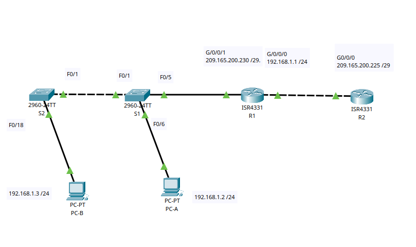

# Настройка NAT для IPv4

## Цель:

* Создание сети и настройка основных параметров устройства.
* Настройка и проверка NAT для IPv4.
* Настройка и проверка PAT для IPv4.
* Настройка и проверка статического NAT для IPv4.

## Описание/Пошаговая инструкция выполнения домашнего задания:

В этой работе вы будете настраивать различные типы NAT. Вы выполните тестирование, отображение и проверку осуществления
всех преобразований и проанализируете статистику NAT/PAT для контроля процесса.

---


Часть 1. Создание сети и настройка основных параметров устройства
<details>
<summary>Шаг 1. Подключите кабели сети согласно приведенной топологии.</summary>



**Таблица адресации**

| Устройство	 | Интерфейс	 |    IP-адрес	     |  Маска подсети  |
|:-----------:|:----------:|:----------------:|:---------------:|
|     R1	     |  G0/0/0	   | 209.165.200.230	 | 255.255.255.248 |
|     R1	     |  G0/0/1	   |   192.168.1.1	   |  255.255.255.0  |
|     R2	     |  G0/0/0	   | 209.165.200.225	 | 255.255.255.248 |
|     R2	     |    Lo1	    |  209.165.200.1	  | 255.255.255.224 |
|     S1	     |  VLAN 1	   |  192.168.1.11	   |  255.255.255.0  |
|     S2	     |  VLAN 1	   |  192.168.1.12	   |  255.255.255.0  |
|    PC-A	    |    NIC	    |   192.168.1.2	   |  255.255.255.0  |
|    PC-B	    |    NIC	    |   192.168.1.3	   |  255.255.255.0  |

</details>

<details>
<summary>Шаг 2. Произведите базовую настройку маршрутизаторов.</summary>

a. Назначьте маршрутизатору имя устройства.  
b. Отключите поиск DNS, чтобы предотвратить попытки маршрутизатора неверно преобразовывать введенные команды таким
образом, как будто они являются именами узлов.  
c. Назначьте class в качестве зашифрованного пароля привилегированного режима EXEC.  
d. Назначьте cisco в качестве пароля консоли и включите вход в систему по паролю.  
e. Назначьте cisco в качестве пароля VTY и включите вход в систему по паролю.  
f. Зашифруйте открытые пароли.  
g. Создайте баннер с предупреждением о запрете несанкционированного доступа к устройству.  
h. Настройте IP-адресации интерфейса, как указано в таблице выше.  
i. Настройте маршрут по умолчанию. от R2 до R1.  
j. Сохраните текущую конфигурацию в файл загрузочной конфигурации.

``R1``

```Console
en
conf t
no ip domain-lookup
hostname R1
banner motd ##### R1 Router ##########
line console 0
logging synchronous
password cisco
login
exit
enable secret class
line vty 0 15
password cisco
login
exit
service password-encryption
 

int g0/0/0
ip add 209.165.200.230 255.255.255.248
no sh
ex

int g0/0/1
ip add 192.168.1.1 255.255.255.0
no sh
ex

ip route 209.165.200.0 255.255.255.224 209.165.200.225

ex
copy running-config startup-config
ex
```

``R2``

```Console
en
conf t
no ip domain-lookup
hostname R2
banner motd ##### R2 Router ##########
line console 0
logging synchronous
password cisco
login
exit
enable secret class
line vty 0 15
password cisco
login
exit
service password-encryption
 

int g0/0/0
ip add 209.165.200.225 255.255.255.248
no sh
exit

int Lo 1
ip add 209.165.200.1 255.255.255.224
no sh
ex

ip route 192.168.1.0 255.255.255.0 209.165.200.230

exit
copy running-config startup-config

```

</details>

<details>
<summary>Шаг 3. Настройте базовые параметры каждого коммутатора.</summary>

a. Присвойте коммутатору имя устройства.  
b. Отключите поиск DNS, чтобы предотвратить попытки маршрутизатора неверно преобразовывать введенные команды таким
образом, как будто они являются именами узлов.  
c. Назначьте class в качестве зашифрованного пароля привилегированного режима EXEC.  
d. Назначьте cisco в качестве пароля консоли и включите вход в систему по паролю.  
e. Назначьте cisco в качестве пароля VTY и включите вход в систему по паролю.  
f. Зашифруйте открытые пароли.  
g. Создайте баннер с предупреждением о запрете несанкционированного доступа к устройству.  
h. Выключите все интерфейсы, которые не будут использоваться.  
i. Настройте IP-адресации интерфейса, как указано в таблице выше.  
j. Сохраните текущую конфигурацию в файл загрузочной конфигурации.

``S1``

```Console

en
conf t
no ip domain-lookup
hostname S1
banner motd ### S1  Switch ####
line console 0
logging synchronous
password cisco
login
exit
enable secret class
line vty 0 15
password cisco
login
exit
service password-encryption

int range f0/2-4, f0/7-24, g0/1-2
sh
ex

int VLAN1
description VLAN1
ip add 192.168.1.11 255.255.255.0
no sh
ex
ip default-gateway 192.168.1.1

ex
copy running-config startup-config
```

``S2``

```Console
en
conf t
no ip domain-lookup
hostname S2
banner motd ### S2 Switch ###
line console 0
logging synchronous
password cisco
login
exit
enable secret class
line vty 0 15
password cisco
login
exit
service password-encryption

int range f0/2-17, f0/19-24, g0/1-2
sh
ex

int VLAN1
description VLAN1
ip add 192.168.1.12 255.255.255.0
no sh
ex
ip default-gateway 192.168.1.1

ex
copy running-config startup-config
```

</details>

Часть 2. Настройка и проверка NAT для IPv4

<details>
<summary>Шаг 1. Настройте NAT на R1, используя пул из трех адресов 209.165.200.226-209.165.200.228.</summary>


a. Настройте простой список доступа, который определяет, какие хосты будут разрешены для трансляции. В этом случае все
устройства в локальной сети R1 имеют право на трансляцию.  
b. Создайте пул NAT и укажите ему имя и диапазон используемых адресов.  
c. Настройте перевод, связывая ACL и пул с процессом преобразования.  
d. Задайте внутренний (inside) интерфейca .  
e. Определите внешний (outside) интерфейс.

``R1``

```Console
en
conf t

access-list 1 permit 192.168.1.0 0.0.0.255 
ip nat pool PUBLIC_ACCESS 209.165.200.226 209.165.200.228 netmask 255.255.255.248 
ip nat inside source list 1 pool PUBLIC_ACCESS
interface g0/0/1
ip nat inside
interface g0/0/0
ip nat outside   
```

</details>

<details>
<summary>Шаг 2. Проверьте и проверьте конфигурацию.</summary>

a. PC-B, запустите эхо-запрос интерфейса Lo1 (209.165.200.1) на R2. Если эхо-запрос не прошел,выполните процес поиска и
устранения неполадок.  
``PC-B``

```Console

C:\>ping 209.165.200.1

Pinging 209.165.200.1 with 32 bytes of data:

Request timed out.
Request timed out.
Reply from 209.165.200.1: bytes=32 time=4ms TTL=254
Reply from 209.165.200.1: bytes=32 time<1ms TTL=254

Ping statistics for 209.165.200.1:
    Packets: Sent = 4, Received = 2, Lost = 2 (50% loss),
Approximate round trip times in milli-seconds:
    Minimum = 0ms, Maximum = 4ms, Average = 2ms

```

На R1 отобразите таблицу NAT на R1 спомощью командыshow ip nat translations.
``R1``

```Console
R1>show ip nat translations
Pro  Inside global     Inside local       Outside local      Outside global
icmp 209.165.200.226:1 192.168.1.3:1      209.165.200.1:1    209.165.200.1:1
icmp 209.165.200.226:2 192.168.1.3:2      209.165.200.1:2    209.165.200.1:2
icmp 209.165.200.226:3 192.168.1.3:3      209.165.200.1:3    209.165.200.1:3
icmp 209.165.200.226:4 192.168.1.3:4      209.165.200.1:4    209.165.200.1:4

```

``Во что был транслирован внутренний локальный адрес PC-B?``  
Внутренний локальный адрес PC-B был транслирован в 209.165.200.226  
``Какой тип адреса NAT является переведенным адресом?``  
В данном случае используется динамический NAT

b. С PC-A, запустите эхо-запрос интерфейса Lo1 (209.165.200.1) на R2.

``PC-A``

```Console
C:\>ping 209.165.200.1

Pinging 209.165.200.1 with 32 bytes of data:

Reply from 209.165.200.1: bytes=32 time<1ms TTL=254
Reply from 209.165.200.1: bytes=32 time<1ms TTL=254
Reply from 209.165.200.1: bytes=32 time<1ms TTL=254
Reply from 209.165.200.1: bytes=32 time=4ms TTL=254

Ping statistics for 209.165.200.1:
    Packets: Sent = 4, Received = 4, Lost = 0 (0% loss),
Approximate round trip times in milli-seconds:
    Minimum = 0ms, Maximum = 4ms, Average = 1ms
```

На R1 отобразите таблицу NAT на R1 с помощью команды `show ip nattranslations`.

``R1``

```Console
R1>show ip nat translations
Pro  Inside global     Inside local       Outside local      Outside global
icmp 209.165.200.226:5 192.168.1.3:5      209.165.200.1:5    209.165.200.1:5
icmp 209.165.200.226:6 192.168.1.3:6      209.165.200.1:6    209.165.200.1:6
icmp 209.165.200.226:7 192.168.1.3:7      209.165.200.1:7    209.165.200.1:7
icmp 209.165.200.226:8 192.168.1.3:8      209.165.200.1:8    209.165.200.1:8
icmp 209.165.200.227:5 192.168.1.2:5      209.165.200.1:5    209.165.200.1:5
icmp 209.165.200.227:6 192.168.1.2:6      209.165.200.1:6    209.165.200.1:6
icmp 209.165.200.227:7 192.168.1.2:7      209.165.200.1:7    209.165.200.1:7
icmp 209.165.200.227:8 192.168.1.2:8      209.165.200.1:8    209.165.200.1:8
```

c. Обратите внимание, что предыдущая трансляция для PC-B все еще находится в таблице. Из S1,эхо-запрос интерфейса Lo1 (
209.165.200.1) на R2.

``S``

```Console
S1>ping 209.165.200.1

Type escape sequence to abort.
Sending 5, 100-byte ICMP Echos to 209.165.200.1, timeout is 2 seconds:
.!!!!
Success rate is 80 percent (4/5), round-trip min/avg/max = 0/0/0 ms

```

На R1 отобразите таблицу NAT на R1 с помощью команды `show ip nat translations`.

```Console
R1>show ip nat translations
Pro  Inside global     Inside local       Outside local      Outside global
icmp 209.165.200.227:2 192.168.1.11:2     209.165.200.1:2    209.165.200.1:2
icmp 209.165.200.227:3 192.168.1.11:3     209.165.200.1:3    209.165.200.1:3
icmp 209.165.200.227:4 192.168.1.11:4     209.165.200.1:4    209.165.200.1:4
icmp 209.165.200.227:5 192.168.1.11:5     209.165.200.1:5    209.165.200.1:5
```

d. Теперь запускаем пинг R2 Lo1 из S2. На этот раз перевод завершается неудачей, и вы получаете эти сообщения (или
аналогичные) на консоли R1:  
``Sep 23 15:43:55.562: %IOSXE-6-PLATFORM: R0/0: cpp_cp: QFP:0.0 Thread:000 TS:00000001473688385900 %NAT-6-ADDR_ALLOC_FAILURE: Address allocation failed; pool 1 may be exhausted [2]``

``S1``

```Console
S2>ping 209.165.200.1

Type escape sequence to abort.
Sending 5, 100-byte ICMP Echos to 209.165.200.1, timeout is 2 seconds:
.....
Success rate is 0 percent (0/5)
```

Сообщение нет, но запрос не проходит

``R1``

```Console
R1>show ip nat translations
Pro  Inside global     Inside local       Outside local      Outside global
icmp 209.165.200.227:2 192.168.1.12:2     209.165.200.1:2    209.165.200.1:2
icmp 209.165.200.227:3 192.168.1.12:3     209.165.200.1:3    209.165.200.1:3
icmp 209.165.200.227:4 192.168.1.12:4     209.165.200.1:4    209.165.200.1:4
icmp 209.165.200.227:5 192.168.1.12:5     209.165.200.1:5    209.165.200.1:5

```

e. Это ожидаемый результат, потому что выделено только 3 адреса, и мы попытались ping Lo1 с четырех устройств. Напомним,
что NAT — это трансляция «один-в-один». Как много выделено трансляций? Введите команду `show ip nat translations
verbose` , и вы увидите, что ответ будет 24 часа.  
``R1``

```Console
show ip nat translations verbose
```

**Данная опция отсутствует в СРТ**

f. Учитывая, что пул ограничен тремя адресами, NAT для пула адресов недостаточно для нашего приложения. Очистите
преобразование NAT и статистику, и мы перейдем к PAT.

``R1``

```Console
clear ip nat translations *
clear ip nat statistics
```

**Данная опция отсутствует в СРТ.**


</details>

Часть 3. Настройка и проверка PAT для IPv4

<details>
<summary>Шаг 1. Удалите команду преобразования на R1.</summary>

``R1``

```Console
no ip nat inside source list 1 pool PUBLIC_ACCESS 
```

</details>


<details>
<summary>Шаг 2. Добавьте команду PAT на R1.</summary>

``R1``

```Console
ip nat inside source list 1 pool PUBLIC_ACCESS overload 
```

</details>

<details>
<summary>Шаг 3. Протестируйте и проверьте конфигурацию.</summary>

a. Давайте проверим, что PAT работает. С PC-B, запустите эхо-запрос интерфейса Lo1 (209.165.200.1) на R2.
``PC-B``

```Console
C:\>ping 209.165.200.1 

Pinging 209.165.200.1 with 32 bytes of data:

Reply from 209.165.200.1: bytes=32 time<1ms TTL=254
Reply from 209.165.200.1: bytes=32 time<1ms TTL=254
Reply from 209.165.200.1: bytes=32 time=10ms TTL=254
Reply from 209.165.200.1: bytes=32 time=4ms TTL=254

Ping statistics for 209.165.200.1:
    Packets: Sent = 4, Received = 4, Lost = 0 (0% loss),
Approximate round trip times in milli-seconds:
    Minimum = 0ms, Maximum = 10ms, Average = 3ms
```

На R1 отобразите таблицу NAT на R1 с помощью команды `show ip nat translations`.

``R1``

```Console
R1#show ip nat translations
Pro  Inside global     Inside local       Outside local      Outside global
icmp 209.165.200.226:17192.168.1.3:17     209.165.200.1:17   209.165.200.1:17
icmp 209.165.200.226:18192.168.1.3:18     209.165.200.1:18   209.165.200.1:18
icmp 209.165.200.226:19192.168.1.3:19     209.165.200.1:19   209.165.200.1:19
icmp 209.165.200.226:20192.168.1.3:20     209.165.200.1:20   209.165.200.1:20

```

`Во что был транслирован внутренний локальный адрес PC-B?`  
Внутренний локальный адрес PC-B был транслирован в 209.165.200.226

`Какой тип адреса NAT является переведенным адресом?`  
insade global

`Чем отличаются выходные данные команды show ip nat translations из упражнения NAT?`  
В данной версии Packet tracer разницы нет

b. С PC-A, запустите эхо-запрос интерфейса Lo1 (209.165.200.1) на R2.

``PC-A``

```Console
C:\>ping 209.165.200.1

Pinging 209.165.200.1 with 32 bytes of data:

Reply from 209.165.200.1: bytes=32 time=20ms TTL=254
Reply from 209.165.200.1: bytes=32 time<1ms TTL=254
Reply from 209.165.200.1: bytes=32 time<1ms TTL=254
Reply from 209.165.200.1: bytes=32 time<1ms TTL=254

Ping statistics for 209.165.200.1:
    Packets: Sent = 4, Received = 4, Lost = 0 (0% loss),
Approximate round trip times in milli-seconds:
    Minimum = 0ms, Maximum = 20ms, Average = 5ms
```

На R1 отобразите таблицу NAT на R1 с помощью команды `show ip nat translations`
``R1``

```Console
R1#show ip nat translations
Pro  Inside global     Inside local       Outside local      Outside global
icmp 209.165.200.226:13192.168.1.2:13     209.165.200.1:13   209.165.200.1:13
icmp 209.165.200.226:14192.168.1.2:14     209.165.200.1:14   209.165.200.1:14
icmp 209.165.200.226:15192.168.1.2:15     209.165.200.1:15   209.165.200.1:15
icmp 209.165.200.226:16192.168.1.2:16     209.165.200.1:16   209.165.200.1:16
```

Обратите внимание, что есть только одна трансляция. Отправьте ping еще раз, и быстро вернитесь к маршрутизатору и
введите команду `show ip nat translations verbose` , и вы увидите, что произошло.

команды show ip nat translations verbose нет в CiscoPacketTracer

c. Генерирует трафик с нескольких устройств для наблюдения PAT. На PC-A и PC-B используйте параметр -t с командой ping,
чтобы отправить безостановочный ping на интерфейс Lo1 R2 (`ping -t 209.165.200.1`), затем вернитесь к R1 и выполните
команду `show ip nat translations`:

``R1``

```Console
R1#show ip nat translations
Pro  Inside global     Inside local       Outside local      Outside global
icmp 209.165.200.226:1024192.168.1.2:21     209.165.200.1:21   209.165.200.1:1024
icmp 209.165.200.226:17192.168.1.2:17     209.165.200.1:17   209.165.200.1:17
icmp 209.165.200.226:18192.168.1.2:18     209.165.200.1:18   209.165.200.1:18
icmp 209.165.200.226:19192.168.1.2:19     209.165.200.1:19   209.165.200.1:19
icmp 209.165.200.226:20192.168.1.2:20     209.165.200.1:20   209.165.200.1:20
icmp 209.165.200.226:21192.168.1.3:21     209.165.200.1:21   209.165.200.1:21
icmp 209.165.200.226:22192.168.1.3:22     209.165.200.1:22   209.165.200.1:22
icmp 209.165.200.226:23192.168.1.3:23     209.165.200.1:23   209.165.200.1:23
icmp 209.165.200.226:24192.168.1.3:24     209.165.200.1:24   209.165.200.1:24
icmp 209.165.200.226:25192.168.1.3:25     209.165.200.1:25   209.165.200.1:25
icmp 209.165.200.226:26192.168.1.3:26     209.165.200.1:26   209.165.200.1:26
icmp 209.165.200.226:27192.168.1.3:27     209.165.200.1:27   209.165.200.1:27

```

`Как маршрутизатор отслеживает, куда идут ответы?`
Для каждого внутренего локального адреса IP адресс предусматривает отдельный порт

d. PAT в пул является очень эффективным решением для малых и средних организаций. Тем не менее есть неиспользуемые
адреса IPv4, задействованные в этом сценарии. Мы перейдем к PAT с перегрузкой интерфейса, чтобы устранить эту трату IPv4
адресов. Остановите ping на PC-A и PC-B с помощью комбинации клавиш Control-C, затем очистите трансляции и статистику:

</details>

<details>
<summary>Шаг 4. На R1 удалите команды преобразования nat pool.</summary>
Опять же, наш список доступа (список доступа 1) по-прежнему корректен для сетевого сценария, поэтому нет необходимости воссоздавать его. Кроме того, внутренний и внешний интерфейсы не меняются. Чтобы начать работу с PAT к интерфейсу, очистите конфигурацию, удалив пул NAT и команду, связывающую ACL и пул вместе

``R1``

```Console
 no ip nat inside source list 1 pool PUBLIC_ACCESS overload 
 no ip nat pool PUBLIC_ACCESS
```

</details>

<details>
<summary>Шаг 5. Добавьте команду PAT overload, указав внешний интерфейс.</summary>
Добавьте команду PAT, которая вызовет перегрузку внешнего интерфейса

``R1``

```Console
ip nat inside source list 1 int g0/0/0 overload 
```

</details>

<details>
<summary>Шаг 6. Протестируйте и проверьте конфигурацию</summary>

a. Давайте проверим PAT, чтобы интерфейс работал. С PC-B, запустите эхо-запрос интерфейса Lo1 (209.165.200.1) на R2.
Если эхо-запрос не прошел, выполните отладку. На R1 отобразите таблицу NAT на R1 с помощью команды

``PC-B``

```Console
C:\>ping 209.165.200.1

Pinging 209.165.200.1 with 32 bytes of data:

Reply from 209.165.200.1: bytes=32 time<1ms TTL=254
Reply from 209.165.200.1: bytes=32 time<1ms TTL=254
Reply from 209.165.200.1: bytes=32 time<1ms TTL=254
Reply from 209.165.200.1: bytes=32 time<1ms TTL=254

Ping statistics for 209.165.200.1:
    Packets: Sent = 4, Received = 4, Lost = 0 (0% loss),
Approximate round trip times in milli-seconds:
    Minimum = 0ms, Maximum = 0ms, Average = 0ms
```

``R1``

```Console
R1#show ip nat translations
Pro  Inside global     Inside local       Outside local      Outside global
icmp 209.165.200.230:100192.168.1.3:100    209.165.200.1:100  209.165.200.1:100
icmp 209.165.200.230:97192.168.1.3:97     209.165.200.1:97   209.165.200.1:97
icmp 209.165.200.230:98192.168.1.3:98     209.165.200.1:98   209.165.200.1:98
icmp 209.165.200.230:99192.168.1.3:99     209.165.200.1:99   209.165.200.1:99
```

b. Сделайте трафик с нескольких устройств для наблюдения PAT. На PC-A и PC-B используйте параметр -t с командой ping для
отправки безостановочного ping на интерфейс Lo1 R2 (`ping -t 209.165.200.1`). На S1 и S2 выполните привилегированную
команду exec `ping 209.165.200.1` повторить 2000. Затем вернитесь к R1 и выполните команду

``R1``

```Console
R1>show ip nat translations
Pro  Inside global     Inside local       Outside local      Outside global
icmp 209.165.200.230:100192.168.1.2:100    209.165.200.1:100  209.165.200.1:100
icmp 209.165.200.230:101192.168.1.3:101    209.165.200.1:101  209.165.200.1:101
icmp 209.165.200.230:1024192.168.1.2:101    209.165.200.1:101  209.165.200.1:1024
icmp 209.165.200.230:1025192.168.1.2:102    209.165.200.1:102  209.165.200.1:1025
icmp 209.165.200.230:1026192.168.1.2:103    209.165.200.1:103  209.165.200.1:1026
icmp 209.165.200.230:1027192.168.1.2:104    209.165.200.1:104  209.165.200.1:1027
icmp 209.165.200.230:1028192.168.1.12:16    209.165.200.1:16   209.165.200.1:1028
icmp 209.165.200.230:1029192.168.1.12:17    209.165.200.1:17   209.165.200.1:1029
icmp 209.165.200.230:102192.168.1.3:102    209.165.200.1:102  209.165.200.1:102
icmp 209.165.200.230:1030192.168.1.12:18    209.165.200.1:18   209.165.200.1:1030
icmp 209.165.200.230:1031192.168.1.12:19    209.165.200.1:19   209.165.200.1:1031
icmp 209.165.200.230:1032192.168.1.12:20    209.165.200.1:20   209.165.200.1:1032
icmp 209.165.200.230:1033192.168.1.12:21    209.165.200.1:21   209.165.200.1:1033
icmp 209.165.200.230:1034192.168.1.12:22    209.165.200.1:22   209.165.200.1:1034
icmp 209.165.200.230:1035192.168.1.2:105    209.165.200.1:105  209.165.200.1:1035
icmp 209.165.200.230:1036192.168.1.12:23    209.165.200.1:23   209.165.200.1:1036
icmp 209.165.200.230:1037192.168.1.12:24    209.165.200.1:24   209.165.200.1:1037
icmp 209.165.200.230:1038192.168.1.12:25    209.165.200.1:25   209.165.200.1:1038
icmp 209.165.200.230:1039192.168.1.12:26    209.165.200.1:26   209.165.200.1:1039
icmp 209.165.200.230:103192.168.1.3:103    209.165.200.1:103  209.165.200.1:103
icmp 209.165.200.230:1040192.168.1.12:27    209.165.200.1:27   209.165.200.1:1040
```

Теперь все внутренние глобальные адреса сопоставляются с IP-адресом интерфейса g0/0/0.
Остановите все пинги. На PC-A и PC-B, используя комбинацию клавиш CTRL-C.

</details>

Часть 4. Настройка и проверка статического NAT для IPv4
<details>
<summary>Шаг 1. На R1 очистите текущие трансляции и статистику.</summary>

``R1``

```Console
clear ip nat translation *
clear ip nat statistics // нет такой команды в СРТ
```

</details>

<details>
<summary>Шаг 2. На R1 настройте команду NAT, необходимую для статического сопоставления внутреннего адреса с внешним адресом.</summary>

Для этого шага настройте статическое сопоставление между 192.168.1.11 и 209.165.200.1 с помощью следующей
команды `ip nat inside source static 192.168.1.2 209.165.200.229`

``R1``

```Console
ip nat inside source static 192.168.1.2 209.165.200.229
```

</details>

<details>
<summary>Шаг 3. Протестируйте и проверьте конфигурацию.</summary>

a. Давайте проверим, что статический NAT работает. На R1 отобразите таблицу NAT на R1 с помощью
команды `show ip nat translations`, и вы увидите статическое сопоставление.

``R1``

```Console
R1#show ip nat translations
Pro  Inside global     Inside local       Outside local      Outside global
---  209.165.200.229   192.168.1.2        ---                ---
```

b. Таблица перевода показывает, что статическое преобразование действует. Проверьте это, запустив ping с R2 на
209.165.200.229. Пинги должны работать.

``R2``

```Console
R2>ping 209.165.200.229

Type escape sequence to abort.
Sending 5, 100-byte ICMP Echos to 209.165.200.229, timeout is 2 seconds:
.!!!!
Success rate is 80 percent (4/5), round-trip min/avg/max = 0/0/0 ms
```

c. На R1 отобразите таблицу NAT на R1 с помощью команды `show ip nat translations`, и вы увидите статическое
сопоставление
и преобразование на уровне порта для входящих pings.

``R1``

```Console
R1#show ip nat translations
Pro  Inside global     Inside local       Outside local      Outside global
icmp 209.165.200.229:10192.168.1.2:10     209.165.200.225:10 209.165.200.225:10
icmp 209.165.200.229:6 192.168.1.2:6      209.165.200.225:6  209.165.200.225:6
icmp 209.165.200.229:7 192.168.1.2:7      209.165.200.225:7  209.165.200.225:7
icmp 209.165.200.229:8 192.168.1.2:8      209.165.200.225:8  209.165.200.225:8
icmp 209.165.200.229:9 192.168.1.2:9      209.165.200.225:9  209.165.200.225:9
---  209.165.200.229   192.168.1.2        ---                ---
```

Это подтверждает, что статический NAT работает.

</details>

---