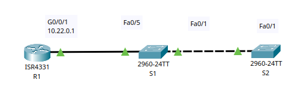

# Настройка протоколов CDP, LLDP и NTP

## Цель:

* Создание сети и настройка основных параметров устройства.
* Обнаружение сетевых ресурсов с помощью протокола CDP.
* Обнаружение сетевых ресурсов с помощью протокола LLDP.
* Настройка и проверка NTP.

## Описание/Пошаговая инструкция выполнения домашнего задания:

В этой лабораторной работе вам предстоит задокументировать порты, которые используются для подключения к другим
коммутаторам по протоколам CDP и LLDP.   
Полученные результаты следует указать в диаграмме сетевой топологии.
Подробное описание задания в методичке в материалах к занятию.

---


Часть 1. Создание сети и настройка основных параметров устройства
<details><summary>Шаг 1. Создайте сеть согласно топологии.

</summary>
Топология



Таблица адресации сетевой топологии.

| Устройство	 | Интерфейс	 |  IP-адрес	  | Маска подсети	 | Шлюз по умолчанию |
|:-----------:|:----------:|:-----------:|:--------------:|:-----------------:|
|     R1	     | Loopback1	 | 172.16.1.1	 | 255.255.255.0	 |         —         |
|     R1	     |  G0/0/1	   | 10.22.0.1	  | 255.255.255.0	 |         —         |
|     S1	     |    SVI     |  VLAN 1 	   |   10.22.0.2	   |  255.255.255.0	   | 10.22.0.1 |
|     S2	     |    SVI     |   VLAN 1	   |   10.22.0.3	   |  255.255.255.0	   | 10.22.0.1 |

</details>

<details><summary>Шаг 2. Настройте базовые параметры для маршрутизатора.</summary>

```
a.	Назначьте маршрутизатору имя устройства.
b.	Отключите поиск DNS, чтобы предотвратить попытки маршрутизатора неверно преобразовывать введенные команды таким образом, как будто они являются именами узлов.
c.	Назначьте class в качестве зашифрованного пароля привилегированного режима EXEC.
d.	Назначьте cisco в качестве пароля консоли и включите вход в систему по паролю.
e.	Назначьте cisco в качестве пароля VTY и включите вход в систему по паролю.
f.	Зашифруйте открытые пароли.
g.	Создайте баннер с предупреждением о запрете несанкционированного доступа к устройству.
h.	Настройка интерфейсов, перечисленных в таблице выше
i.	Сохраните текущую конфигурацию в файл загрузочной конфигурации.
```

``R1``

```Console
en
conf t
no ip domain-lookup
hostname R1
banner motd #####R1 Router ############
line console 0
logging synchronous
password cisco
login
exi
enable secret class
line vty 0 15
password cisco
login
exi
service password-encryption
interface G 0/0/1
ip add 10.22.0.1 255.255.255.0
no sh
ex
interface  Loopback1
ip add 172.16.1.1 255.255.255.0
no sh
ex

copy running-config startup-config
```

</details>

<details><summary>Шаг 3. Настройте базовые параметры каждого коммутатора.</summary>

```
a.	Присвойте коммутатору имя устройства.
b.	Отключите поиск DNS, чтобы предотвратить попытки маршрутизатора неверно преобразовывать введенные команды таким образом, как будто они являются именами узлов.
c.	Назначьте class в качестве зашифрованного пароля привилегированного режима EXEC.
d.	Назначьте cisco в качестве пароля консоли и включите вход в систему по паролю.
e.	Назначьте cisco в качестве пароля VTY и включите вход в систему по паролю.
f.	Зашифруйте открытые пароли.
g.	Создайте баннер, который предупреждает всех, кто обращается к устройству, видит баннерное сообщение «Только авторизованные пользователи!».  
h.	Отключите неиспользуемые интерфейсы
i.	Сохраните текущую конфигурацию в файл загрузочной конфигурации.
```

``S1``

```Console
en
conf t
no ip domain-lookup
hostname S1
banner motd "######## S1 Switch ########"
line console 0
logging synchronous
password cisco
login
exit
enable secret class
line vty 0 15
password cisco
login
exi
service password-encryption
ex
interface range f0/2-4, f0/6-24, g0/1-2
sh
ex

copy running-config startup-config
```

``S2``

```Console
en
conf t
no ip domain-lookup
hostname S2
banner motd "######## S2 Switch ########"
line console 0
logging synchronous
password cisco
login
exi
enable secret class
line vty 0 15
password cisco
login
exi
service password-encryption
ex
interface range f0/2-24, g0/1-2
sh
ex

copy running-config startup-config
```

</details>

Часть 2. Обнаружение сетевых ресурсов с помощью протокола CDP
<details><summary>
</summary>

a. На R1 используйте соответствующую команду show cdp, чтобы определить, сколько интерфейсов включено CDP, сколько из
них включено и сколько отключено.

``R1``

```Console
R1>show cdp interface
Vlan1 is administratively down, line protocol is down
  Sending CDP packets every 60 seconds
  Holdtime is 180 seconds
GigabitEthernet0/0/0 is administratively down, line protocol is down
  Sending CDP packets every 60 seconds
  Holdtime is 180 seconds
GigabitEthernet0/0/1 is up, line protocol is up
  Sending CDP packets every 60 seconds
  Holdtime is 180 seconds
GigabitEthernet0/0/2 is administratively down, line protocol is down
  Sending CDP packets every 60 seconds
  Holdtime is 180 seconds
```

`Вопрос: Сколько интерфейсов участвует в объявлениях CDP? Какие из них активны?`  
Используется один интерфейс GigabitEthernet0/0/1

b. На R1 используйте соответствующую команду show cdp, чтобы определить версию IOS, используемую на S1.

``R
S1``

```Console
R1>show cdp entry  S1

Device ID: S1
Entry address(es): 
Platform: cisco 2960, Capabilities: Switch
Interface: GigabitEthernet0/0/1, Port ID (outgoing port): FastEthernet0/5
Holdtime: 153

Version :
Cisco IOS Software, C2960 Software (C2960-LANBASEK9-M), Version 15.0(2)SE4, RELEASE SOFTWARE (fc1)
Technical Support: http://www.cisco.com/techsupport
Copyright (c) 1986-2013 by Cisco Systems, Inc.
Compiled Wed 26-Jun-13 02:49 by mnguyen

advertisement version: 2
Duplex: full
```

`Какая версия IOS используется на S1?`
15.0(2)SE4

c. На S1 используйте соответствующую команду show cdp, чтобы определить, сколько пакетов CDP было выданных.

``S1``

```Console
S1>show cdp traffic
            ^
% Invalid input detected at '^' marker.
S1> show cdp ?
  entry      Information for specific neighbor entry
  interface  CDP interface status and configuration
  neighbors  CDP neighbor entries
  <cr>
```

Нет такой команды в CPT

d. Настройте SVI для VLAN 1 на S1 и S2, используя IP-адреса, указанные в таблице адресации выше. Настройте шлюз по
умолчанию для каждого коммутатора на основе таблицы адресов.

``S1``

```Console
en
conf t
int vlan 1
description SVI VLAN 1
ip add 10.22.0.2 255.255.255.0
no sh
ex
ip default-gateway 10.22.0.1
```

``S2``

```Console
en
conf t
int vlan 1
description SVI VLAN 1
ip add 10.22.0.3 255.255.255.0
no sh
ex
ip default-gateway 10.22.0.1
```

e. На R1 выполните команду `show cdp entry S1` .

``R1``

```Console
R1>show cdp entry S1

Device ID: S1
Entry address(es): 
  IP address : 10.22.0.2
Platform: cisco 2960, Capabilities: Switch
Interface: GigabitEthernet0/0/1, Port ID (outgoing port): FastEthernet0/5
Holdtime: 177

Version :
Cisco IOS Software, C2960 Software (C2960-LANBASEK9-M), Version 15.0(2)SE4, RELEASE SOFTWARE (fc1)
Technical Support: http://www.cisco.com/techsupport
Copyright (c) 1986-2013 by Cisco Systems, Inc.
Compiled Wed 26-Jun-13 02:49 by mnguyen

advertisement version: 2
Duplex: full
```

`Вопрос: Какие дополнительные сведения доступны теперь?`
Дополнительно показан IP адрес ( IP address : 10.22.0.2)

f. Отключить CDP глобально на всех устройствах.

``R1/S1/S2``

```Console
en
conf t
no cdp run
ex
show cdp 
```

```Console
R1>en
Password: 
R1#conf t
Enter configuration commands, one per line.  End with CNTL/Z.
R1(config)#no cdp run
R1(config)#ex
R1#
%SYS-5-CONFIG_I: Configured from console by console

R1#show cdp
% CDP is not enabled
```

```Console
S1(config)#no cdp run
S1(config)#ex
S1#
%SYS-5-CONFIG_I: Configured from console by console

S1#show cdp 
% CDP is not enabled
```

```Console
S2(config)#no cdp run
S2(config)#ex
S2#
%SYS-5-CONFIG_I: Configured from console by console

S2#show cdp 
% CDP is not enabled
```

</details>
Часть 3. Обнаружение сетевых ресурсов с помощью протокола LLDP
<details><summary>
</summary>
a. Введите соответствующую команду `lldp`, чтобы включить LLDP на всех устройствах в топологии.

``R1/S1/S2``

```Console
show lldp
conf t
lldp run
ex
show lldp
```

```Console
R1#show lldp
% LLDP is not enabled
R1#conf t
Enter configuration commands, one per line.  End with CNTL/Z.
R1(config)#lldp run
R1(config)#ex
R1#
%SYS-5-CONFIG_I: Configured from console by console

R1#show lldp

Global LLDP Information:
    Status: ACTIVE
    LLDP advertisements are sent every 30 seconds
    LLDP hold time advertised is 120 seconds
    LLDP interface reinitialisation delay is 2 seconds
R1#
```

```Console
S1#show lldp
% LLDP is not enabled
S1#conf t
Enter configuration commands, one per line.  End with CNTL/Z.
S1(config)#lldp run
S1(config)#ex
S1#
%SYS-5-CONFIG_I: Configured from console by console

S1#show lldp

Global LLDP Information:
    Status: ACTIVE
    LLDP advertisements are sent every 30 seconds
    LLDP hold time advertised is 120 seconds
    LLDP interface reinitialisation delay is 2 seconds
```

```Console
S2#show lldp
% LLDP is not enabled
S2#conf t
Enter configuration commands, one per line.  End with CNTL/Z.
S2(config)#lldp run
S2(config)#ex
S2#
%SYS-5-CONFIG_I: Configured from console by console

S2#show lldp

Global LLDP Information:
    Status: ACTIVE
    LLDP advertisements are sent every 30 seconds
    LLDP hold time advertised is 120 seconds
    LLDP interface reinitialisation delay is 2 seconds
```

b. На S1 выполните соответствующую команду `lldp`, чтобы предоставить подробную информацию о S2.

``S1``

```Console
S1#show lldp entry S2
             ^
% Invalid input detected at '^' marker.
	
S1#show lldp ?
  neighbors  LLDP neighbor entries
  <cr>
```

Нет такой команды в CPT

`Что такое chassis ID для коммутатора S2?`
MAC-адрес устройства которое за портом Fa0/1

c. Соединитесь через консоль на всех устройствах и используйте команды LLDP, необходимые для отображения топологии
физической сети только из выходных данных команды show.

``R1/S1/S2``

```Console
show lldp neighbors
```

```Console
R1#show lldp neighbors
Capability codes:
    (R) Router, (B) Bridge, (T) Telephone, (C) DOCSIS Cable Device
    (W) WLAN Access Point, (P) Repeater, (S) Station, (O) Other
Device ID           Local Intf     Hold-time  Capability      Port ID
S1                  Gig0/0/1       120        B               Fa0/5

Total entries displayed: 1
```

```Console
S1#show lldp neighbors
Capability codes:
    (R) Router, (B) Bridge, (T) Telephone, (C) DOCSIS Cable Device
    (W) WLAN Access Point, (P) Repeater, (S) Station, (O) Other
Device ID           Local Intf     Hold-time  Capability      Port ID
S2                  Fa0/1          120        B               Fa0/1
R1                  Fa0/5          120        R               Gig0/0/1

Total entries displayed: 2
```

```Console
S2#show lldp neighbors
Capability codes:
    (R) Router, (B) Bridge, (T) Telephone, (C) DOCSIS Cable Device
    (W) WLAN Access Point, (P) Repeater, (S) Station, (O) Other
Device ID           Local Intf     Hold-time  Capability      Port ID
S1                  Fa0/1          120        B               Fa0/1

Total entries displayed: 1
```

</details>

Часть 4. Настройка и проверка NTP

<details><summary>Шаг 1. Выведите на экран текущее время.</summary>

``R1``

```Console
R1#show clock detail 
*0:36:4.624 UTC Mon Mar 1 1993
Time source is hardware calendar
```

</details>
<details><summary>Шаг 2. Установите время.</summary>

С помощью команды `clock set` установите время на маршрутизаторе R1. Введенное время должно быть в формате UTC.

``R1``

```Console
R1#clock set 19:57:00 Jun 1 2024
R1#show clock detail 
19:57:2.992 UTC Sat Jun 1 2024
Time source is user configuration
``` 

</details>

<details><summary>Шаг 3. Настройте главный сервер NTP.</summary>

Настройте R1 в качестве хозяина NTP с уровнем слоя 4.

``R1``

```Console
ntp server 172.16.1.1
ntp master 4
ntp update-calendar
```

```Console

```

</details>
<details><summary>Шаг 4. Настройте клиент NTP.</summary>

a. Выполните соответствующую команду на S1 и S2, чтобы просмотреть настроенное время. Запишите текущее время, в
следующей таблице.

``S1/S2``

```Console
show clock detail 
```

|     Дата	      |   Время	    | Часовой пояс	 |         Источник времени         |
|:--------------:|:-----------:|:-------------:|:--------------------------------:| 
| Mon Mar 1 1993 | 0:41:29.742 |      UTC      | Time source is hardware calendar |
| Mon Mar 1 1993 | 0:43:22.588 |      UTC      | Time source is hardware calendar |

b. Настройте S1 и S2 в качестве клиентов NTP. Используйте соответствующие команды NTP для получения времени от
интерфейса G0/0/1 R1, а также для периодического обновления календаря или аппаратных часов коммутатора.

``S1/S2``

```Console
ntp server 10.22.0.1
ntp update-calendar
```

```Console
S1(config)#ntp server 10.22.0.1
S1(config)#ntp update-calendar
               ^
% Invalid input detected at '^' marker.
S1(config)#ntp ?
  authenticate        Authenticate time sources
  authentication-key  Authentication key for trusted time sources
  master              Act as NTP master clock
  server              Configure NTP server
  trusted-key         Key numbers for trusted time sources
```

```Console
   S2(config)#ntp server 10.22.0.1
```

</details>

<details><summary>Шаг 5. Проверьте настройку NTP.</summary>

a. Используйте соответствующую команду show , чтобы убедиться, что S1 и S2 синхронизированы с R1. Примечание.
Синхронизация метки времени на маршрутизаторе R2 с меткой времени на маршрутизаторе R1 может занять несколько минут.

``S1/S2``

```Console
show ntp status
```

```Console
S1#show ntp status
Clock is synchronized, stratum 5, reference is 10.22.0.1
nominal freq is 250.0000 Hz, actual freq is 249.9990 Hz, precision is 2**24
reference time is FFFFFFFFE9DBD136.000002AA (20:21:10.682 UTC Sat Jun 1 2024)
clock offset is 3.00 msec, root delay is 0.00  msec
root dispersion is 10.08 msec, peer dispersion is 0.12 msec.
loopfilter state is 'CTRL' (Normal Controlled Loop), drift is - 0.000001193 s/s system poll interval is 4, last update was 1 sec ago.
```

```Console
S2#show ntp status
Clock is synchronized, stratum 5, reference is 10.22.0.1
nominal freq is 250.0000 Hz, actual freq is 249.9990 Hz, precision is 2**24
reference time is FFFFFFFFE9DBD19C.0000000F (20:22:52.015 UTC Sat Jun 1 2024)
clock offset is 3.00 msec, root delay is 0.00  msec
root dispersion is 10.08 msec, peer dispersion is 0.12 msec.
loopfilter state is 'CTRL' (Normal Controlled Loop), drift is - 0.000001193 s/s system poll interval is 4, last update was 10 sec ago.
```

b. Выполните соответствующую команду на S1 и S2, чтобы просмотреть настроенное время и сравнить ранее записанное время.

``S1/S2``

```Console
S1#show clock detail 
*20:22:32.837 UTC Sat Jun 1 2024
Time source is hardware calendar
```

```Console
S2#show clock detail 
20:23:26.433 UTC Sat Jun 1 2024
Time source is NTP
```

</details>


Вопрос для повторения  
`Для каких интерфейсов в пределах сети не следует использовать протоколы обнаружения сетевых ресурсов? Поясните ответ.`

```
Интерфейсы, подключенные к ненадежным или публичным сетям (например, Интернет):
    Причина: Протоколы обнаружения передают информацию о топологии сети, IP-адресах, версиях ПО и других деталях, которые
    могут быть использованы злоумышленниками для атаки на сеть. Использование этих протоколов в публичных сетях увеличивает
    риск утечки информации и компрометации безопасности.

Интерфейсы, подключенные к гостевым сетям:
    Причина: В гостевых сетях пользователи не должны иметь доступ к информации о внутренней инфраструктуре сети, так как это
    может привести к несанкционированному доступу и другим угрозам безопасности.

Интерфейсы, подключенные к сторонним организациям или внешним партнерам:
    Причина: Обмен информацией о внутренней топологии сети с внешними партнерами может привести к потенциальным утечкам и
    снижению уровня безопасности. Сторонние организации не должны иметь доступ к детальной информации о  сети.

Интерфейсы DMZ (демилитаризованная зона):
    Причина: В DMZ размещаются серверы и устройства, доступные из внешней сети. Разглашение информации о внутренней сети
    через DMZ может быть использовано злоумышленниками для атак на внутренние ресурсы.

Интерфейсы беспроводных сетей, особенно открытых или защищенных слабой аутентификацией:
    Причина: Беспроводные сети могут быть уязвимы к перехвату данных. Обнаружение сетевых ресурсов в таких сетях может
    позволить злоумышленникам узнать конфигурацию и уязвимости  сети.
```
